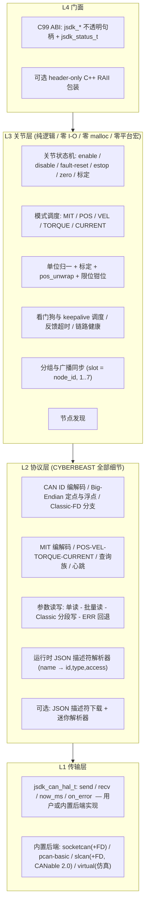

# CyberBeast Joint SDK（CAN / CYBERBEAST 后端）设计方案

| 项 | 值 |
|---|---|
| 文档版本 | v0.26（WP1~WP9 + A1~A13 + B1~B4/B8~B10 + **真机联调修正**：参数值小端化适配、描述符下载健壮性、CLI 前置条件、slcan 首帧丢失、Python/C 两个入口对齐、**`break_timeout == 0` = 禁用**；端点解析为**全动态 JSON 描述符**；变更见 §12） |
| 目标固件 | CyberBeast 分支（`PROTOCOL_CYBERBEAST`，`AXIS_COUNT = 1`，fw v8 系列） |
| 协议参考 | `ODrive/docs/cyberbeast-protocol.md` v2.4 + `Firmware/communication/can/can_cyberbeast.{hpp,cpp}` |
| 家族定位 | `jsdk_*` 家族的**第三个后端**（前两个：`SOEM/joint-sdk`、`EtherCAT_Master/joint-sdk`） |
| 代码根 | `d:\projects\cheetah\JointSDK` |
| 状态 | 设计+实现+验证均已闭环（WP1~WP9、A1~A13、B1~B4/B8~B10）；真机只读路径已逐条验证（见 `BACKLOG` §2.4）；**未完成项与已知限制的完整清单见 `BACKLOG.zh-CN.md`**（P1：A12 + B6；人工项：真驱动器运动） |

---

## 1. 目标与范围

### 1.1 目标

1. **纯 C（C99）**，零依赖，可移植到 Windows / Linux / 嵌入式 MCU。
2. **完全隔离 CYBERBEAST 协议细节**：客户不接触 CAN ID 位域、Big-Endian 定点打包、Classic/FD 分支、参数分段传输、JSON 描述符分块。
3. **UI 单位归一**：客户只用 `rad / rad/s / N·m`，SDK 负责映射到各模式线上单位（度 / RPM / A / 定点）。
4. 与 `jsdk_*` 家族**同名同义**（`jsdk_context_*` / `jsdk_joint_*`），使客户在 EtherCAT 与 CAN 之间迁移只需改 `context_config` 与寻址字段。
5. **配套 PC 诊断 CLI**（`jsdk-cli`，C 实现，随库一起构建），让客户在没有自研上位机时也能完成扫描/监控/参数读写/排障。
6. **配套 Python 绑定**（`jsdk_can`，ctypes over C ABI），供快速原型、数据采集与可视化。

### 1.2 范围外（明确的非目标）

| 非目标 | 理由 |
|---|---|
| 轨迹生成 / 插值 / 运动学 | 与两个 EtherCAT 版一致，属上层 |
| 固件升级（OTA）、Bootloader | 协议未定义 |
| 制动器 / 抱闸控制 | 协议未定义，需走参数写 |
| 内部线程 / 后台轮询 | MCU 不可能有；**C 核心不提供**；Form A 线程仅在可选 C++ 包装、以及 Python 绑定（明确标注为非实时）中提供 |
| 动态内存分配（默认） | 零 malloc 交付 |
| 心跳主动上报配置（`active_report_enabled_`） | 固件已声明但**未实现**，SDK 不依赖 |

---

## 2. 约束：协议事实与"坑"清单

> 本节是 SDK 的主要增值所在。实现者与客户都必须以此为唯一依据，不得依赖口头描述。

### 2.1 帧与寻址

| 项 | 事实 |
|---|---|
| CAN ID | **仅 29-bit 扩展帧**，`Priority[28:26] │ MsgType[25:18] │ Dest[17:10] │ Source[9:2] │ Seq[1:0]`；RTR 帧被丢弃 |
| 优先级 | `CRITICAL=0, EMERGENCY=1, HIGH_CTRL=2, CTRL=3, CONFIG=4, QUERY=5, STATUS=6, LOW=7`（0 = 仲裁优先） |
| 寻址 | `MsgType < 0x80` → 单播（`Dest` = 节点 ID）；`MsgType ≥ 0x80` → 广播（`Dest` = 8-bit 位图，`0xFF` = 全局） |
| 帧内头 | **无**。无协议版本、无 CRC、无 ACK、无重传（除 CAN 控制器自身重传） |
| 字节序 | 帧字段（ID 位域、`ep_id`、`offset`、查询与状态响应、控制帧）**Big-Endian**；**参数值（0x20/0x21 载荷）是 Little-Endian**（真机实测，见 `PROTOCOL_NOTES` §3.1）；JSON 描述符传输也是 **Little-Endian** |
| Seq | 2-bit，仅 MIT 响应递增；接收侧存了但不校验 → **不可用于丢包检测** |
| Classic / FD | 由**设备侧** `can.config.baud_rate ≤ 1 Mbps` 判定为 Classic；**无运行时协商**，两端必须预先一致 |
| 默认 | `baud_rate = 5 Mbps` → CAN FD，1 Mbps 仲裁 / 5 Mbps 数据，BRS = 1，TDC 使能 |

### 2.2 消息目录（SDK 会用到的全部）

| MsgType | 名称 | 方向 | 载荷 |
|---|---|---|---|
| `0x00` | MIT_CONTROL | M→D | 8B 位打包：pos16 / vel12 / kp12 / kd12 / tau12（BE） |
| `0x01` | POS_CONTROL | M→D | FD 12B：`f32 pos[度(输出端)] + f32 vel_lim[RPM] + f32 cur_lim[A]`；Classic 8B：`f32 pos[度] + i16 vel_lim[RPM] + i16 cur_lim[0.1A]` |
| `0x02` | VEL_CONTROL | M→D | 8B：`f32 target[RPM] + f32 cur_lim[A]` |
| `0x03` | TORQUE_CONTROL | M→D | 4B：`f32 torque[N·m(输出端)]` |
| `0x04` | CURRENT_CONTROL | M→D | 4B：`f32 current[A]`。**不回复、不喂看门狗** |
| `0x20` | PARAM_READ | M→D | 8B：`[flags u8][ep u16 BE][reqLen u8][offset u32 BE]`；响应 `[flags][ep u16][dataLen u8][value…]`，`flags.bit7=More` |
| `0x20`+bit6 | PARAM_READ 批量 | M→D | `[0x40][count u8][N×ep u16 BE]`（N ≤ 31）；响应 `[flags][count][validBitmap ⌈N/8⌉][值流]`；**仅 FD**，Classic 回 ERR |
| `0x21` | PARAM_WRITE | M→D | `[flags][ep u16 BE][len u8][value ≤8B BE]`；ACK 8B `[flags][ep][0][00×4]`；Classic 且 len>4 → 4B 分块，`flags.bit7=More` |
| `0x22` | CONFIG_SAVE | M→D | 无载荷、无响应 |
| `0x23` | CONFIG_RESET | M→D | 无载荷、无响应（恢复出厂并重启） |
| `0x24` / `0x25` | JSON_DESC_READ / DATA | M→D / D→M | 请求 4B `offset u32 **LE**`；数据帧 `[chunkOffset u16 LE][json ≤6B(Classic) / ≤62B(FD)]`，元数据帧 `[00 00][totalLen u32 LE][crc u16 LE]` |
| `0x40` | QUERY_STATUS | M→D | 无载荷 → **MIT 响应格式** |
| `0x41` | QUERY_POS_VEL | M→D | `f32 pos[**电机 turns**] + f32 vel[电机 turns/s]` |
| `0x42` | QUERY_CURRENT | M→D | `f32 Iq[A] + f32 Id_setpoint[A]`（第 2 项是**给定值**，不是实测） |
| `0x43` | QUERY_TEMPERATURE | M→D | `f32 电机°C + f32 FET°C` |
| `0x44` | QUERY_BUS | M→D | `f32 Vbus + f32 Ibus` |
| `0x45` | QUERY_ERROR | M→D | 请求 1B `errorType`（0 motor / 1 encoder / 2 sensorless / 3 controller / 4 system / 5 axis）→ `[type][00×3][u32 BE]` |
| `0x46` | QUERY_DEVICE_INFO | M→D | FD 16B `hw u32 + fw u32 + serial u64`；Classic 8B `hw u32 + fw u32` |
| `0x47` | QUERY_POWER | M→D | `f32 电功率 W + f32 机械功率 W` |
| `0x48` | HEARTBEAT | D→M | 周期上报，`Dest` = 最后见到的 master（默认 `0x01`），默认 100 ms，`heartbeat_rate_ms = 0` 关闭 |
| `0x49` | STATUS_FEEDBACK | M→D | 请求节拍上报 → **MIT 响应格式** |
| `0x60` | SET_NODE_ID | M→D | 1B 新 ID（1..0xFE）；不落 Flash |
| `0x61` | SET_ZERO | M→D | 无载荷，无响应；把当前位置设为零点 |
| `0x62` | START_MOTOR | M→D | `requested_state = CLOSED_LOOP_CONTROL` |
| `0x63` | STOP_MOTOR | M→D | `requested_state = IDLE` |
| `0x64` | RESET_DEVICE | M→D | 软复位 |
| `0x65` | CLEAR_ERRORS | M→D | 清除全部子系统错误 |
| `0x80` | MIT_CONTROL_BCAST | M→D | FD：`8B × N` 槽位，**槽位号 = node_id**；Classic：只有 slot 0，所有被掩码设备执行同一命令。广播**永不回复** |
| `0x81` / `0x82` / `0x83` | POS / VEL / TORQUE 广播 | M→D | 载荷同单播 |
| `0xC0` | ESTOP | M→全局 | 载荷被忽略 → `error |= ESTOP_REQUESTED`，`requested_state = IDLE` |
| `0xC1` | FAULT_ALERT | M→全局 | 载荷被忽略 |

**MIT 响应帧（8B）**：`pos16 | vel12 | err4 | current12 | mode4 | motor_temp u8(-50) | mos_temp u8(-50)`。
其中 `current` 满量程 = `min(mit_max_torque / torque_constant, 80 A)`，取不到时回退 ±40 A → **SDK 必须读 `torque_constant` 才能正确解码电流**。

**响应解复用规则**：`0x00/0x01/0x02/0x03/0x40/0x49` 的回复 **MsgType 全部是 `0x00`**、`Priority = HIGH_CTRL`、Seq 递增。SDK 必须按 `(Source, Priority, MsgType)` 分派，且必须容忍"未请求的 MIT 响应"。

### 2.3 心跳载荷

| 字节 | FD（18B） | Classic（8B） |
|---|---|---|
| 0 | `Life[7:5]`（3-bit 滚动） │ `ErrorFlags[4:0]` | 同 |
| 1 | `current_state[7:4]` │ `control_mode[3:0]` | 同 |
| 2 | 电机温度（u8，`值−50` °C） | 同 |
| 3 | MOSFET 温度 | pos `i16`（**电机 turns × 100**） |
| 4–5 | Vbus（`u16`，0.1 V） | pos 续 |
| 6–7 | Ibus（`i16`，0.01 A） | vel `i16`（turns/s × 100） |
| 8–11 | pos `i32`（**电机 turns × 10000**） | — |
| 12–15 | vel `i32`（turns/s × 10000） | — |
| 16–17 | Iq `i16`（0.01 A） | Iq `i8`（0.5 A/bit） |

`ErrorFlags`：`AXIS=0x01, MOTOR=0x02, ENCODER=0x04, CONTROLLER=0x08, BOARD=0x10`。

**坐标系陷阱**：MIT 响应与查询是**输出端**；心跳与 `QUERY_POS_VEL` 是**电机端 turns**。SDK 统一转输出端。

### 2.4 状态与模式

| `ModeState` nibble | 含义 | 来源 |
|---|---|---|
| 0 | RESET | `AXIS_STATE_UNDEFINED` |
| 1 | CALIBRATING | 电机/编码器标定类状态 |
| 2 | IDLE | `AXIS_STATE_IDLE` |
| 3 | CLOSED_LOOP（未识别模式） | `CLOSED_LOOP_CONTROL` + 非 MIT 输入模式 |
| 4 | **MIT** | `CLOSED_LOOP_CONTROL` + `input_mode == INPUT_MODE_MIT(9)` |
| 5 / 6 / 7 | POSITION / VELOCITY / TORQUE | `CLOSED_LOOP_CONTROL` + `control_mode = 3/2/1` |

MIT 响应 4-bit `ErrorCode`：`NONE=0, MOTOR=1, ENCODER=2, CONTROLLER=3, VOLTAGE=4, OVER_TEMP=5, OVER_CURRENT=6, STALL=7, OVERLOAD=8, CAN_TIMEOUT=9, MULTIPLE=0xF`。
⚠ **取值随固件版本变**：固件 `61cf2c5e`（2026-09-28）把 `UNDER_VOLTAGE` 改名为 `VOLTAGE`（0x4 未变）、新增 `OVERLOAD=0x8`、并把 `CAN_TIMEOUT` **从 0x8 挪到 0x9**。SDK 已对齐该版本；接更旧的设备时 `0x8` 的含义相反（过载 ↔ CAN 超时）。
已知缺陷：`ERROR_ESTOP_REQUESTED`（E-STOP 帧）与 `ERROR_CAN_BUS_FAILED`（总线 `break_timeout`）都映射成 `CAN_TIMEOUT`；`DC_BUS_UNDER_VOLTAGE` 与 `DC_BUS_OVER_VOLTAGE` 共用 `VOLTAGE` → 详情必须靠 `QUERY_ERROR(0x45)`。另：固件把通用的 `motor_.error_ != 0 → MOTOR` 检查排在细分检查之前，使 `5/6/7/8` 四个码**实际不可达**（见 `FIRMWARE_ISSUES.zh-CN.md` F31）。

### 2.5 看门狗（安全关键）

| 事实 | 后果 |
|---|---|
| `can.config.break_timeout` 默认 **0**，但 CYBERBEAST 把 0 当作 **100 ms** | **0 无法关闭看门狗**，只能显式设成很大的值（如 65535） |
| 只有 `MsgType ≤ 0x03` 或 `0x80..0x83` 刷新计时 | 只发查询帧**不能**维持使能 |
| `CURRENT_CONTROL(0x04)` 不刷新计时 | 纯电流控制既不喂狗也不受保护 |
| `last_cmd_time_ == 0`（从未收到控制帧）时完全跳过检查 | 上电后只要不发控制帧就不会触发 |
| 超时动作：`axis.error |= ERROR_CAN_BUS_FAILED` + `motor.disarm()` | 需要 `CLEAR_ERRORS` + `START_MOTOR` 才能恢复 |
| 每个被寻址帧都会 `axis.watchdog_feed()` | 独立于 `enable_watchdog` 配置 |

### 2.6 其他必须规避的坑

| # | 坑 | SDK 对策 |
|---|---|---|
| 1 | `kp/kd` 量纲：pos/vel/torque 都做输出端↔电机端换算，`kp/kd` 原样透传。**2026-09-29 真机实测定案：输出端刚度 = `kp`（不缩放）** | 保留双入口：`jsdk_joint_set_mit()`（照抄线上值）+ `jsdk_joint_set_mit_stiffness()`（语义入口）；§6.2 给出完整推导与实测数据 |
| 2 | `POS_CONTROL` / `VEL_CONTROL` **持久改写** `controller.config.vel_limit` 与 `motor.config.torque_lim`（不落 Flash） | 文档警示；不擅自替客户"恢复" |
| 3 | 广播**永不回复** | 反馈只能靠单播查询或心跳 |
| 4 | 位掩码寻址只覆盖 **node_id 1..7**，MIT FD 槽位 = `8 × node_id` | 分组 API 在 `add_joint` 时校验并告警；≥8 的节点自动降级单播 |
| 5 | 主站必须先发帧，设备才学到 `master_id`（否则心跳发往 `0x01`） | `configure/activate` 内做**握手帧**；`activate` 后重新握手 |
| 6 | `Source = 0` 会导致设备**完全不回复** | `master_id` 校验，0 直接返回 `JSDK_ERR_INVALID_ARG` |
| 7 | 无节点发现机制 | 被动听心跳 + 主动逐个探测，两者都提供 |
| 8 | `SET_NODE_ID` 不落 Flash，`RESET_DEVICE` 后可能回旧 ID | 提供 `persist` 参数，内部调 `CONFIG_SAVE` |
| 9 | **端点 ID 跨固件版本会大规模漂移**：实测 v8 与 0.5.13 的 471 个共有端点中 **405 个（86%）ID 不同**（端点 ID 按声明顺序分配，任意插入都会整体位移）：`node_id` 176→180、`gear_ratio` 238→242、`torque_constant` 243→247、`cpr` 352→390、`vel_limit` 288→301，且 `mit_max_*` 仅在 v8 存在 | 见 §6.6：端点表**按固件版本分表 + 运行期版本校验**，并提供 11 个必需端点的**显式覆盖通道**；数值合理性校验兜底 |
| 10 | 多轴板只有 axis0 做超时检查 | 当前 `AXIS_COUNT = 1`，设计保留 `axis` 字段 |
| 11 | MIT 标定范围 `mit_max_*` 是设备侧可配，仓库内 `Firmware/json/*.json` 是**陈旧副本**（不含 `mit_max_*`） | 只从**设备**读（JSON 描述符 / 端点 335..339），绝不硬编码 |

---

## 3. 家族关系与决策记录

### ADR-1 落地形态：独立第三个库，符号同名，互斥链接
- `JointSDK/` 独立开发，导出 `jsdk_*` 符号；**不与 EtherCAT 版同进程链接**。
- **风险（必须在实现中缓解）**：C 无名字修饰，"同名不同 ABI"可能导致**静默的 ABI 不匹配**（结构体大小不同 → 内存踩踏），比链接报错更危险。
- **缓解措施（P0 必做）**：
  1. 库名与其它两版区分：`libjsdk_can.a` / `jsdk_can.dll` / `joint-sdk-can.pc`；
  2. 头文件强制 ABI 标签：`#define JSDK_BACKEND_TAG 3 /* 1=IgH 2=SOEM 3=CAN */`，与库内定义不一致时 `#error`；
  3. 提供 `jsdk_backend_name()` / `jsdk_abi_version()`，`jsdk_context_init()` 内校验并拒绝错配；
  4. 结构体首字段放 `uint32_t magic`（每个结构体独立魔数），运行期校验。
- **状态：已确认（v0.2）**——上述 4 条判定为足够，**不引入**宏别名隔离（保持 `jsdk_*` 纯同名）。

### ADR-2 兼容性目标：概念一致，允许 API 不一致
- 要求：**同名（`jsdk_*`）+ 同名概念 + 语义可映射**；允许 `jsdk_context_config_t`、`jsdk_joint_feedback_t` 等结构体布局与 EtherCAT 版不同。
- 因此本设计**以 CAN 语义自然表达优先**，仅在"有明确对应关系"处保持字段同名。

### ADR-3 寻址：`jsdk_joint_config_t.node_id`（新增字段，不复用 `position`）

### ADR-4 模式枚举：`JSDK_MODE_MIT = 4`（跟随固件 `ModeState::MODE_MIT` nibble），新增 `JSDK_MODE_CURRENT = 11`

### ADR-5 raw setter：保留同名函数，语义 = **协议原始量**（逐模式在文档中列表说明）

### ADR-6 内存模型：零 malloc 为唯一默认；堆模式 `jsdk_context_create()` 移入独立可选文件

### ADR-7 许可证：**专有许可**（仅授权客户随产品分发）。不与现有 GPLv3 双授权的 EtherCAT 版混链；若未来统一库，需重新决策许可证。

### ADR-8 端点解析：**全动态 JSON 描述符，不内置任何静态表**（v0.4 定案）
- 背景：实测端点 ID 漂移率 **86%**（见 §6.6）。
- 曾考虑：①编译期单表 ②按固件版本分表 ③分表 + 客户显式覆盖。
- **最终决策：全部舍弃**。连接时从设备读回 JSON 描述符并动态解析出全部端点，
  静态表与 `jsdk_endpoint_override_t` 一并删除。
- 收益：ID 漂移问题**从根上消失**；不再需要“SDK 紧跟固件发版”；客户可访问任意底层参数。
- 代价（已接受，见 §6.6）：启动时 0.1~2 s 下载（41029 字节 / 662~6839 帧）、全量保留约 24.9 KB RAM。
  缓解：`RETAIN_FILTERED`（<1 KB）、`share_by_crc`（多节点只下一次）、`desc_export/import` 缓存。
- 相应的硬约束：禁止在使能状态下下载（否则触发看门狗）；下载 RX 不受 `rx_burst_limit` 限制。

---

## 4. 分层架构与目录结构



```
JointSDK/
├─ CMakeLists.txt                       # 唯一构建入口（库 + 测试 + 示例 + install/export）
├─ cmake/
│   ├─ joint-sdk-can.pc.in              # pkg-config 模板（A2，装到 lib/pkgconfig/）
│   └─ jsdk_canConfig.cmake.in          # find_package(jsdk_can) → jsdk::can（A6）
├─ docs/
│   ├─ DESIGN.zh-CN.md                  # 本文档
│   ├─ PROTOCOL_NOTES.zh-CN.md          # 帧级参考 + 实现检查表
│   ├─ FIRMWARE_ISSUES.zh-CN.md         # 固件问题权威清单 F1~F26（逐条回源核实）
│   ├─ PORTING.zh-CN.md                 # 如何写自己的 HAL（MCU 客户入口）
│   ├─ UNITS.zh-CN.md                   # 单位与 kp/kd 公式速查
│   ├─ MIGRATION.zh-CN.md               # 从 EtherCAT 版迁移（逐符号对照）
│   └─ CLI.zh-CN.md / PYTHON.zh-CN.md   # 两个交付面的使用手册
├─ include/joint_sdk/
│   ├─ joint_sdk.h                      # 公共 C ABI（唯一对外头文件）
│   ├─ jsdk_hal_builtin.h               # 内置后端工厂（socketcan/pcan/slcan/virtual）
│   └─ joint_group.hpp                  # C++ 包装（header-only，RAII，C++14）
├─ src/                                 # core（可移植）+ proto_cyberbeast（协议）+ hal（后端）
├─ arduino/                             # Arduino / PlatformIO 包装（A5）
│   ├─ library.properties
│   ├─ src/jsdk_can_amalgam.{h,c}       # ⚠ 生成物（amalgamate.py 的产物副本）
│   ├─ examples/01_mit_move/            # sketch + 三回调 HAL 骨架
│   └─ extras/host_shim/Arduino.h       # PC 上做语法检查用的替身
├─ examples/                            # 8 个可跑示例（A1），全部注册进 ctest
│   ├─ ex_common.h                      # 示例共用样板（只给用虚拟后端的那些）
│   ├─ 01_hello_virtual.c  02_enable_mit.c  03_control_loop.c  04_param_rw.c
│   ├─ 05_desc_cache.c     06_group_broadcast.c
│   ├─ 07_custom_hal.c                  # 自己实现 jsdk_can_hal_t（MCU 入口）
│   └─ 08_cpp_wrapper.cpp               # C++ 包装示例
├─ dist/                                # amalgamation 输出（生成物，A3）
│   └─ jsdk_can_amalgam.{h,c}
├─ tools/                               # 构建/验证脚本（见 §8）
│   ├─ amalgamate.py                    # 生成单文件版
│   ├─ wsl_build.sh / live_can_smoke.sh / live_can_mutation_test.sh
│   ├─ packaging_smoke.sh / amalgam_smoke.sh / arduino_smoke.sh
│   ├─ extract_endpoints_json.py / gen_golden_vectors*.py
│   └─ jsdk_cli/                        # PC 诊断 CLI 源码
└─ tests/                               # 10 套 C 单测 + packaging/ 消费工程 + data/ 夹具
```

---

## 5. 公共 API 设计

> ⚠ **权威定义以 `include/joint_sdk/joint_sdk.h` 为准。**
> 本节是设计期草案，v0.4 起端点解析已改为“全动态 JSON 描述符”（见 §6.6），
> 因此下文出现的 `jsdk_endpoint_override_t`、`ep_override`、`jsdk_endpoint_table_fw()`、
> 编译期端点表 等内容**均已删除，不要按此实现**。下文仅保留与最新头文件不矛盾的骨架。

> 唯一对外头文件 `include/joint_sdk/joint_sdk.h`。所有句柄不透明；所有函数 `extern "C"`。

### 5.1 后端标识与 ABI 守卫

```c
#define JSDK_BACKEND_TAG        3u   /* 1 = IgH EtherCAT, 2 = SOEM EtherCAT, 3 = CYBERBEAST CAN */
#define JSDK_BACKEND_NAME       "cyberbeast-can"
#define JSDK_ABI_VERSION        0x00010000u

const char *jsdk_backend_name(void);
uint32_t    jsdk_abi_version(void);
```

### 5.2 状态码

```c
typedef enum {
    JSDK_OK              = 0,
    JSDK_ERR_INVALID_ARG = -1,
    JSDK_ERR_NO_MEMORY   = -2,
    JSDK_ERR_NOT_FOUND   = -3,
    JSDK_ERR_BAD_STATE   = -4,
    JSDK_ERR_TRANSPORT   = -5,   /* 原 JSDK_ERR_ECRT 语义泛化：主站/链路错误 */
    JSDK_ERR_UNSUPPORTED = -6,
    JSDK_ERR_TIMEOUT     = -7,   /* CAN 扩展 */
    JSDK_ERR_PROTOCOL    = -8,   /* CAN 扩展：对端返回非法/错误码 */
    JSDK_ERR_BUSY        = -9    /* CAN 扩展：TX 队列满 / 请求进行中 */
} jsdk_status_t;

#define JSDK_ERR_ECRT JSDK_ERR_TRANSPORT   /* 源码兼容别名 */
```

### 5.3 传输层 HAL（MCU 客户唯一需要实现的部分）

```c
typedef struct {
    uint32_t id;      /* 29-bit；bit31 = 1 表示扩展帧 */
    uint8_t  len;     /* 0..8 (Classic) / 0..64 (FD) */
    uint8_t  flags;   /* JSDK_FRAME_FD | JSDK_FRAME_BRS */
    uint8_t  data[64];
} jsdk_can_frame_t;

typedef struct {
    void *user;
    /* 非阻塞。0 = 已发出/已入队；非 0 = 失败或忙 */
    int      (*send)(void *user, const jsdk_can_frame_t *f);
    /* 非阻塞。1 = 取到一帧；0 = 当前无帧；< 0 = 链路错误 */
    int      (*recv)(void *user, jsdk_can_frame_t *f);
    /* 单调递增毫秒时钟，用于看门狗/超时/新鲜度 */
    uint32_t (*now_ms)(void *user);
    /* 可 NULL */
    void     (*on_error)(void *user, int kind, uint32_t detail);
} jsdk_can_hal_t;
```

**契约**：HAL 可在中断上下文外被调用；SDK 保证**不在 `cycle_*` 内阻塞**；`send` 返回失败时 SDK 记账并重试下一周期；`now_ms` 必须单调（溢出按 `uint32_t` 回绕处理）。

### 5.4 上下文配置

```c
typedef struct {
    uint32_t magic;                 /* 内部使用：ABI 魔数，jsdk_context_init 校验 */
    jsdk_can_hal_t hal;             /* 必需 */
    uint8_t  master_id;             /* 本机源地址 1..254；0 非法（设备将完全不回复） */
    uint8_t  is_fd;                 /* 1 = CAN FD（默认，1M/5M BRS）；0 = Classic */
    uint32_t period_ns;             /* 期望控制周期，用于 keepalive 与超时判定；0 = 自动 */
    uint8_t  auto_keepalive;        /* 1（默认）= cycle_end 内按需自动补喂狗帧 */
    uint8_t  clamp_target_position; /* 目标位置越界策略，见 §6.10：
                                       0（默认）= 拒绝该目标并计数，本周期改发安全帧；
                                       1 = 静默钳位到 ±mit_max_pos 后发送 */
    uint8_t  max_joints;            /* 调用者数组容量 */
    uint8_t  enable_watchdog_hint;  /* 1 = configure 时把设备 break_timeout 设为 2×period，
                                       避免"默认 100ms"比控制周期还短；默认 0（不擅自改客户设备）*/
} jsdk_context_config_t;   /* 注意：v0.1 文档此处笔误为 jsdk_context_t，已修正 */
```

### 5.5 生命周期（零 malloc）

```c
#define JSDK_MAX_JOINTS_STATIC   8u
#define JSDK_CONTEXT_MAX_SIZE    2048u   /* 与 max_joints=8 匹配；编译期固定 */
#define JSDK_CONTEXT_MAX_ALIGN   8u

typedef union {
    uint64_t _align;
    uint8_t  bytes[JSDK_CONTEXT_MAX_SIZE];
} jsdk_context_storage_t;

jsdk_status_t jsdk_context_init(jsdk_context_t *ctx, const jsdk_context_config_t *cfg);
jsdk_status_t jsdk_context_add_joint(jsdk_context_t *ctx,
                                     const jsdk_joint_config_t *jc,
                                     jsdk_joint_t **out);
jsdk_status_t jsdk_context_configure(jsdk_context_t *ctx);   /* 参数发现 + 校验 + 握手 */
jsdk_status_t jsdk_context_activate (jsdk_context_t *ctx);   /* 可选：按 initial_mode 使能 */
void          jsdk_context_deactivate(jsdk_context_t *ctx);
void          jsdk_context_destroy  (jsdk_context_t *ctx);

/* 循环边界（Form B，RT 安全） */
jsdk_status_t jsdk_context_cycle_begin(jsdk_context_t *ctx, uint64_t app_time_ns);
jsdk_status_t jsdk_context_cycle_end  (jsdk_context_t *ctx);
/* MCU 便利入口：等价于 begin + end */
jsdk_status_t jsdk_context_poll       (jsdk_context_t *ctx, uint64_t app_time_ns);

/* 总线 */
jsdk_status_t jsdk_context_discover(jsdk_context_t *ctx, uint8_t *ids,
                                   unsigned cap, unsigned *found, uint8_t max_probe);
jsdk_status_t jsdk_context_get_bus_state(jsdk_context_t *ctx, jsdk_bus_state_t *st);
const char   *jsdk_context_last_error(jsdk_context_t *ctx);
void          jsdk_context_estop(jsdk_context_t *ctx);       /* 广播 0xC0 */
```

### 5.6 关节配置与反馈

```c
typedef struct {
    uint8_t     node_id;      /* 1..254，对应设备 axis0.config.can.node_id */
    uint8_t     axis;         /* 预留：多轴板轴号；当前固定 0 */
    const char *profile;      /* 关节型号（查内置默认表）；NULL = 全自动发现 */
    float       gear_ratio;         /* 0 = 从设备读（端点 242 @v8） */
    float       mit_max_pos;        /* 0 = 从设备读（端点 335），单位 rad(输出端) */
    float       mit_max_vel;        /* 0 = 从设备读（端点 336），rad/s(输出端) */
    float       mit_max_torque;     /* 0 = 从设备读（端点 337），N·m(输出端) */
    float       mit_max_kp;         /* 0 = 从设备读（端点 338） */
    float       mit_max_kd;         /* 0 = 从设备读（端点 339） */
    float       torque_constant;    /* 0 = 从设备读（端点 247 @v8），解码电流必需 */
    jsdk_mode_t initial_mode;       /* activate() 使用的模式 */
} jsdk_joint_config_t;
/* 注：v0.4 已删除 ep_override 与 profile；端点 ID 完全由运行时描述符解析提供 */

typedef struct {
    double   pos;              /* 输出端 rad */
    double   vel;              /* 输出端 rad/s */
    double   current_A;        /* 电机端 A（MIT 响应解码） */
    double   torque_Nm;        /* 估算：current_A × torque_constant × gear_ratio */
    double   t_motor_C, t_fet_C;
    double   vbus_V, ibus_A;
    jsdk_axis_state_t axis_state;
    jsdk_mode_t       mode;
    uint8_t  err_code;         /* MIT 响应 4-bit ErrorCode */
    uint8_t  hb_error;         /* 心跳 5-bit 子系统位图 */
    uint32_t axis_error;       /* 可选：QUERY_ERROR(0x45) type=5 */
    uint32_t age_ms;           /* 距上次有效反馈 */
    uint32_t tx_rejected;      /* 累计因目标越界被拒绝的指令数（§6.10） */
    uint32_t tx_frames;        /* 累计发出的控制帧数 */
    uint16_t status_flags;     /* 粘滞标志位，见 JSDK_JF_* */
    int      online;           /* 曾经收到过有效帧 */
    int      valid;            /* 本次数据来自有效帧 */
} jsdk_joint_feedback_t;

/* status_flags 位定义（粘滞，可清除） */
#define JSDK_JF_TARGET_REJECTED   0x0001u  /* 曾因越界拒绝目标位置 */
#define JSDK_JF_SAFE_FRAME_SENT   0x0002u  /* 曾在本周期改发安全帧 */
#define JSDK_JF_WATCHDOG_RISK     0x0004u  /* 控制周期已接近 break_timeout */
#define JSDK_JF_FEEDBACK_STALE    0x0008u  /* 反馈超时（age_ms > 阈值） */
#define JSDK_JF_TX_FAILED         0x0010u  /* HAL send 连续失败 */
#define JSDK_JF_SCALE_INVALID     0x0020u  /* 未取得标定参数，物理量 API 不可用 */

void jsdk_joint_clear_status_flags(jsdk_joint_t *j, uint16_t mask);

jsdk_status_t jsdk_joint_get_feedback(const jsdk_joint_t *j, jsdk_joint_feedback_t *fb);
int  jsdk_joint_is_enabled(const jsdk_joint_t *j);
int  jsdk_joint_is_fault  (const jsdk_joint_t *j);
int  jsdk_joint_get_mode_state(const jsdk_joint_t *j);   /* 原始 ModeState nibble */
```

**`jsdk_axis_state_t` 语义映射**（保留家族枚举名以利迁移）：

| 枚举 | CAN 含义 |
|---|---|
| `JSDK_AXIS_UNKNOWN` | 尚未收到任何反馈 |
| `JSDK_AXIS_SWITCH_ON_DISABLED` | `IDLE` |
| `JSDK_AXIS_READY_TO_SWITCH_ON` | `CALIBRATING` / 使能过渡中 |
| `JSDK_AXIS_SWITCHED_ON` | 已进入 `CLOSED_LOOP` 但尚无控制帧（瞬态） |
| `JSDK_AXIS_OPERATION_ENABLED` | `CLOSED_LOOP` 且正在执行控制（结合 `mode` 区分） |
| `JSDK_AXIS_FAULT` | 任一错误位置位 |

### 5.7 控制

```c
/* 使能与模式 */
void jsdk_joint_request_enable     (jsdk_joint_t *j, jsdk_mode_t mode);
void jsdk_joint_request_disable    (jsdk_joint_t *j);
void jsdk_joint_request_fault_reset(jsdk_joint_t *j);
void jsdk_joint_set_mode           (jsdk_joint_t *j, jsdk_mode_t mode);

/* 物理量入口（推荐）：输出端 rad / rad/s / N·m */
void jsdk_joint_set_target_position_rad  (jsdk_joint_t *j, double rad);
void jsdk_joint_set_target_velocity_rad_s(jsdk_joint_t *j, double rad_s);
void jsdk_joint_set_target_torque_Nm     (jsdk_joint_t *j, double Nm);

/* MIT 力位混合 */
void jsdk_joint_set_mit(jsdk_joint_t *j,
                        double pos_rad, double vel_rad_s,
                        double kp, double kd, double tau_Nm);
/* 显式刚度入口：内部换算为线上 kp/kd，使"输出端刚度"名副其实 */
void jsdk_joint_set_mit_stiffness(jsdk_joint_t *j,
                                  double pos_rad, double vel_rad_s,
                                  double stiffness_Nm_per_rad,
                                  double damping_Nm_per_rad_s,
                                  double tau_Nm);

/* 协议原始量入口（逃生通道，语义见 §6.2 表） */
void jsdk_joint_set_target_position (jsdk_joint_t *j, int32_t raw);
void jsdk_joint_set_target_velocity (jsdk_joint_t *j, int32_t raw);
void jsdk_joint_set_target_torque   (jsdk_joint_t *j, int16_t raw);

/* 限制量（POS / VEL / CURRENT 模式用） */
void jsdk_joint_set_limits(jsdk_joint_t *j, double vel_lim_rad_s, double cur_lim_A);
void jsdk_joint_set_current_A(jsdk_joint_t *j, double amp);   /* 注意：不喂看门狗 */

/* 安全动作：按当前模式发送最小能量指令（默认“自由”，不主动抱持）
 *   MIT            : pos = 实际位置, vel = 0, kp = kd = 0, tau = 0  → 电机泄力
 *   POS            : target = 实际位置, 保留上次 vel_lim / cur_lim
 *   VEL            : target = 0
 *   TORQUE/CURRENT : 0
 * 若需要主动“锁位”，用 hold_position_pd()。
 */
void jsdk_joint_hold_position(jsdk_joint_t *j);
/* 主动抱持（PD 锁位）。kp/kd 为线上值，量纲同 set_mit()，见 §6.2。 */
void jsdk_joint_hold_position_pd(jsdk_joint_t *j, double kp, double kd);
```

### 5.8 系统管理 / 运维

```c
jsdk_status_t jsdk_joint_set_zero_here   (jsdk_joint_t *j);            /* 0x61 */
jsdk_status_t jsdk_joint_calibrate       (jsdk_joint_t *j);            /* 写 requested_state=3 */
jsdk_status_t jsdk_joint_home            (jsdk_joint_t *j);            /* 写 requested_state=11 */
jsdk_status_t jsdk_joint_save_config     (jsdk_joint_t *j);            /* 0x22 */
jsdk_status_t jsdk_joint_reset_device    (jsdk_joint_t *j);            /* 0x64 */
jsdk_status_t jsdk_joint_set_node_id     (jsdk_joint_t *j, uint8_t new_id, int persist);
jsdk_status_t jsdk_joint_set_watchdog_ms (jsdk_joint_t *j, uint32_t ms); /* 写端点 73 */
jsdk_status_t jsdk_joint_get_device_info (jsdk_joint_t *j, jsdk_device_info_t *info); /* 0x46 */
jsdk_status_t jsdk_joint_get_fault_info  (jsdk_joint_t *j, jsdk_fault_info_t *info);
jsdk_status_t jsdk_joint_query_error_detail(jsdk_joint_t *j, jsdk_error_detail_t *d);
```

### 5.9 参数访问（SDO 风格，映射 `0x20` / `0x21`）

```c
typedef int  jsdk_sdo_handle_t;
typedef enum { JSDK_SDO_IDLE = 0, JSDK_SDO_BUSY, JSDK_SDO_SUCCESS, JSDK_SDO_ERROR } jsdk_sdo_state_t;

/* 与 EtherCAT 版同名同义：index → endpoint ID，subindex 保留（固定 0） */
jsdk_sdo_handle_t jsdk_joint_sdo_create(jsdk_joint_t *j, uint16_t ep_id,
                                        uint8_t subindex, size_t size);
jsdk_sdo_state_t  jsdk_joint_sdo_state (jsdk_joint_t *j, jsdk_sdo_handle_t h);
uint8_t          *jsdk_joint_sdo_data  (jsdk_joint_t *j, jsdk_sdo_handle_t h);
size_t            jsdk_joint_sdo_data_size(jsdk_joint_t *j, jsdk_sdo_handle_t h);
int               jsdk_joint_sdo_read  (jsdk_joint_t *j, jsdk_sdo_handle_t h);
int               jsdk_joint_sdo_write (jsdk_joint_t *j, jsdk_sdo_handle_t h);

/* 便捷：按名字（查编译期端点表） */
jsdk_status_t jsdk_joint_param_get_f32(jsdk_joint_t *j, const char *path, float *v);
jsdk_status_t jsdk_joint_param_set_f32(jsdk_joint_t *j, const char *path, float v);
/* 批量读：FD 自动分组到单帧，Classic 自动退化为逐条 */
jsdk_status_t jsdk_joint_param_get_batch(jsdk_joint_t *j, const char *const *paths,
                                         float *out, unsigned n);
```

**`path` 命名**：沿用设备 JSON 的扁平点号路径，如 `"axis0.controller.config.mit_max_torque"`、`"axis0.motor.config.gear_ratio"`。表未命中 → `JSDK_ERR_NOT_FOUND`（**不猜、不近似**）。

### 5.10 分组与广播同步

```c
typedef struct { uint8_t node_id; double pos_rad, vel_rad_s, kp, kd, tau_Nm; } jsdk_group_target_t;

jsdk_status_t jsdk_group_set_mit (jsdk_context_t *ctx, const jsdk_group_target_t *t, unsigned n);
jsdk_status_t jsdk_group_enable  (jsdk_context_t *ctx, const uint8_t *node_ids, unsigned n);
jsdk_status_t jsdk_group_disable (jsdk_context_t *ctx, const uint8_t *node_ids, unsigned n);
```

约束与行为：
- 组内 `node_id` 必须 ∈ 1..7；≥8 的成员自动降级为单播，并在 `configure()` 期返回 `JSDK_ERR_UNSUPPORTED` 告警位。
- Classic 模式下 `jsdk_group_set_mit` 只支持"全员同一目标"；组内目标不一致 → 自动降级为逐关节单播。
- 广播不回复 → 组内反馈依赖心跳与后续单播查询，`jsdk_group_set_mit` 不产生反馈更新。

### 5.11 单位与文本

```c
typedef struct {
    double pos_counts_to_rad;     /* 输出端 */
    double vel_counts_to_rad_s;
    double trq_to_Nm;
    int    valid;                 /* 0 = 尚未从设备取得标定参数 */
} jsdk_unit_scale_t;

void          jsdk_unit_scale_default(jsdk_unit_scale_t *s, uint32_t rated_trq);
void          jsdk_unit_scale_calc(jsdk_unit_scale_t *s, uint32_t encoder_resolution,
                                   uint32_t motor_rev, uint32_t shaft_rev, uint32_t rated_torque);
void          jsdk_joint_set_scale(jsdk_joint_t *j, const jsdk_unit_scale_t *s);
void          jsdk_joint_get_scale(jsdk_joint_t *j, jsdk_unit_scale_t *s);

const char *jsdk_status_string(jsdk_status_t st);
const char *jsdk_axis_state_string(jsdk_axis_state_t st);
const char *jsdk_mode_string(jsdk_mode_t m);
```

---

## 6. 关键机制设计

### 6.1 模式与单位归一化

**SDK 对外统一**：`rad / rad/s / N·m`（输出端）。内部按模式映射：

| SDK 入口 | MIT (0x00) | POS (0x01) | VEL (0x02) | TORQUE (0x03) | CURRENT (0x04) |
|---|---|---|---|---|---|
| `set_target_position_rad` | 直接（线上已是输出端 rad） | rad → **度** | — | — | — |
| `set_target_velocity_rad_s` | 直接（输出端 rad/s） | → **RPM** | → **RPM** | — | — |
| `set_target_torque_Nm` | 直接（线上输出端 N·m） | — | — | 直接 | — |
| `set_limits(v, i)` | —（MIT 用 kp/kd/tau） | `vel_lim[RPM]`, `cur_lim[A]` | `cur_lim[A]` | — | — |
| `set_current_A` | — | — | — | — | 直接 |

**逆向换算（反馈）**：MIT 响应已是输出端 → 直接用；`QUERY_POS_VEL` 与心跳是电机端 turns → `rad = turns × 2π / gear_ratio`。
**多圈位置**：MIT 响应 pos 为 16-bit 定点，满量程 `±mit_max_pos`（默认 ±12.5 rad）→ **单圈内不会回绕**，但超出量程会被钳位。因此 SDK 提供 `pos_unwrap` 仅在需要绝对多圈累积时启用（默认关闭，避免掩盖钳位）。

### 6.2 `kp / kd` 量纲（必须显式定义）

固件实际计算（`controller.cpp:380`）：

```
torque_motor = tau_setpoint + input_mit_kp * (pos_setpoint - pos_estimate_motor)
                            + input_mit_kd * (vel_des      - vel_estimate_motor)
```

其中 `pos_setpoint / pos_estimate_motor` 单位为**电机 turns**，而线上 `pos` 由输出端 rad 换算而来（`turns = rad × gear / 2π`），`kp/kd` **原样透传**。

> ⚠ **2026-09-29 真机实测定案**：本节先后写过 $kp\times\text{gear}/(2\pi)$（偏 2π 倍）和 $kp/\text{gear}$（偏 gear 倍），**两者都被实测推翻**。
> 正确结论：**$K_{\text{out}} = kp$，不做任何齿比换算**。
> 只看 `controller.cpp` 会以为 kp 被 `/gear` 多除一次，但必须带上**齿轮箱两端的力矩关系**：
> `:415` 把电机端 turns 误差换回输出端 rad（得 $e_{\text{out}}$），而 `:450` 的 `/gear` 正是
> 「电机端 N·m → 输出端 N·m」这一步，kp 并未跟着被除。
> **实测**（v4.2.55_fw-v0.6.10，gear=7.75）：静态平衡 $e=-\tau_{ff}/K$，三组独立测量
> $K/kp$ = **1.019 / 1.000 / 1.008**（见 `tools/f1_kp_ratio.py`）。

$$\text{刚度}_{\text{输出端}}\ [\mathrm{N\cdot m/rad}] = kp \qquad(\text{与 } \text{gear\_ratio} \text{ 无关})$$

| API | 语义 |
|---|---|
| `jsdk_joint_set_mit(..., kp, kd, ...)` | **照抄线上值**。与 `cyberbeast_tool.py` 及现有文档完全一致 |
| `jsdk_joint_set_mit_stiffness(..., stiffness, damping, ...)` | 传入**输出端真实刚度**；**与 kp/kd 数值相同**（不做齿比换算） |

**与固件已达成一致（2026-09-29 实测）**：`kp/kd` 就是输出端刚度，不经 `gear_ratio` 缩放。
JSON 描述符的 `mit_kp_unit` 能力标志因此**不再必需**（仍可作为将来的防歧义手段）。

### 6.3 看门狗与 keepalive

策略（`auto_keepalive = 1` 时）：

```
cycle_end():
  1. 若本周期已发送任一控制帧（MsgType ≤ 0x03 或 0x80..0x83）→ 记录 last_ctrl_tx 并结束
  2. 否则：
     - 计算 remaining = watchdog_ms - (now - last_ctrl_tx)
     - 若 remaining ≤ max(2 × period_ms, 10 ms) → 自动补发一帧 MIT
       目标 = 上一次控制目标（无历史则 实际位置 + kp=0,kd=0,tau=0）
       优先级 = PRI_HIGH_CTRL
     - 记录本次为 SDK 生成的 keepalive（反馈中可通过 age_ms 区分新鲜度）
```

配套要求：
- `period_ms` 已知**且设备侧超时 > 0**时，`configure()` **检查 `period_ms ≥ watchdog_ms`** 并返回 `JSDK_ERR_BAD_STATE`（否则控制回路本身就不可能喂住狗）；提供 `enable_watchdog_hint` 让客户授权 SDK 在**需要时**把 `break_timeout` 设为 `2 × period_ms`（并读回确认）。
  ⚠ 超时为 `0`（禁用）时**必须跳过该检查** —— 拿 0 去比会恒真，把每个循环命令都拒掉。
- 文档必须写明：**`break_timeout = 0` = 设备侧超时检测被禁用**（最新固件 `auto_stop_if_timeout()` 首句就是 `if (timeout_ms == 0) return;`，且配置项默认值就是 0）—— 这也意味着**设备出厂时没有协议级超时保护**，要靠主站主动武装。
- 文档必须写明：`CURRENT_CONTROL` 不喂狗。
- `deactivate()` 顺序：先 `STOP_MOTOR` → 等待 2 个周期确认模式变为 IDLE → 再停止发送，避免"停发即故障"。

### 6.4 使能 / 失能 / 故障恢复序列（SDK 内部封装）

```
enable(node, mode):
  1. 保证 master_id 已知：发送一次 QUERY_STATUS（握手帧）
  2. CLEAR_ERRORS(0x65)（幂等）
  3. START_MOTOR(0x62)
  4. 轮询等待 ModeState ∈ {CLOSED_LOOP, MIT, POSITION, VELOCITY, TORQUE}（超时 200 ms）
  5. 按 mode 发首帧控制指令；首帧的安全钳位：
     - POS 模式：target = 当前实际位置（禁止"使能瞬间大跳变"）
     - VEL / TORQUE / CURRENT：目标 = 0
     - MIT：pos = 实际位置, vel = 0, kp/kd 用客户给定值, tau = 0

disable(node):
  1. 发一次"零速/零扭矩"控制帧（POS 模式改为 hold 当前位置）
  2. 等待 2 个周期
  3. STOP_MOTOR(0x63)
  4. 等待 ModeState == IDLE（超时 200 ms）

fault_reset(node):
  1. STOP_MOTOR → CLEAR_ERRORS → 等待 error_flags == 0（超时 200 ms）
  2. 返回 JSDK_ERR_TIMEOUT 时保留 last_error（含 QUERY_ERROR 详情）
```

`jsdk_joint_calibrate()` / `jsdk_joint_home()`：向 `axis0.requested_state` 写 `3` / `11`，随后等待 `current_state` 变化，并在期间**禁止**发送控制帧。

### 6.5 反馈来源与新鲜度

| 来源 | 触发 | 内容 | 频率 |
|---|---|---|---|
| MIT 响应 | 每次单播控制帧（POS/VEL/TORQUE/MIT/QUERY_STATUS/STATUS_FEEDBACK） | pos/vel(输出端)、电流、错误码、模式、温度 | 随控制周期 |
| 心跳 `0x48` | 设备主动 | pos/vel(电机端 turns)、温度、Vbus/Ibus、子系统错误位 | 默认 100 ms |
| 查询 `0x41..0x47` | 客户或 SDK 按需 | 各类明细 | 按需 |
| 广播控制 | — | **无反馈** | — |

SDK 合并策略：MIT 响应覆盖 pos/vel/err/mode/temp；心跳**仅在无更新的情况下**刷新 pos/vel（并做 turns→rad 换算）+ 温度/Vbus/Ibus/hb_error；`age_ms` 记录最后一次有效数据的时间。`feedback.valid` 表示本周期有新数据。

### 6.6 端点解析：全动态 JSON 描述符（v0.4 定案）

**决策**：SDK **不内置任何静态端点表**。连接时从设备下载 JSON 描述符并动态解析出全部端点。

**实现要点**：

| 项 | 设计 |
|---|---|
| 触发 | `jsdk_context_configure()` 内自动执行；也可单独调 `jsdk_context_desc_fetch()` |
| 传输 | 一次 `JSON_DESC_READ(0x24)` 请求 → 设备自主流式回送 `0x25` 帧（≤50 帧/ms） |
| 解析 | 逐帧**增量状态机**（无递归、无 malloc、无需 41 KB 缓冲），维护路径栈（深度 ≤8） |
| 存储 | 写入**调用者提供的 arena**（`jsdk_desc_config_t.arena`）。SDK 不做堆分配 |
| 保留策略 | `RETAIN_ALL`（≈24 KB）/ `RETAIN_FILTERED`（只留 `filter_paths` 命中的，典型 <1 KB） |
| 节点共享 | 同一总线上 `(fw_version, crc)` 相同的节点只下载一次（`share_by_crc`，默认开） |
| 缓存 | 两条路线：**A** `desc_export/import()`（失效键含 `filter_hash`）；**B** `desc_raw_sink` + `desc_import_raw()`（失效键仅 `fw`+`crc`，推荐） |
| 失败处理 | 下载/解析失败 → `configure()` 失败（`JSDK_ERR_TIMEOUT`/`JSDK_ERR_PARSE`），**绞不用错误量程继续** |

**实测成本（描述符 41029 字节）**：

| 总线 | 帧数 | 设备侧 | 总线耗时（估） |
|---|---|---|---|
| CAN FD 1M/5M | 1 + 662 | ≥14 ms | ≈0.1~0.2 s |
| Classic 1 M | 1 + 6839 | ≥137 ms | ≈1~2 s |
| Classic 500 k | 1 + 6839 | ≥137 ms | ≈3~4 s |
| slcan 适配器（Classic） | 1 + 6839 | — | 数秒（不推荐，优先开 FD） |
| slcan 适配器（FD 1M/5M） | 1 + 662 | — | 数十秒量级（ASCII 展开 + 串口带宽；实测需真机确认） |

→ 因此**缓存是强烈建议项**，尤其对量产设备。

**四条硬约束（编码时不得违反）**：

| # | 约束 | 理由 |
|---|---|---|
| 1 | **禁止在关节使能时下载** | 设备以 ≤50 帧/ms 灌入 JSON 帧，会挤掉控制帧 → 看门狗触发 `disarm`。`desc_fetch()` 检测到使能即返回 `JSDK_ERR_BAD_STATE` |
| 2 | 下载的 RX 排空**不受 `rx_burst_limit` 限制** | 662 帧连续到达，按默认 32 帧/周期会丢帧导致 JSON 断裂 |
| 3 | 元数据帧与 `offset=0` 的数据帧不能靠 `buf[0..1]` 区分（两者都是 `00 00`） | 三重判别：① `buf[2] == '{'` → 数据帧（元数据帧此处是 `totalLen` 低字节）；② 每次请求后首帧必为元数据；③ `total_len ∈ [1,65535]` 且解析自洽。任一不符 → **整体失败，不留部分结果**（不提固件需求，自行规避） |
| 4 | `chunkOffset` 是 **u16 LE**，上限 65535 | 当前 41029 已用 62%。`total_len > 65535` 时直接返回 `JSDK_ERR_UNSUPPORTED`（不提固件需求，自行规避） |

**成功标准**：`jsdk_desc_info_t.complete == 1`、`crc` 与设备一致、必需端点全部可 `lookup`、且下方数值校验通过。

**`configure()` 强制校验（必做）**：
1. `arena` 非空且 `arena_size ≥ jsdk_desc_arena_size(&cfg->desc)`，否则 `JSDK_ERR_NO_MEMORY`（错误串给出所需字节数）；
2. `jsdk_context_desc_fetch()`（`FROM_CACHE` 模式则为 `desc_import()`）；
3. `QUERY_DEVICE_INFO(0x46)` 取 `fw/hw` 写入 `desc_info`（同时作为共享/缓存键的一部分）；
4. **数值合理性校验**：`gear_ratio ∈ [1, 1000]`、`mit_max_pos/vel/torque/kp/kd > 0`、`torque_constant ∈ (0, 1]`；任一不满足 → `JSDK_ERR_PROTOCOL` + `unit_scale.valid = 0`，**拒绍进入物理量 API**；
5. 必需端点缺失 → `JSDK_ERR_NOT_FOUND`（错误串列出缺失路径）。

### 6.6.1 历史分析（为何放弃静态表，保留备查）

> 以下 v0.1~v0.3 的静态表分析保留，用于说明“不内置表”这一决策的依据。
> **注意：本节描述的所有静态表机制已在 v0.4 删除，不要实现。**

**实测事实**（v0.3 核对）：对 `Firmware/autogen/endpoints.hpp`（v8，594 个端点）与
`Firmware/json/endpoints_0.5.13.json`（480 个端点）逐路径比对：

| 指标 | 值 |
|---|---|
| 共有路径 | 471 |
| ID 相同 | 66（14.0%） |
| **ID 漂移** | **405（86.0%）** |
| 偏移分布 | +4：171；+43：111；+5：36；+38：23；+37：17；+22：16；余为零散 |

根因：端点 ID 按 JSON 描述符的**声明顺序**分配，任意插入/删除都会使其后所有端点整体位移。
（这也解释了为何 `mit_max_*` 只在 v8 存在。）

**当时的结论（已被 v0.4 取代）**：编译期单表方案不可用 → 三级解析策略（T1 分版本表 / T2 静态覆盖 / T3 JSON 模块）。v0.4 最终**只保留 T3 的思路并做成唯一的常规路径**，T1/T2 删除。

| 级 | 机制 | 适用 | 代价 |
|---|---|---|---|
| **T1（默认）** | **按固件版本分表**：`tools/gen_endpoints.py` 扫描 `Firmware/autogen/endpoints.hpp` 与 `Firmware/json/endpoints_*.json`，为每个已知版本生成一行表；`configure()` 用 `QUERY_DEVICE_INFO(0x46)` 的 `fw u32` 选行 | 所有已收录固件；MCU 友好（纯 rodata） | 新固件需重新生成表（脚本一条命令） |
| **T2（逃生通道）** | 客户用 `jsdk_endpoint_override_t` 显式给出 **11 个必需端点 ID** | 未收录固件、客户自改固件 | 客户填 11 个数字；文档给出从设备 JSON 查 ID 的方法 |
| **T3（可选模块）** | 下载 JSON 描述符（`0x24/0x25`）+ 迷你解析 | PC/桌面；按任意路径访问参数 | +约 6~8 KB 代码；Classic 下下载慢（约 380 帧） |

T1 的表结构（`jsdk_endpoints.h`，由 `tools/gen_endpoints.py` 生成）：

```c
typedef struct {
    const char *path;   /* "axis0.controller.config.mit_max_torque" */
    uint16_t    ep_id;
    uint8_t     type;   /* JSDK_T_F32 / U8 / I16 / U16 / U32 / U64 / BOOL */
    uint8_t     access;
} jsdk_endpoint_entry_t;

typedef struct {
    const char *fw;      /* 该表对应的固件版本标识，如 "8.1.50" */
    uint32_t    fw_u32;  /* QUERY_DEVICE_INFO(0x46) 返回的 fw 字段，用于选行 */
    const jsdk_endpoint_entry_t *entries;
    unsigned    count;
} jsdk_endpoint_table_t;

extern const jsdk_endpoint_table_t jsdk_endpoint_tables[];
extern const unsigned              jsdk_endpoint_tables_len;

/* T2：11 个必需端点的显式覆盖（全 0 = 用选中表的默认值） */
typedef struct {
    uint16_t gear_ratio, torque_constant;
    uint16_t mit_max_pos, mit_max_vel, mit_max_torque, mit_max_kp, mit_max_kd;
    uint16_t requested_state, current_state;
    uint16_t node_id, break_timeout;
} jsdk_endpoint_override_t;
```

**T3 细节**：可选 JSON 描述符模块（`cb_jsondesc.c`）：下载 + 迷你解析，版本无关，供 PC 端与"未知固件"场景。

**（已废弃的）当时校验清单**：
1. `QUERY_DEVICE_INFO(0x46)` 取 `fw u32` → 选表（或判定为未知版本）；
2. 未知版本且未提供 `ep_override` 且未编译 JSON 模块 → `JSDK_ERR_UNSUPPORTED`，
     错误串给出三条出路（升级 SDK / 显式给 ID / 开 JSON 模块）；
3. 无论版本是否命中，都做**数值合理性校验**：`gear_ratio ∈ [1, 1000]`、`mit_max_pos > 0`、
   `mit_max_vel > 0`、`mit_max_torque > 0`、`mit_max_kp > 0`、`mit_max_kd > 0`、
   `torque_constant ∈ (0, 1]`；任一不满足 → `JSDK_ERR_PROTOCOL` + `unit_scale.valid = 0`，
   **拒绍进入物理量 API**（宁可不动作，不可用错误量程算出错误力矩）；
4. `jsdk_joint_param_get_f32()` 表未命中返回 `JSDK_ERR_NOT_FOUND`（不猜、不近似）。

> 另注：`Firmware/json/*.json` 是固件构建产物的**副本**，旧版本不含 `mit_max_*`。
> 生成表时必须以**设备实际服务的**那份为准，即 `Firmware/autogen/endpoints.hpp`
> （解析方法：拼接其 JSON 字符串字面量 → 完整 JSON → 递归展开 `members`）。

### 6.7 节点发现

```c
jsdk_context_discover(ctx, ids, cap, &found);
```
实现：
1. **被动**：清空接收缓冲，静置 2 个心跳周期（默认 200 ms），收集所有 `MsgType = 0x48` 且 `Priority = STATUS` 的帧的 `Source` 字段。
2. **主动**：对 1..N（默认 N = 16，可配）逐一发 `QUERY_STATUS(0x40)`，等待响应（单节点 5 ms 超时，总预算 = N × 5 ms），收集有响应的 `Source`。
3. 合并去重后输出，并标注"仅被动发现"（可能漏掉心跳关闭的节点）/ "主动探测确认"。

限制：`configure()`/`activate()` 期间禁止发现（会与参数读取争用响应）；`SET_NODE_ID` 不落 Flash，文档提示配合 `save_config`。

### 6.8 错误模型

| 层 | 机制 |
|---|---|
| 函数返回 | `jsdk_status_t`（配置期与循环期入口都返回；控制 setter 为 `void` 以保持 RT 路径无分支） |
| 上下文字符串 | `jsdk_context_last_error()`，192 字节，含动作 + 节点 + 期望/实际，"可直接读给工程师看" |
| 关节状态 | `is_fault()` / `err_code`(4-bit) / `hb_error`(5-bit) / `axis_error`(32-bit) |
| 故障回调 | `jsdk_context_set_fault_callback(cb, user)`，**每次故障事件触发一次**（边沿触发，内部状态更新后回调），RT 安全（禁 sleep/malloc/锁） |
| 链路健康 | `jsdk_bus_state_t { tx_frames, rx_frames, tx_errors, rx_dropped, last_rx_age_ms, link_up, nodes_online }` |
| 反馈新鲜度 | `feedback.age_ms` —— 应用层可据此判"指令没被接收" |

### 6.9 内存模型

| 项 | 策略 |
|---|---|
| 上下文 | 调用者提供 `jsdk_context_storage_t`（`JSDK_CONTEXT_MAX_SIZE`，需覆盖 `max_joints`）。**端点表不入上下文**：它放在独立的 `jsdk_desc_config_t.arena`（见 §6.6） |
| 关节 | 内嵌于上下文（固定数组），无独立分配 |
| 参数 SDO 缓冲 | 每个关节 8 个槽位 × 8 字节定长；槽位 0 保留给故障详情自动读取 |
| 发送缓冲 | 每次编码在栈上构造 `jsdk_can_frame_t`（64B），无堆 |
| 堆模式 | 仅 `hal/heap_optional.c` 内的 `jsdk_context_create()`，默认不编译 |
| 栈占用 | 最大单函数栈 < 256 B（`jsdk_joint_param_get_batch` 用调用者数组，不建临时大数组） |

> 例外：`src/hal/` 下的**内置后端**（socketcan/pcan/slcan）位于零 malloc 核心之外，允许 `malloc` 操作系统句柄——它们只在桌面平台编译，MCU 构建不包含。

### 6.10 目标位置越界策略（已确认）

**默认：报错 + 计数，不静默修改客户指令。**

越界判定发生在 `cycle_end()` 编码阶段（setter 保持 `void`，RT 路径无分支）。对每个关节独立处理：

| `clamp_target_position` | 行为 |
|---|---|
| `0`（默认） | **不采用客户目标**。本周期改发一帧**安全帧**（MIT：`pos = 实际位置, vel = 0, kp = kd = 0, tau = 0`；POS：`target = 实际位置`；VEL/TORQUE/CURRENT：`0`），并 ① `tx_rejected++` ② 置位 `JSDK_JF_TARGET_REJECTED`/`JSDK_JF_SAFE_FRAME_SENT` ③ 记录 `jsdk_context_last_error()`（含关节、给定值、量程） |
| `1` | 钳位到 `±mit_max_pos`（或该模式的对应量程）后发送，`tx_rejected++` 与 `JSDK_JF_TARGET_REJECTED` 仍计数/置位，但**不**记录错误串 |

**为什么“拒绝”必须仍然发帧**：看门狗只认 `MsgType ≤ 0x03`/`0x80..0x83` 的控制帧（§2.5）。若越界时干脆不发，超过 `break_timeout` 就会让驱动器 `ERROR_CAN_BUS_FAILED` + `disarm()` —— 从“拒绝一个越界目标”升级成“整机掉使能”。因此拒绝语义是**替换为安全帧**，不是静默丢帧。

其他量程检查同样生效：`vel` 相对 `±mit_max_vel`、`tau` 相对 `±mit_max_torque`、`kp ∈ [0, mit_max_kp]`、`kd ∈ [0, mit_max_kd]`（MIT 命令编码本就是无符号定点，负 kp/kd 会在编码层被钳到 0，SDK 显式拒绝并计数，避免“悄悄变成 0”）。

`jsdk_joint_set_scale()` 未成功（`valid = 0`）时，所有物理量 API 返回前不发送任何帧，置位 `JSDK_JF_SCALE_INVALID`——**绝不猜测量程**。

---

## 7. 构建与交付形态

| 形态 | 内容 | 面向 |
|---|---|---|
| CMake（主） | `add_library(jsdk_can STATIC)`；选项：`JSDK_BUILD_HAL_SOCKETCAN/PCAN/SLCAN/VIRTUAL`（**按平台给默认值**）、`JSDK_BUILD_CLI`（默认跟随 `JSDK_ENABLE_HEAP`）、`JSDK_BUILD_EXAMPLES`（默认跟随 `JSDK_BUILD_TESTS`）、`JSDK_ENABLE_HEAP`、`JSDK_BUILD_TESTS`、`JSDK_WERROR`；描述符解析为**核心必经**（无开关）；`install(EXPORT jsdk_canTargets)` → `find_package(jsdk_can)` → 目标 **`jsdk::can`**（含两个 include 目录与 `-lm/-ldl` 传递） | 所有平台 |
| pkg-config | `cmake/joint-sdk-can.pc.in` → `joint-sdk-can.pc`（`Libs: -ljsdk_can`；`Libs.private: -lm -ldl`）。⚠ **`-lm` 必须有**（glibc 把 `floor()` 放在独立 libm；v0.17 ⑥）；**没有 pthread**（本库不建线程）。带尾随 `-I<inc>/joint_sdk`：公开头之间用引号互相引用 | Linux/macOS |
| 单文件 amalgamation | `tools/amalgamate.py` → **`jsdk_can_amalgam.{h,c}`**（默认纯核心，无任何 OS 头；`--with heap,virtual,slcan` 可选）。⚠ MCU 上需要 `stdio.h`（`snprintf`，约 1.5 KB） | MCU / Keil / IAR / 单文件导入 |
| Arduino / PlatformIO | `arduino/`（`library.properties` + `src/`（amalgamation 副本）+ `examples/01_mit_move/`）；HAL 用 3 回调接 MCP2515 / ESP32 TWAI / FDCAN | 快速原型 |
| C++ 包装 | `include/joint_sdk/joint_group.hpp`（header-only，RAII，**C++14**，只依赖 `joint_sdk.h`；不可拷贝/移动） | C++ 客户 |
| **示例** | `examples/` 8 个（7 个 C + 1 个 C++），全部编进 `JSDK_BUILD_EXAMPLES` 并注册为 ctest | 客户上手、CI 回归 |
| **PC 诊断 CLI** | `tools/jsdk_cli/`（C 实现）→ `jsdk-cli` / `jsdk-cli.exe`，随主库构建 | 现场排障、客户验收、CI 真机冒烟 |
| **Python 绑定** | `bindings/python/` → PyPI 包 `cyberbeast-joint-sdk`，import `jsdk_can`；支持 **Windows / Linux / macOS**（Linux 已在 Ubuntu 20.04 + Py3.8 上跑通全套 142 项）；Python **>=3.8**；wheel 内含**本平台**的共享库（CMake 拷成无版本号规范名，见 B9） | 原型、采集、可视化、上位机 |

### 7.1 PC 诊断 CLI（`jsdk-cli`）

**用 C 实现而非 Python**：零运行时依赖、可直接用于现场、并强制 dogfooding C ABI 与内置 HAL（等于把 ABI 当产品来测）。

```
jsdk-cli [全局选项] <子命令> [子命令选项]

全局选项
  --if socketcan|pcan|slcan|virtual   传输后端（默认 socketcan，Windows 默认 pcan）
  --channel can0|PCAN_USBBUS1|COM5    通道名
  --bitrate N           仲裁段波特率（默认 1000000）
  --data-bitrate N      数据段波特率（默认 5000000）
  --classic             强制 Classic CAN（默认 FD）
  --master-id N         主站源地址（默认 1）
  --node N              目标节点 ID（默认 1）
  --json                机器可读输出（便于脚本/CI 断言）
  --rate-hz N           用于 mon/scenario，默认 10
  --duration S          运行时长，0 = 直到 Ctrl-C
  -v/-q                 日志级别
```

| 分级 | 子命令 | 说明 |
|---|---|---|
| 只读 | `scan` | 节点发现（被动听心跳 200 ms + 主动探测 1..16），输出 ID / 副信息 |
| 只读 | `info` | `QUERY_DEVICE_INFO(0x46)`：hw / fw / serial |
| 只读 | `health` | 健康快照：模式 nibble、错误码、心跳标志、温度、Vbus/Ibus、`age_ms`、链路统计 |
| 只读 | `mon` | 周期监控，支持 `--csv out.csv`（列与 `cyberbeast_tool.py` 对齐，便于比对） |
| 只读 | `read <path>` / `batch-read <path>...` | 按名字读参数（后者演示 FD 批量读与 Classic 自动退化） |
| 只读 | `dump-config` | 一次性读回全部关键参数（`gear_ratio` / `mit_max_*` / `torque_constant` / `node_id` / `heartbeat_rate_ms` / `break_timeout`） |
| 只读 | `err` | `QUERY_ERROR(0x45)` 六类 32-bit 错误字明细 |
| 只读 | `hb-dump` | 心跳原始字节 + 解码对照 |
| 只读 | `desc-info` | 描述符元信息：`total_len` / `crc` / 帧数 / 耗时 / `complete` / 端点数 |
| 只读 | `ep-list [--filter P]` | 枚举已解析的端点（路径 / ID / 类型 / 权限），`--json` 可导出 |
| 只读 | `ep-lookup <path>` | 路径 → 端点 ID / 类型 / 权限 |
| 只读 | `desc-export/import <file>` | 描述符缓存写入/导入（避免每次重下 41 KB） |
| 只读 | `read/batch-read <path>...` | 按名读参数（后者演示 FD 批量读与 Classic 自动退化） |
| 配置 | `write <path> <value>` | 参数写 + ACK 校验 |
| 配置 | `save` / `set-node-id N` / `watchdog N` / `set-zero` | 对应 `0x22` / `0x60` / 端点 73 / `0x61` |
| 动作 | `calibrate` / `home` | 写 `requested_state` = 3 / 11，并等待状态跳转 |
| 动作 | `estop` | 广播 `0xC0`，最高优先级 |
| 动作 | **`mit --pos .. --vel .. --kp .. --kd .. --tau .. --hold S`** | 唯一会驱动电机的命令。**必须同时给 `--hold`（秒）与 `--yes`**；`--hold` 到期自动 `hold_position()` 并 `disable()`；无 `--yes` 直接拒绝执行 |

**安全约束（已实现，写进 CLI 与文档）**：
- 默认只读；**凡会写设备或让电机动的子命令都要求 `--yes`** —— 比本文档早先写的"只有 `mit` 需要"更严一档。
  理由：`write axis0.motor.config.gear_ratio 8` 会让同一条 MIT 指令的实际输出差一倍，足以让电机跳；
  与其维护"哪些参数危险"的清单，不如规则统一（`--yes` 缺失时退出码 3，并在 JSON 下输出结构化的 `refused`/`reason`）。
- `mit` 需要 `--yes` **且** `--hold`（1..60 s，必需），并在执行前把将发送的量与设备量程/限值打到 stderr；
- 收到 `SIGINT`/`SIGTERM` → 主循环先 `hold_position()` 再 `disable()` 再退出（顺序不可颠倒：先停发控制帧会
  直接触发设备的 `break_timeout` 保护）；
- 越界目标按 §6.10 默认策略处理并在 stderr 提示。

**实现要点**（细节见 `docs/CLI.zh-CN.md`）：
- CLI 逻辑在静态库 `jsdk_cli_core`，可执行文件只负责装信号并转调 `jsdk_cli_run(argc, argv, out, err)` ——
  于是测试可以**同进程**断言输出，不必起子进程抓 stdout；
- CLI 自己持有一层 HAL 包装：既能留存最近 16 帧原始字节（`hb-dump` 用真实字节，不是"重新编码出来的"），
  又能在 virtual 后端上按调用推进仿真时钟，让配置阶段的阻塞 API 也能跑完；
- v0.13 起 `--channel` 之外新增 **`--baud`**（slcan 的**串口**波特率）。串口速率与 CAN 段速率是两个量，
  复用 `--bitrate` 会以 1 Mbaud 打开只支持 115200 的适配器 → 收到的全是乱码，现场只表现为"什么都收不到"。

### 7.2 Python 绑定（`jsdk_can`）

**实现方式**：ctypes 直接加载 `libjsdk_can.so` / `jsdk_can.dll`（不做 CFFI/编译扩展，避免客户侧编译负担）。

```
bindings/python/
├─ pyproject.toml                # setuptools；package-data 含 py.typed 与 lib/*.so|*.dll
├─ README.md
├─ src/jsdk_can/
│   ├─ __init__.py               # 全部公开 API 的再导出 + __version__
│   ├─ _abi.py                   # ctypes 结构体 + ≈85 个函数签名 + ABI 自检 + 对齐分配
│   ├─ enums.py                  # Status / Mode / AxisState / ModeState / EpType / StatusFlag ...
│   ├─ errors.py                 # JsdkError 家族 + status→异常映射
│   ├─ hal.py                    # VirtualHal / SocketCanHal / PcanHal / SlcanHal
│   ├─ context.py                # Context：生命周期 / 控制回路 / 总线级操作 / pace()
│   ├─ joint.py                  # Joint：反馈 / 使能 / 目标 / 参数 / 运维
│   ├─ __main__.py               # python -m jsdk_can：**只读**子集
│   └─ py.typed
├─ examples/  (5 个，全部可对 virtual 后端直接运行)
└─ tests/     (4 个模块 / 124 项，pytest + virtual HAL)
```

**C 侧为绑定做的三处改动**（都在公共 ABI 内，非绑定用户零成本）：

| 改动 | 目的 |
|---|---|
| `JSDK_API` 导出宏 + `JSDK_BUILD_SHARED=ON` 目标 `jsdk_can_shared` | 静态库用 `C_VISIBILITY_PRESET hidden`（避免内部符号泄漏）；共享库只导出公共 ABI。实测导出 **114** 个 `jsdk_*` 符号，`cb_*`/`sim_*` **零泄漏**（用 `objdump -p` 数导出表；注意 `nm` 看的是符号表、会把内部符号也算进来，不能用来判断导出面） |
| `jsdk_abi_types(size_t*)` | 返回每个公共结构体的 `sizeof`/对齐。绑定加载后**先比对再使用**：不一致就抛 `AbiMismatchError` 而不是等着踩内存。表本身是"**只增不改**"契约（改名/改序 = 破坏 ABI，必须改 `JSDK_ABI_VERSION_CAN`） |
| `jsdk_hal_virtual_set_autotick()` | 仿真后端的时间默认冻结（测试要确定性）。打开后每个周期自动推进 1 ms 并跑仿真，使 `configure()`/`discover()`/`activate()` 这些**阻塞** API 在纯仿真下也能跑完 |

**实测用法**（真机把 `VirtualHal` 换成 `SocketCanHal("can0")` 即可）：

```python
from jsdk_can import Context, VirtualHal, Mode

with Context(VirtualHal(), period_ns=2_000_000) as ctx:
    j = ctx.add_joint(1)
    ctx.configure()                      # 下载描述符 → 解析端点 → 读回标定量并校验
    print(ctx.desc_info())               # total_len=2949 endpoint_count=39 crc=0xC3C4 complete=True
    print(ctx.dump_config().gear_ratio)  # 16.5
    ctx.activate()                       # 阻塞：使能序列 + 安全首帧，全有或全无
    for i in range(1000):
        ctx.cycle_begin()
        j.set_mit(pos=0.1, vel=0.0, kp=0.5, kd=0.05, tau=0.0)
        ctx.cycle_end()
        ctx.pace()                       # 桌面节拍（cycle_end 自己不等待）
    ctx.deactivate()                     # 阻塞：hold → 等 2 周期 → STOP → 等 IDLE
```

| 项 | 设计 |
|---|---|
| HAL | Python 侧**不**用 ctypes 回调拼 `jsdk_can_hal_t`（脆弱且慢）。改为 C 侧提供内置后端工厂（见 §7.3），Python 只选后端名 |
| 实时性 | **明确非实时**。`cycle_*` + `pace()` 是"桌面级"节拍（`perf_counter_ns` + `sleep`，实测 1 kHz 下最大落后 1~3 ms）。硬实时控制请用 C/C++；Python 用于配置、采集、可视化 |
| 错误 | C 返回码 → `JsdkError` 子类异常，并带上 `jsdk_context_last_error()` 原文。**异常类与状态码一一对应**（`error_for_status()` 是唯一入口），因此 `except JsdkTransportError` 这类写法可靠 |
| 数值 | 统一 `float`/`float64`，不使用 numpy 作为硬依赖（`param_get_batch` 等直接返回 `dict`） |
| 打包 | 源码安装 `pip install -e .`；`JSDK_LIB_PATH` → 包内 `lib/` → 仓库构建目录逐级回退找库；`-DJSDK_BUILD_PYTHON=ON` 会在构建共享库后把 DLL/so 复制进包内 `lib/` |
| 与 CLI 的关系 | 无重复：CLI 是 C 程序（可写、可动电机）；Python 只提供 `python -m jsdk_can` 的**只读**子集（`scan/health/mon/read/dump-config/desc-info/ep-list/ep-lookup`），用于无编译环境的排障。写类子命令**不存在**（不是"有但被禁"，是根本没注册） |
| 测试接入 CI | `JSDK_BUILD_SHARED=ON` 且能找到 `pytest` 时，CMake 自动注册 ctest 目标 `python_bindings`（`JSDK_LIB_PATH` 指向刚构建的库）。没装 pytest 就安静跳过，不让 configure 失败 |

### 7.3 内置 HAL 工厂（新增公共头 `include/joint_sdk/jsdk_hal_builtin.h`）

```c
typedef struct jsdk_hal_handle jsdk_hal_handle_t;   /* 不透明 */

jsdk_status_t jsdk_hal_socketcan_open(jsdk_can_hal_t *hal, jsdk_hal_handle_t **h,
                                      const char *ifname, uint32_t bitrate, uint32_t data_bitrate);
jsdk_status_t jsdk_hal_pcan_open    (jsdk_can_hal_t *hal, jsdk_hal_handle_t **h,
                                      const char *channel, uint32_t bitrate, uint32_t data_bitrate);
jsdk_status_t jsdk_hal_slcan_open   (jsdk_can_hal_t *hal, jsdk_hal_handle_t **h,
                                      const char *port, uint32_t baud, uint32_t data_bitrate);
jsdk_status_t jsdk_hal_virtual_open (jsdk_can_hal_t *hal, jsdk_hal_handle_t **h,
                                      const char *node_spec);   /* 仿真驱动器，CI 用 */
jsdk_status_t jsdk_hal_close        (jsdk_hal_handle_t *h);
```

该头**独立于** `joint_sdk.h`，仅在选择 `JSDK_BUILD_HAL_*` 时安装——MCU 客户完全看不到它。CLI 与 Python 绑定都通过它选择后端。

编译标准：**C99**；禁用 VLA；不使用 C11 atomics/threads；不使用编译器扩展（`__attribute__((weak))`、`__builtin_*`）——MCU 工具有兼容风险。
命名空间：所有全局符号 `jsdk_*`；宏 `JSDK_*`；内部静态函数加 `cb_` 前缀避免与其他后端目标文件冲突。

---

## 8. 测试策略

| 层 | 方法 | CI 可跑 |
|---|---|---|
| 协议编解码 | **黄金向量对拍**：`tools/golden_vectors.py` 用 `ODrive/tools/can/cyberbeast_tool.py` 的编码函数生成用例（CAN ID、MIT 命令/响应、POS Classic/FD 变体、参数读写与分段、心跳解码），C 侧断言字节完全一致 | ✅ |
| 单位换算 | 表格驱动：给定 `gear_ratio / mit_max_*`，断言 rad↔定点、deg↔rad、RPM↔rad/s、**kp↔刚度为恒等（不换算）**，且不等于两个曾被误用的旧公式 | ✅ |
| 控制回路 | **虚拟总线 + 驱动器行为模拟器**：实现一个简化固件模型（模式 nibble、看门狗计时、钳位、SetZero、故障注入、FD/Classic 两套编码），完整跑 enable→control→disable→fault→recover | ✅ |
| 描述符解析 | 对 `Firmware/autogen/endpoints.hpp` 拼接出的 41029 字节 JSON：断言解析出 594 个端点、路径与 `id` 全对；断言增量解析在**逐字节喂入**与**整块喂入**下结果一致；断言截断/非法 JSON/超深嵌套 → `JSDK_ERR_PARSE` 且不留部分结果 | ✅ |
| 描述符传输 | 虚拟驱动器模拟 `0x25` 流（含元数据帧、末帧补零、丢帧/inject 故障）：断言 `complete`/`crc`/`frames_rx`；断言丢帧时整体失败而非部分成功；断言 `total_len > 65535` 返回 `JSDK_ERR_UNSUPPORTED`；断言 `share_by_crc` 下 4 节点只下载 1 次 | ✅ |
| arena 预算 | 断言 `jsdk_desc_arena_size()` 给出的估算在 `RETAIN_ALL`（594 端点）与 `RETAIN_FILTERED`（12 条路径）下均不欠（实运行 `arena_used ≤ arena_size`）；断言 arena 不足时 `configure()` 返回 `JSDK_ERR_NO_MEMORY` | ✅ |
| **真链路（内核 CAN，Linux）** | `tests/test_socketcan_live.c` 对 `vcan` 跑：open + `bus_status`、Classic 双向、29-bit 扩展帧、**FD 64 B 出 + 32 B 入带 BRS**、FD 帧落到 Classic socket 上不得污染链路、FD 请求打 Classic 链路必须 `INVALID_ARG`（`tools/live_can_smoke.sh` 一键跑全套） | ✅（`vcan`；需 WSL/Linux + root） |
| **多平台构建** | Linux/gcc 9 + `-Werror` **0 告警**、ASAN + UBSan 全套通过、glibc 链接（`-lm`）、`ctest` 10/10；Windows/MinGW `build` 10/10 + `bsh` 11/11 + pytest **140 项**（`tools/wsl_build.sh all\|asan\|pcan`） | ✅ |
| **交付面（A1~A7）** | `./tools/packaging_smoke.sh`（装到临时前缀→ `pkg-config` 动态/静态两条 + `find_package` + 版本不兼容必拒，全部真编译真运行）；`./tools/amalgam_smoke.sh`（纯核心严格编译/无 OS 头、单文件件即插即用跑通、C++ 客户可链、`dist/` 不过期）；`./tools/arduino_smoke.sh`（`arduino/src` 新鲜度 + `library.properties` + sketch 逻辑编过）；8 个示例 + C++ 包装为 ctest | ✅ |
| 真机冒烟（**真实驱动器**） | 单关节 MIT 定点 / 使能-失能 / 断链触发看门狗并恢复 / 4 关节广播同步 / 参数读写与标定 / 拔插链路 | ❌ 人工 |
| ABI 守卫 | 断言 `jsdk_backend_name()`、`JSDK_BACKEND_TAG`、各结构体魔数校验生效；断言 `jsdk_context_init()` 在魔数错误时返回 `JSDK_ERR_INVALID_ARG` | ✅ |
| 越界策略 | 断言默认策略下越界目标**不发客户值、发安全帧**、`tx_rejected` 递增、`status_flags` 置位、`last_error` 有文本；断言 `clamp_target_position=1` 时钳位发送。断言两种策略下**看门狗都不会超时** | ✅ |
| CLI | 对 virtual 后端跑全部只读子命令并断言 `--json` 输出字段；断言 `mit` 无 `--yes` 被拒绝；断言 `--hold 1` 到期后自动 hold+disable | ✅ |
| Python 绑定 | pytest + virtual HAL：上下文生命周期、5 种模式、反馈新鲜度、异常映射、`dump_config()` 数值；`python -m jsdk_can` 只读子集冒烟；**包内库可发现性 + 候选路径去重**（B9 的回归）——**Windows(Py3.12) 与 Linux(Ubuntu 20.04, Py3.8.10) 各跑一遍，各 142 项** | ✅ |

---

## 9. P0 工作包与验收标准

| WP | 内容 | 验收标准 |
|---|---|---|
| **WP1 传输层** | HAL vtable + 4 个后端（socketcan / pcan / slcan / virtual） | virtual 后端能用脚本注入帧并断言 SDK 行为；socketcan 能在真机收发；pcan 能在 Windows 收发；slcan 能用 CANable 收发 |
| **WP2 协议层** | ID 编解码、BE 定/浮点、MIT 编解码、控制/查询/心跳、参数读写（单读+批量+Classic 分段+ERR 回退） | 黄金向量 100% 通过；Classic 与 FD 两套用例覆盖 |
| **WP2b JSON 描述符** | `0x24/0x25` 收发、元数据帧识别、**增量 JSON 状态机**（路径栈、深度/条目/路径长度限制）、arena 分配、`lookup/enumerate`、`share_by_crc`、`desc_export/import` 缓存、**`desc_raw_sink` tee + `desc_import_raw` 原始缓存** | 对真 41029 字节描述符解析出 594 个端点且路径/id 全对；逐字节与整块喂入结果一致；坏输入→`JSDK_ERR_PARSE`；`RETAIN_FILTERED` 下 arena <1.5 KB；4 节点只下载 1 次；**raw 往返**：sink 拼接出的字节与原 JSON 逐字节相等，`import_raw` 后 `lookup` 结果与直接解析一致；`stop_when_satisfied=1` 时 `complete==0` 且 sink 数据不完整（必须能被三个后置校验拦住）；**提前终止仅在所有 filter 均为精确路径时启用**（`stop_allowed` 回报，见 v0.9 ②），含通配 filter 时必须扫完全量 |
| **WP3 关节层** | 状态机、5 种模式、单位归一、`pos_unwrap`、限位钳位、安全首帧 | 虚拟总线上完成 enable→5 种模式各自控制→disable 全流程；单位换算表驱动测试通过 |
| **WP4 健壮性** | 看门狗/keepalive、反馈超时、故障码映射、链路健康、`age_ms` | 模拟"停止发送控制帧"→ 断言 SDK 自动补喂狗且状态不进入故障；模拟看门狗超时 → 断言 SDK 报错并给出恢复路径 |
| **WP5 运维** | 节点发现（被动+主动）、标定、回零、保存配置、设备信息、32-bit 错误详情、参数批量读 | 虚拟总线上发现 4 个节点；标定/回零序列按 §6.4 执行；批量读在 FD 下单帧完成、Classic 下自动退化 |
| **WP6 规模** | 广播同步分组（≤7）、多上下文（多 CAN 口） | 4 关节广播同步在一个周期内发出；单帧槽位布局与固件一致（字节级对拍）；8 号节点自动降级单播并告警 |
| **WP7 PC 诊断 CLI** | 全局选项解析、内置 HAL 工厂接入、15 个子命令（`scan`→`mit`）、`--json` 输出、`--hold`/`--yes` 安全闸、SIGINT 处理 | 见 §7.1 安全约束；对 virtual 后端全部子命令跑通并断言 `--json` 字段；真机能完成 `scan/health/mon/dump-config/read/write` |
| **WP8 Python 绑定** | `_abi.py` 全签名绑定 + **ABI 布局自检**、`Context`/`Joint` 封装、异常映射、内置 HAL 选择、桌面节拍 `pace()`、wheel/源码安装、pytest 套件、`python -m jsdk_can` 只读入口 | pip 安装后能用 virtual HAL 完整跑通 enable→mit→feedback→disable；wheel 内共享库可正常加载；`python -m jsdk_can scan` 可用 |

**当前实现进度**（2026-09-19）：

| 项 | 状态 | 产物 |
|---|---|---|
| WP2b 的**解析器部分** | ✅ 已完成并通过回归 | `src/proto_cyberbeast/cb_jsondesc_parse.c`、`src/jsdk_internal.h`、`tests/test_jsondesc.c`、`tests/data/endpoints_v8.json`（由 `tools/extract_endpoints_json.py` 从固件提取） |
| WP2 的**帧编解码部分** | ✅ 已完成并通过回归 | `src/proto_cyberbeast/cb_frame.{h,c}`（CAN ID / BE·LE 存取 / BSWAP）、`src/proto_cyberbeast/cb_mit.{h,c}`、`tests/test_codec.c`、`tests/data/golden_vectors.h`（由 `tools/gen_golden_vectors.py` 生成） |
| **WP1 的虚拟后端**（+ 设备模型） | ✅ 已完成并通过回归 | `src/hal/hal_virtual.c`（传输：捕获/注入/TX 故障/虚拟时钟）、`src/hal/sim_device.{h,c}`（固件替身）、`include/joint_sdk/jsdk_hal_builtin.h`、`tests/test_hal_virtual.c` |
| WP2 的**控制/查询/心跳/参数编解码** | ✅ 已完成并通过回归 | `cb_ctrl.{h,c}`（POS/VEL/TORQUE/CURRENT）、`cb_query.{h,c}`（0x40~0x47）、`cb_heartbeat.{h,c}`（0x48）、`cb_param.{h,c}`（0x20/0x21 + 分段写装配器 + 批量装箱器）、`tests/test_proto.c`、`tests/data/golden_vectors_proto.h` |
| WP2b 的**传输部分**（`0x24/0x25` 收发、`share_by_crc`、`export/import`、`raw_sink`） | ✅ 已完成并通过回归 | `src/proto_cyberbeast/cb_jsondesc_fetch.{h,c}`（传输状态机 + 进度 + raw tee）、`src/proto_cyberbeast/cb_desc_cache.{h,c}`（路线 A 导出/导入 + 路线 B `import_raw`）、`tests/test_desc_fetch.c` |
| **WP3 关节层** | ✅ 已完成并通过回归 | `src/core/{jsdk_text,jsdk_units,jsdk_context,jsdk_joint,jsdk_watchdog,jsdk_desc,jsdk_config}.c`、`src/jsdk_core_internal.h`、`tests/test_joint.c` |
| **WP4 健壮性** | ✅ 已完成并通过回归 | `src/core/jsdk_fault.c`（故障码映射 / 链路健康 / 反馈新鲜度）、`jsdk_joint.c` 的故障边沿与恢复提示、`tests/test_ops.c` 的 `[6]` |
| **WP5 运维** | ✅ 已完成并通过回归 | `src/core/jsdk_ops.c`（零点/标定/回零/保存/复位/节点号/看门狗）、`src/core/jsdk_param.c`（类型化 get-set / 批量读 / SDO 槽位）、`src/hal/heap_optional.c`（可选堆模式）、`tests/test_ops.c` |
| **WP6 规模** | ✅ 已完成并通过回归 | `src/core/jsdk_group.c`（广播同步 / 位掩码寻址 / 降级策略）、`tests/test_group.c`（含**多上下文**与字节级对拍） |
| **WP1 其余后端** | ✅ 已完成（真机收发需人工冒烟） | `src/hal/hal_common.c`（句柄关闭分派 + 未编译后端的明确错误）、`src/hal/hal_socketcan.c`、`src/hal/hal_slcan.c` + `hal_slcan_codec.{h,c}`（纯逻辑，可离线单测）、`src/hal/hal_pcan.c`（运行期加载 PCANBasic）、`src/hal/hal_handle.h`、`tests/test_hal.c` |
| **WP7 PC 诊断 CLI** | ✅ 已完成并通过回归 | `tools/jsdk_cli/`（`jsdk_cli.h`、`cli_json.{h,c}`、`cli_stop.c`、`cli_app.{h,c}`、`cli_cmd.c`、`cli_main.c`）→ 静态库 `jsdk_cli_core` + 可执行 `jsdk-cli`、`tests/test_cli.c` |
| **WP8 Python 绑定** | ✅ 已完成并通过回归 | `bindings/python/`（`pyproject.toml`、`src/jsdk_can/{__init__,_abi,enums,errors,hal,context,joint,__main__}.py` + `py.typed`）、5 个示例、4 个 pytest 模块（**124** 项）；C 侧新增 `JSDK_API`/`JSDK_BUILD_SHARED` 双目标、`jsdk_abi_types()` 布局探针、`jsdk_hal_virtual_set_autotick()`；`ctest` 新增 `python_bindings` 目标 |
| **WP1 真链路验证（A9/A8）** | ✅ Linux 已自动化；**真实驱动器**仍需人工（PORTING §7.5.3） | `tests/test_socketcan_live.c`（只用公共 HAL API，对端是独立 `PF_CAN` socket；6 个场景 **44** 项断言）、`tools/live_can_smoke.sh`（`modprobe` + 建 `vcan0`/`vcan1` + 构建 + 冒烟 + 清理）、`tools/wsl_build.sh`（configure/build/ctest/**asan**）；修掉 **5 个 socketcan 缺陷**，其中 3 个让该后端在**任何真实链路上都完全不可用**（详见 §12.3 v0.17） |

解析器已覆盖的验收项（1907 项断言全通过，`-Werror -Wpedantic -Wconversion` 干净）：
对真 41029 字节描述符解析出 594 个端点且路径/ID 全对；逐字节（1 B）与按 62 B 分块喂入结果与整块喂入**逐字节一致**；
截断（含 4 个真实截断点）/未知 type/非法字面量/括号不配对/尾随数据 → `JSDK_ERR_PARSE` 且**不留部分结果**；
`RETAIN_FILTERED` 精确/前缀(`*`)/段前缀(`.`)/通配(`*`) 四种匹配；arena 恰好 25493 B 成功、25492 B 失败。

WP6 已覆盖的验收项（**207** 项断言全通过，同样零告警）：
FD 广播帧的**槽位布局逐字节对拍**（40 B 帧、`Dest = 0x1E`、每槽与 `cb_mit_pack_command()` 手拼结果 `memcmp` 相同）；
4 关节在**同一周期**由**一条**帧驱动（并断言该周期不再补发单播）；四个虚拟节点各自解出自己的目标并按各自目标运动；
未使用槽位写入**显式零增益指令**（并断言“绝不是全零字节”——全零解出来是 `tau = -50 N·m`）；
Classic：全员同目标 → 一条 8 B 槽位 0 广播；目标不一致 → 自动降级 4 条单播且**零广播帧**；
组内目标越界 → 降级单播并走 §6.10 安全帧策略（不静默钳位）；非 MIT 模式的关节拒绝入组；
`node_id ≥ 8` 拒绝（并说明只能单播）、`configure()` 提前告警；重复/空/超限分组拒绝；未使能关节拒绝入组；
**稀疏分组**（组 {1,3} → 32 B 帧、`Dest = 0x0A`，被跳过的槽位 0/2 同样是零增益而**不是全零字节**）；
同一周期内重复命令同一关节 → `JSDK_ERR_BAD_STATE` 且不发出任何帧（区分"调用顺序错"与"链路错"）；
`group_enable/disable` 逐个下单播请求并由循环推进到全部生效；
**多上下文**：两条总线交错跑循环互不干扰，各自只用自身 `master_id` 发帧；交错的分段写证明**装配器按总线隔离**；
`>4` 字节参数写：FD 一帧完成 / Classic 分段完成，两种都正确落到设备。

WP7 已覆盖的验收项（**90** 项断言全通过）：
24 个子命令在 virtual 后端全部跑通并断言关键输出；`--json` 下断言字段名（`joint`/`bus`/`pos_rad`/`age_ms`/`link_up`/
`gear_ratio`/`mit_max_torque`/`break_timeout_ms`/`endpoints`/`nodes`/`count`/`bytes`/`imported`/`endpoint_count`）；
`write`/`save`/`set-zero`/`calibrate`/`home`/`watchdog`/`mit` 无 `--yes` 一律**拒绝**（退出码 3，JSON 下是结构化的
`refused`+`reason`）；`mit` 另需合法 `--hold`（1..60 s，缺了拒绝、0/61 是用法错误）；`mit --hold 1` 到期后
自动 `hold_position` + `disable` 并断言执行前打印了将发送的量与量程；`--help` / 缺子命令 / 非法取值 / 未知后端 /
未知选项 / 选项在子命令前后的两种顺序；类型不符与超范围**在客户端就被挡住**；`desc-export → desc-import` 往返，
且 `desc-import` **不下载**描述符（`downloaded:false`）就能得到非空端点表；`hb-dump` 自己等到心跳才输出。

WP1 其余后端已覆盖的验收项（**156** 项断言全通过）：
slcan ASCII 编解码的编/解/往返（16 帧逐字节一致）+ 全部畸形输入（状态行、非法 hex、长度不符、DLC>8、RTR、
半行未结束、`--filter` 之外的行）与"**DLC 省略 = 0 字节**"（Lawicel 规范；本实现早期把它当 8 字节，被用例当场拓出）；
`jsdk_hal_close()` 对每个后端分派到各自的 destroy（早先对真实后端直接 `free()`，**漏 fd**）；
未编译的后端返回 `JSDK_ERR_UNSUPPORTED`；打开失败时 `*out` 一定是 `NULL`；参数非法（通道名/波特率组合/空指针）
在任何后端上都先被挡住。真机收发（socketcan / pcan / slcan）无法在 CI 断言 → 见 `PORTING.zh-CN.md` 的手工冒烟清单。


WP4/WP5 已覆盖的验收项（203 项断言全通过，同样零告警）：
故障码三套编码的文本映射（MIT 4-bit / 心跳 5-bit / 32-bit 位图，未定义位**不编名字**）；
`jsdk_joint_describe_fault()` 输出的可读串含错误名与状态名；
类型化参数 get/set（f32/u32/i32/bool，u32 便利函数写 u16 端点自动按宽度降级）；
**批量读在 FD 下确实只用 1 帧**且与逐条单读结果一致，Classic 下自动退化为逐条且**一个批量帧都不发**；
批量里混入坏路径只影响那一条；SDO 槽位（含只读端点拒绝、subindex 必须为 0、宽度上限 8）；
节点发现：被动（静置 2 个心跳周期）与主动探测在 4 节点总线上都找到 4 个，使能中被拒；
标定/回零走 `requested_state` 并在 `current_state` 离开瞬时态后才返回，期间**零控制帧**；
使能中调 `calibrate()` 被拒；零点操作读回位置确认；保存配置读回校验；
改节点号以新地址应答为验收条件，冲突/越界拒绝；看门狗写端点 73 并读回校验（0 给出警告、>65535 拒绝）；复位后本地状态清空；
反馈新鲜度（关掉心跳后 `age_ms` 超阈值 → `FEEDBACK_STALE`，且粘滞到显式清除）；发送失败计入 `tx_failed` 并置 `TX_FAILED`；
故障边沿回调**只触发一次**且错误串包含恢复路径。

关节层已覆盖的验收项（181 项断言全通过，同样零告警）：
单位换算表驱动（rad↔电机 turns、rad/s↔RPM、kp↔输出端刚度、非法齿比不除零）；`pos_unwrap` 跨圈与"无量程不推断"；
ABI 守卫（`master_id=0` / 缺 HAL 回调 / 缺 arena / 外来魔数 逐个拒绝；重复 `init` → `BAD_STATE`）；
描述符已在手 → `configure()` 不重下（日志无 0x24，帧数 < 100）；标定值逐项从设备读回并校验；
虚拟总线上 `enable → MIT/POS/VEL/TORQUE/CURRENT → disable` 五种模式各自的**线上字节**都对（含 CSP 的“度+RPM”、TORQUE 的“输出端 N·m → 电机端”换算）；
越界两种策略（拒绝改发安全帧 / 静默钳位，且**都必须仍然发帧**，否则看门狗超时）；
纯 CURRENT 客户端 → 自动补喂 MIT（每 20 ms 链路窗口补 4 帧），停发后设备侧确实 `CAN_BUS_FAILED`；
使能中拒绝下载描述符与节点发现；标定失效时不发任何控制帧；上下文级缓存导出 24353 B / 导入后可重新 configure。

传输部分已覆盖的验收项（919 项断言全通过，同样零告警）：
虚拟 HAL 下 FD（663 帧）与 Classic（6840 帧）两种模式重组出的 JSON 与 fixture **逐字节相等**，arena 也両模式一致；
元数据缺失/首帧非元数据/偏移乱序/帧长非法/`total_len` 越界 均报确定错误码；
截断到 661/662 帧时 `is_done()==0`、`is_ok()==0`、`cache_safe()==0`；
含通配 filter → `stop_allowed=0` 且扫完，`mit_max_*` 家族完整；全精确 filter → `stop_allowed=1`、24490/41029 B 处终止；
最后一个 filter 恰在末帧命中时 `complete=1` 且 `stopped_early=0`（互斥已被断言）；
缓存导出 24353 B（594 条），导入到**不同尺寸 arena**（26000 B）得到同一张表；
失效键（retain / filter / max_path_len / max_endpoints）逐项拒绝为 `JSDK_ERR_BAD_STATE`；
体内翻转 1 bit → `JSDK_ERR_PROTOCOL`；路线 B `import_raw` 与逐帧解析的 arena 逐字节相同。

帧编解码已覆盖的验收项（18918 项断言全通过，同样零告警）：
CAN ID 组装/拆解 8 组向量 + 协议文档 §2.4 四条示例；寻址判定 36 组向量（含全局广播、位图、`node_id=0/≥8`、阈值 0x7F/0x80）；
MIT 命令打包 24 组向量**逐字节对拍** + 钳位标志 + 往返 + 幂等；MIT 响应 5 组向量（含温度 255→205）；
**越界危害回归**：复刻固件的截断不钳位语义，证明 `+12.625 rad`（仅超 1%）会被回绕成 `−12.376 rad`、`+50.5 N·m` 回绕成 `−49.5 N·m`，
并验证 SDK 钳位后**不变号且不超量程**；响应电流满量程 7 组向量（含 80 A 钳位与 40 A 回退）；
33 个 MsgType / 8 个优先级 / 16 个错误码 / 8 个模式状态的名称映射**无遗漏分支**。

第 2 步（控制/查询/心跳/参数）的验收项（2612 项断言全通过，同样零告警）：
POS 控制 Classic 8 B / FD 12 B 共 24 组向量逐字节对拍 + quantize 期望值 + 钳位标志；
VEL/TORQUE/CURRENT 各自的向量；查询帧 0x41~0x47 编解码与请求构造；
心跳 Classic 8 B / FD 18 B 共 11 组——**期望值取自 Python 参考工具的独立解码器**；
AxisState / ControlMode 名称从**固件 autogen 头文件**导出并逐条比对（含“参考工具已过时”的反向断言）；
参数单读（设备侧切片 + More 位 + offset 越界 + Classic ReqLen 归一化 + 分块数）、
批量读（请求/响应/ERR/装箱器）、参数写（请求/静默确认/分段写装配器的全部 4 个中止条件）；
另外对全部 256 个 MsgType 交叉验证 `is_control_msgtype` / `min_len` / `expects_response` 三者一致（无枚举盲区）。

WP1（虚拟 HAL + 设备模型）的验收项（422 项断言全通过）：
传输层捕获/注入/TX 失败注入/丢弃计数/虚拟时钟/参数校验；寻址 9 类场景
（单播、不匹配、**单播类型下 `dest=0xFF` 谁都不命中**、全局广播、位图、`Dest=0`、`node_id≥8`、禁用节点）；
MIT 端到端单位换算（输出端 ↔ 电机端、力矩 ÷gear）、响应可被解码、**响应 Seq 非回显**、广播槽位 = `node_id`、Classic 广播槽位恒为 0；
控制帧 4 种路径及应答差异（CURRENT 不应答）；查询 5 种 f32×2 + 错误 + 设备信息（Classic/FD）；
心跳 18 B 内容与 life 递增、`break_timeout` 触发与两种 CURRENT 场景；
参数单读 u32/u64（Classic 分段）、写回读、只读保护、批量读与 ERR、分段写装配器的 4 个中止条件与畸形帧；
**描述符传输逐字节重组**：FD 663 帧 / Classic 6840 帧，拼出的 41029 B 与样本文件**逐字节相同**；
ESTOP 跨节点生效。
设备模型复用 L2 的 `cb_*` 编解码，因此这些端到端断言同时约束了协议层与模型两侧。

**交付顺序**：`WP1(virtual) → WP2 → WP2b → WP3 → WP4 → WP1(其余后端) → WP5 → WP7 → WP6 → WP8`

说明：**WP2b（JSON 描述符）必须紧跟 WP2**，因为它是所有参数/量程获取的前置条件——没有它，WP3 的单位归一与 WP5 的运维都无法实现。WP7/WP8 放在 WP5 之后，是因为两者都依赖 `JSDK_ERR_*` 语义、参数访问与 `dump-config` 的稳定输出；WP8 最后做，以便 `_abi.py` 一次性对齐已冻结的 C ABI。

**P0 完成后交付物**：
- SDK 源码 + CMake + pkg-config（`joint-sdk-can.pc`）+ amalgamation 脚本
- `jsdk-cli` 可执行文件（含运行说明）
- Python wheel（`cyberbeast-joint-sdk`）
- 7 个 C 示例 + 5 个 Python 示例
- 文档：`PROTOCOL_NOTES.zh-CN.md` / `PORTING.zh-CN.md` / `UNITS.zh-CN.md` / `MIGRATION.zh-CN.md` / `CLI.zh-CN.md`

---

## 10. 固件问题与需求（已移至 `FIRMWARE_ISSUES.zh-CN.md`）

> **本节内容已合并到 `docs/FIRMWARE_ISSUES.zh-CN.md`**（固件问题权威清单，统一编号 **F1 ~ F26**，
> 含类型/严重度/修复顺序/固件源码锚点）。这里只留一句指引，不再维护第二份表：
>
> - **缺陷类**（原 `PROTOCOL_NOTES` §14 的 F11 ~ F22 + 新增 F23 ~ F26）→ 新清单 §1.1
> - **需求类**（原本节 F1 ~ F10）→ 新清单 §1.3；其中 **F3（端点 ID 稳定性）** 与
>   **F10（元数据帧标志 / `chunkOffset` 扩位）** 已作废，**F4 并入 F19**
> - **修复顺序建议** → 新清单 §4；**复核方法与证据锚点** → 新清单 §6
>
> **SDK 侧的做法不变**：一律"忠实转发"，不替固件打补丁；对每条问题都在 SDK 内做
> **显式规避 + 回归用例**，并把规避位置列在新清单的"SDK 侧应对"列里。

## 11. 决策记录汇总

| ADR | 决策 | 备注 |
|---|---|---|
| ADR-1 | 独立第三个库，符号 `jsdk_*` 同名，**互斥链接** | 必须实现 ABI 守卫（§3 ADR-1 缓解措施 1–4） |
| ADR-2 | 兼容目标：**概念一致，允许 API 不一致** | 因此 CAN 语义自然表达优先 |
| ADR-3 | 节点地址用新增字段 `node_id` | 不复用 `position` |
| ADR-4 | `JSDK_MODE_MIT = 4`（跟随固件 nibble）；`JSDK_MODE_CURRENT = 11` | `CSP=8 / CSV=9 / CST=10` 保留并映射到 POS/VEL/TORQUE_CONTROL |
| ADR-5 | raw setter 保留同名函数，语义 = **协议原始量** | 逐模式在 `UNITS.zh-CN.md` 列表说明 |
| ADR-6 | 零 malloc 为唯一默认；堆模式独立可选文件 | MCU 客户只需一个静态 buffer |
| ADR-7 | **专有许可** | 不与 GPLv3 双授权的 EtherCAT 版混链 |
| ADR-8 | 端点解析：**全动态 JSON 描述符，不内置任何静态表**（v0.4 定案） | 删除 `jsdk_endpoint_override_t`；arena 由调用者提供；`RETAIN_ALL`/`RETAIN_FILTERED`；`share_by_crc`；见 §6.6 |

---

## 12. 评审决议与变更记录

### 12.1 v0.1 → v0.2 评审决议（已确认）

| # | 开放问题 | 决议 | 落地位置 |
|---|---|---|---|
| 1 | ABI 守卫是否足够 | **足够**。保留 `libjsdk_can` 改名 + `JSDK_BACKEND_TAG`/`#error` + `jsdk_backend_name()` 运行期校验 + 结构体魔数，共 4 条；**不引入**宏别名隔离 | §3 ADR-1 |
| 2 | P0 是否含 PC CLI | **含**。新增 WP7；C 实现（非 Python），15 个子命令，默认只读，动电机需 `--yes` + `--hold` | §7.1、§9、§8 |
| 3 | P0 是否含 Python 绑定 | **含**。新增 WP8；ctypes over C ABI，包 `cyberbeast-joint-sdk`，import `jsdk_can`；明确非实时 | §7.2、§9、§8 |
| 4 | 目标位置越界策略 | **默认报错 + 计数，不静默改客户指令**；`clamp_target_position = 1` 时可选静默钳位。关键：拒绝时**改发安全帧**以保证喂狗，而非丢帧 | §6.10、§5.4、§5.6 |
| 5 | `hold_position()` 语义 | **默认“自由”**（MIT：`kp=kd=tau=0`；POS：target = 实际位置；VEL/TORQUE/CURRENT：0）；另提供 `hold_position_pd(kp, kd)` 做主动锁位 | §5.7、§6.4 |
| — | 文档笔误 | v0.1 §5.4 结构体名误写为 `jsdk_context_t`，已修正为 `jsdk_context_config_t` | §5.4 |

### 12.1b v0.4 评审决议（已确认）

| # | 争议点 | 决议 | 影响 |
|---|---|---|---|
| 1 | 是否静态生成端点表 | **不生成**。改为在 `joint_sdk.h` 提供 JSON 描述符读取接口，连接时动态解析全部端点 | 端点 ID 漂移问题从根上消除；新增 **WP2b** 与一整套 `jsdk_desc_*` / `jsdk_endpoint_*` API |
| 2 | 是否保留“静态最小集”降级路径 | **完全删除**。只保留动态解析 | `jsdk_endpoint_override_t`、`jsdk_joint_config_t.ep_override`、`jsdk_joint_config_t.profile`、`jsdk_endpoint_table_fw()` 均删除 |
| 3 | arena 与 retain 默认 | **arena 必须由调用者提供**；默认 `retain = RETAIN_ALL` | `configure()` 校验 arena 不足 → `JSDK_ERR_NO_MEMORY`；`jsdk_desc_arena_size()` 提供估算 |
| 4 | 参数访问 API | **加通用 `jsdk_value_t` get/set + 保留 f32 便捷包装** | 修复原头文件只有 f32、`node_id`/`heartbeat_rate_ms`(u32)、`break_timeout`(u16) 等**根本读不到**的缺陷 |
| 5 | 两项协议修正是否提固件需求 | **不提，SDK 自行规避** | 元数据帧识别靠时序约定 + `total_len` 校验；`chunkOffset` u16 上限靠 `total_len ≤ 65535` 拦截（§6.6 硬约束 3/4） |

> ⚠ **决议 #1 与 #2/#3 的内在不一致已处理**：原问题 #4（“改名 `jsdk_endpoint_static_t` 并补全 12 项”）
> 以保留静态集为前提，与 #2“完全删除”矛盾。按 #2（更根本）执行：**该结构体整体删除**，
> 其 RAM 缓解职责改由 `RETAIN_FILTERED` 承担。

### 12.2 公共头

| 头文件 | 说明 |
|---|---|
| `include/joint_sdk/joint_sdk.h` | 唯一对外 ABI。**不含任何端点 ID 常量或静态表** |
| `include/joint_sdk/jsdk_hal_builtin.h` | 内置 HAL 工厂（§7.3），仅在选择 `JSDK_BUILD_HAL_*` 时安装 |

### 12.3 变更记录

| 版本 | 日期 | 变更 |
|---|---|---|
| v0.1 | 2026-09-18 | 初稿：协议事实与坑清单、ADR-1~7、分层与目录、API 骨架、十个关键机制、工作包 WP1~WP6 |
| v0.2 | 2026-09-18 | 并入 5 项评审决议；新增 §6.10 越界策略、§7.1 CLI、§7.2 Python 绑定、§7.3 HAL 工厂；新增 WP7/WP8；修正 §5.4 结构体名笔误；关闭全部开放问题 |
| v0.3 | 2026-09-18 | **事实核对修订**：从 `Firmware/autogen/endpoints.hpp` 重建 v8 权威端点表，发现端点 ID 漂移率 **86%**（471 个共有路径中 405 个 ID 不同）。据此重写 §6.6（三级解析策略）、新增 ADR-8、新增 `jsdk_endpoint_override_t`（11 个必需端点显式覆盖）、F3 升为阻塞级、修正全部端点 ID 引用 |
| v0.4 | 2026-09-19 | **端点解析改为全动态 JSON 描述符**（§12.1b）：删除静态表与 `jsdk_endpoint_override_t`/`ep_override`/`profile`/`jsdk_endpoint_table_fw()`；新增 `jsdk_desc_config_t`/`jsdk_ep_type_t`/`jsdk_value_t` 与 §18 描述符 API（fetch/poll/progress/info/lookup/enumerate/export/import）；参数 API 改通用类型化 + f32 便捷包装；新增 WP2b；修正手册中描述符帧数估算（380/37 → **6839/662**）并给出元数据帧可靠判别规则 |
| v0.5 | 2026-09-19 | 新增原始 JSON 缓存的两个接口：`jsdk_context_set_desc_raw_sink()`（下载时 tee 到 Flash）与 `jsdk_context_desc_import_raw()` + `jsdk_desc_hint_t`（启动时解析回来）；`jsdk_desc_info_t` 增 `raw_sink_failed`；`jsdk_desc_mode_t` 语义明确为“描述符已存在则不下载”；PORTING §3.1b/§3.2.B/§7 增加双路线对比 |
| v0.6 | 2026-09-19 | **WP2 帧编解码实现 + 三方对拍自审**（§9 进度表）。期间查实并处理了 5 个问题：<br>① **上游文档笔误**：`cyberbeast-protocol.md` §2.4 示例 4（ESTOP）算出的 `0x003FFC04` 反解得 `msgtype=0x0F`，与示例自身的 `(0xC0<<18)` 矛盾，正确值 **`0x0303FC04`**（已记入 PROTOCOL_NOTES §1）<br>② **`cb_mit.h` 注释与实现不符**：`CB_MIT_INVALID` 原写“含 NaN/Inf”，实现只在 NaN 时置位（±Inf 走边界饱和）——已改正并写明 CLAMP/INVALID 的分层语义<br>③ **编码器由截断改四舍五入**：原实现复刻固件截断，导致 `pack(unpack(b)) != b`（回读重发每周期漂移 1 LSB）。改后量化误差减半且幂等；固件截断语义保留在 `cb_mit_f2u_raw()` 供诊断。**这是 SDK 相对固件的唯一有意数值差异**，已写入 PROTOCOL_NOTES §4.1 对照表<br>④ **广播寻址澄清**：`Dest=0xFF` 是**全局广播**（先于 `node_id>=8` 检查），不是“位图全选”；`node_id >= 8` 不可位寻址；FD 槽位号 == `node_id`，故 7 设备广播需 **64 B**（头 8 B 属于不存在的设备 0）。API 文档已补全这三个坑<br>⑤ **MIT 响应布局与命令布局完全不同**：响应为 `pos16｜vel12｜err4｜cur12｜mode4｜temp_u8｜mos_u8`，已逐行对齐固件 `pack_mit_response()` 并确认 `CB_ERR_*`(0..8,0xF) / `CB_MODE_*`(0..7) 枚举与固件一致<br>新增 `tools/gen_golden_vectors.py`（生成 `tests/data/golden_vectors.h`）与 `tests/test_codec.c`：**18918 项断言全通过**，`-Werror -Wpedantic -Wconversion` 零告警 |
| v0.7 | 2026-09-19 | **WP2 第 2 步（控制/查询/心跳/参数）实现 + 自审**。用户确认保留 SDK 侧四舍五入，并计划后续修改固件 `float_to_uint()` 使两侧一致。本步查实的问题：<br>① **`cb_ctrl` 的 flags 输出用了累加（`\|=`）而非赋值** → 调用方复用变量时会把上一帧的钳位标志残留到下一帧（被测试的哨兵值 0xEE 暴露）。已改为赋值，与 `cb_mit_pack_command` 统一<br>② **int16 钳位区间写成了对称 ±32767**，白丢 −32768 这个合法码；改为完整 int16 值域（与参考工具一致）<br>③ **PROTOCOL_NOTES §4.5 力矩端别写错**：`TORQUE_CONTROL` 的力矩是**电机端** N·m（固件不做 gear_ratio 换算），而 MIT 是输出端；已改正并新增 **§4.7 单位对照表**<br>④ **PROTOCOL_NOTES §4.6 看门狗结论写错**：`do_command()` 开头**无条件**喂看门狗，任何帧都喂；真正打断纯电流控制的是 `last_cmd_time_` 超时（`break_timeout` 默认 100 ms）→ `ERROR_CAN_BUS_FAILED` + `disarm()`。已改正<br>⑤ **参考工具的状态名表已过时**（`5=sensorless-control`，但本固件跳过 5 且缺 15）→ 名称改从 `Firmware/autogen/interfaces.hpp` 导出，并以测试断言“与工具表不同”<br>⑥ 新增 **固件问题清单 F11~F17**（PROTOCOL_NOTES §14）：心跳 state=16 被 4 bit 静默截断、FD 心跳未钳位、分段写可静默写入补零值、力矩/位置端别不一致、`float_to_uint` 回绕等<br>新增 `tools/gen_golden_vectors_proto.py`（心跳/设备信息/错误的期望值来自 Python 工具独立解码器）与 `tests/test_proto.c`：**2612 项断言全通过** |
| v0.8 | 2026-09-19 | **WP1 虚拟 HAL + 驱动器行为模型实现 + 自审**。设备模型复用 L2 的 `cb_*` 编解码，因此端到端测试同时约束协议层与模型两侧。本步查实的问题：<br>① **`spec_match` 未把 `';'` 当合法终止符** → 多节点规格（`"0:..;1:.."`）解析失败，第二个节点被静默丢弃<br>② **`handle_param_read` 的批量响应缓冲区只有 12 B**，而 FD 批量响应最大 64 B → 栈溢出崩溃。已改为 64 B<br>③ **`send_heartbeat` 漏置 `have_mos_temp`** → MOS 温度被编码器静默写成 0（已修）<br>④ **虚拟时钟从 0 起步**，与固件用 `last_cmd_time_ == 0` 表示“从未武装”的哨兵冲突 → 启动即收到控制帧时超时保护无法武装。起点改为 1 ms<br>⑤ **`cb_param_pack_write_chunk` 会生成固件无法正确装配的块**（非末块不满 4 B / 末块未补齐）→ 加固为三条拒绝规则，使 SDK 作为主站永不会触发固件 F13 的“尾部静默补 0”<br>⑥ **协议文档三处结论写错**：`dest = 0xFF` 仅对广播类型（MsgType ≥ 0x80）才是全局；CURRENT 不是“会被停机”而是“**安全阀永不武装**”（见 PROTOCOL_NOTES §4.6 与 F19）；描述符元数据帧的 `'{'` 判别**只适用于一次请求的第一帧**（后续数据帧是任意 JSON 文本，必须靠状态跟踪）<br>⑦ 新增固件问题 **F18（响应 Seq 非回显，无法用 Seq 关联请求）**、**F19（纯 CURRENT 客户端的超时保护永不生效）**、**F20（`last_cmd_time_` 哨兵歧义）**<br>新增 `tests/test_hal_virtual.c`（422 项断言）与内置 HAL 的 CMake 选项 `JSDK_BUILD_HAL_VIRTUAL` |
| v0.9 | 2026-09-19 | **WP2b 传输部分（描述符下载状态机 + 双路线缓存）实现 + 自审**。本步查实的问题：<br>① **契约级不一致**：arena 不足时解析器返回 `JSDK_ERR_PARSE`，而公开 API 文档（及代码注释）承诺 `JSDK_ERR_NO_MEMORY` → 调用方无法区分“描述符本身坏了（不该重试）”与“缓冲区太小（该扩容重试）”。已引入粘性 `fail_code` + `jfail_mem()`，全部 16 处失败返回改为返回记录码，并强化 `test_jsondesc` 锁定该行为<br>② **静默丢数据的真设计缺陷**：`stop_when_satisfied` 与通配/前缀 filter 组合时，`*` filter 会被**首次命中**即判“已满足”，导致同族的 `mit_max_torque`/`mit_max_kp` 等**静默丢失**，而丢哪几个还取决于 JSON 字段顺序。已新增 `cb_desc_filters_all_exact()`，仅当**全部 filter 均为精确路径**时才允许提前终止；是否启用通过 `cb_desc_fetch_result_t.stop_allowed` 回报并写入头文件与 `jsdk_desc_config_t` 字段注释。**取舍**：通配场景下多下约 40% 帧（662 → 全量）换取“绝不静默丢字段”，该代价被判定为可接受<br>③ **错误常量不可达**：`CB_DESC_ERR_NO_META`/`_TRUNCATED`/`_SINK` 从未被赋值（截断表现为 `is_done()==0`，sink 失败不中断下载）→ 删除，避免调用方写出永远不命中的分支<br>④ **重复调用返回不一致的错误码**：协议级失败后 `cb_desc_fetch_frame()` 会返回解析器的 `fail_code`（PARSE）而不是首错码 → 新增 `fail_rc` 记录首错，重复调用恒定返回同一码<br>⑤ **上限的“生效值”未归一化**：`max_endpoints`/`max_path_len` 为 0 时表示默认值（2048/128），但哈希与缓存头存的是原始 0 → “用默认值导出、用**显式**默认值导入”被误判 `JSDK_ERR_BAD_STATE`。已新增 `cb_desc_eff_max_endpoints()`/`cb_desc_eff_max_path_len()` 并统一用于哈希、导出与导入比对<br>⑥ **测试自身两个真 bug**：字符串字面量用 `CHECK_EQ` 比**指针**（不同编译单元必然不等）→ 新增按内容比较的 `CHECK_STR`；截断用例 `memcpy(&data[2], g_json + sent, 62)` 在最后一帧**越界读**、且把 662×62=41044 当成 41029 → 改为钳位 + 零填充；损坏 JSON 用例用 NUL 补齐帧内剩余字节，结果测到的是“补出来的错”而非“注入的错” → 改用**空格**（合法 JSON 空白）打底<br>⑦ **“收满”与“提前终止”的判定顺序反了**：若最后一个 filter 恰好在**末帧**才满足，先判提前终止会把一次**完整**下载误标成 `complete=0 / stopped_early=1`，进而让 `cache_safe()` 无谓地否掉一份可用的 raw 缓存 → 已把“收满”判定提到前面并直接返回。新增用例 `3c`（filter 取描述符里**最后**一个端点 `get_drv_fault.drv_fault`，其 `id`/`type` 落在第 662 帧内）已实测：把两个块调回旧顺序会稳定失败 2 项<br>⑧ 新增 `tests/test_desc_fetch.c`（**919 项断言**）并接入 ctest（`desc_fetch`）；新增固件/文档问题 **F21**（描述符 filter 语义未说明前缀 filter 会被首个匹配项“满足”）；全套共 **24962 项断言**、0 告警 |
| v0.10 | 2026-09-19 | **WP3 关节层实现 + 自审**。本步落地了 L3/L4 骨架：`jsdk_context_*` 生命周期与循环边界、`jsdk_joint_*` 状态机与 5 种模式编码、看门狗/keepalive、描述符集成、配置阶段标定读回。本步查实的问题：<br>① **把 `cb_ctrl_is_control_msgtype()` 当成了固件的 `is_ctrl`** —— 两者只在 `0x04 CURRENT_CONTROL` 上不同，而那正是安全关键的取值：固件 `is_ctrl`（决定是否刷新 `last_cmd_time_`）**不含** 0x04。用错导致 SDK 以为电流指令能喂狗，于是**永不补 keepalive**，把固件侧 F19 原样复制进 SDK 内部（虚拟总线上设备确实超时 → `CAN_BUS_FAILED`）。已新增 `jsdk_msgtype_feeds_watchdog()` 并加回归断言；`cb_ctrl.h` 也补了反向警告<br>② **`enabled` 早一步为真**：设备一进闭环就报 `ModeState = POSITION`（此时还没收到过任何 MIT 帧，`input_mode` 仍是设备默认值），客户看到 `is_enabled() == 1` 就会立即下发生运动指令，而 §6.4 要求的**安全首帧还没发出去** —— “使能瞬间大跳变”正是这么发生的。已把 `enabled` 门控在“使能序列（含安全首帧）走完”之后<br>③ **使能序列的安全首帧用了 `j->mode` 而非 `enable_mode`**：客户在序列进行中调 `set_mode()` 会让“安全首帧”变成另一种模式（测试里就变成了 CURRENT，而 CURRENT 不喂狗）<br>④ **设备上报不得覆盖客户选择的模式**：原实现把 `ModeState` 反向写进 `j->mode`，刚 `request_enable(MIT)` 的客户会在下一帧被静默改成 POS 指令。现在 `j->mode` 只反映客户意图，设备实况看 `fb.mode_state` / `axis_state`<br>⑤ **`desc.arena_used` 声称是输出却写不出去**：公共头把它声明为“输出：实际用量”，但 `init()` 会复制配置 —— 只写自己的副本的话调用方永远看不到（实测 25493 B）。已用 `arena_used_slot` 直接写回，并在头里写明“配置结构体需与 arena 同寿命”<br>⑥ **描述符下载结束后没清 `fetch_active`** → 之后误调 `desc_poll()` 会继续推进一个已死的传输。已修<br>⑦ **`JSDK_CONTEXT_MAX_SIZE` 与实测严重不符**：原值 2048 B，而实测 `sizeof(jsdk_context_t) = 5744 B`（8 关节 × 560 + 描述符传输机 728 + 配置 128 …）→ 调用者的**静态存储会被静默写溢出**。已升到 6144 B，并在 `.c` 里加编译期断言（数组大小为负的 C99 惯用法）+ 测试打印实测值<br>⑧ **死代码与写反的注释**：keepalive 里那段 `if (mode == CURRENT \|\| mode == CST) { /* 注释 */ }` 既空又把语义写反（TORQUE 是喂狗的，只有 CURRENT 不喂）；已删<br>⑨ **MIT 位置/力矩的定点量化**：`pack(0)` 得 2048（四舍五入），`unpack(2048)` 得 +0.0122 —— “0” 在 12-bit 双向定点里**不是可精确表示的码**（12-bit 对 ±50 是 4095 步）。测试容差从 1e-9 改为 1 LSB，并把这一事实写进用例<br>⑩ **测试自身两处想当然**：把“π rad/s 的限速”写成 60 RPM（应为 30）；在关节仍被标记为使能中时期待 `configure()` 成功（正确行为是 `JSDK_ERR_BAD_STATE`）<br>新增 `tests/test_joint.c`（**181 项断言**）；全套共 **25168 项断言**、0 告警 |
| v0.11 | 2026-09-19 | **WP4 健壮性 + WP5 运维合并落地 + 自审**。本步查实的问题：<br>① （⚙ **本条诊断后来被真机推翻**，见 v0.22）**参数值是「大端」，而我把主机序 `uint16_t` 直接写下去** —— 设备把 250 ms 读成 **64000 ms**（`0x00FA` ↔ `0xFA00`）。同一个错误在 `configure()` 的 `enable_watchdog_hint` 里也有一份。两处都已改为 `cb_be_put_u16()`，并在 `jsdk_ctx_write_param()` 的注释里写明“直接传主机序 u16 会字节交换（本项目踩过）”<br>② **被动节点发现只排空一次接收队列**，没有“静置 2 个心跳周期”就返回 —— 心跳还没到就已经扫完了，**4 个节点的总线发现出 0 个**（现场设备明明是好的）。已改为用 `now_ms` 计时、真正等到 `JSDK_DISCOVER_PASSIVE_MS`（200 ms）<br>③ **未使能的关节也在持续发控制帧**：`cycle_end` 只要关节“已标定”就发 MIT。后果不只是浪费带宽——`is_ctrl` 帧会**替客户武装设备的协议级超时保护**，本来 IDLE 安全的设备在客户停止调用循环后会 `CAN_BUS_FAILED`。已引入 `tx_active`（使能序列走完才置位，失能/复位清除）<br>④ **`set_watchdog_ms(0)` 的警告会被成功消息覆盖**：写在前面，成功后又拼了一条新的。已合并成一条消息，保证“0 = 100 ms ≠ 关闭”这条关键信息活到最后<br>⑤ **虚拟设备缺少 `axis0.current_state`（端点 142），且写入 `requested_state` 不做状态跳转** —— 而标定/回零的“是否完成”完全依赖它。已补上真实状态机（瞬时态 3/11 持续 `SIM_TRANSIENT_MS` 后落到 IDLE/CLOSED_LOOP），否则这两个 API 在仿真上根本走不通<br>⑥ 补 `src/hal/heap_optional.c`（可选堆模式 `jsdk_context_create/free`），并加 CMake 开关 `JSDK_ENABLE_HEAP`（默认 OFF）—— 此前公共头声明了却无实现（ABI 缺口）<br>⑦ **测试自身三处想当然**：把固件 `can_cyberbeast.hpp` 的 `ErrorCode` 表按 ODrive 的 `ErrorCode` 顺序写（两者完全不同，凭记忆必错）；类型不匹配期望 `NOT_FOUND`（应为 `PROTOCOL`）；反馈新鲜度用例只在“不跑循环”下推进时间，帧堆在 RX 环里、下一周期一次性收上来 age 立刻回 0<br>新增 `tests/test_ops.c`（**203 项断言**）与 `src/core/{jsdk_fault,jsdk_ops,jsdk_param}.c`；全套共 **25375 项断言**、0 告警；`JSDK_ENABLE_HEAP=ON` 与默认配置**两种构建都跑通全部测试** |
| v0.12 | 2026-09-19 | **WP6 分组广播同步 + 多上下文落地 + 自审**。本步查实的问题：<br>① **广播帧未使用的槽位填了全零字节** —— MIT 命令的 64 bit 全零解出来是 `pos = −pos_max`、`vel = −vel_max`、`tau = −tau_max`（0 是各字段的**最小码**，不是中点），也就是“满速反向 + 满力矩反向”。位图会让未被寻址的设备忽略该帧，但一旦掩码写错或改用 `Dest=0xFF` 全局广播就是**飞车指令**。已改为对每个空槽显式写 `cb_mit_pack_command(..., 0,0,0,0,0)`，并在测试里显式断言“绝不是全零字节”<br>② **广播路径没有记 `sent_cycle`** → `cycle_end()` 又给组内关节各补了一条单播，“一条帧驱动 N 个关节”变成 **N+1 条帧**，广播同步完全失去意义。已在 `accept_target()` 里补上（测试通过“该周期单播数 = 0”锁住）<br>③ **`jsdk_ctx_write_param()` 拒绝一切 >4 字节的值** —— 而 FD 下一帧能装 12 字节，Classic 才必须分段。已按“≤4 B 单帧 / FD >4 B 单帧 / Classic >4 B 分块”三条路实现，并把 `CB_PARAM_CHUNK_BYTES` 与末块补齐规则写进注释<br>④ **虚拟设备的分段写装配器是文件级 `static`** → 同一进程里两条虚拟总线共用同一组槽位，交错写会**串味**（A 的字节拼进 B 的值）。已把 `asm_state[]` 搬进 `sim_bus_t`。这正是“多 CAN 口”验收项真正的坑<br>⑤ **MIT 广播可能把设备悄悄切到 MIT 输入模式**：入组校验原本只看“已使能 + 已标定”，没看当前模式。已在 `collect()` 里拒绝非 MIT 模式的关节<br>⑥ **`unicast_fallback()` 把"本周期已发过"误报成 `JSDK_ERR_TRANSPORT`**：`jsdk_joint__send_now()` 对"已发"与"发送失败"都返回 0，客户端会去查 CAN 线。已拆成两声明的两种结果（先整体预检 `sent_cycle` → `BAD_STATE`，再逐条发送），并顺带修掉"调用被拒却已改写目标缓存"的副作用<br>⑦ **公共头对 `jsdk_group_set_mit()` 的文档不足以安全使用**：未写明必须在 `cycle_begin`/`cycle_end` 之间调用、未写明降级仍返回 `JSDK_OK`（原因在 `last_error`）、未写明成员必须已使能/已标定/处于 MIT 模式、未写明 n=1 时应用单播（广播没有响应帧）。已在 `joint_sdk.h` 补齐<br>⑧ **测试自身三处陷阱**：`count_and_drain()` 被调用两次会先把队列清空，第二次必然得 0 → `CHECK_EQ(unicast, 0)` **假通过**（已改为一次排空分两桶）；字节级对拍的期望缓冲把槽位 0 留成全零；`node_id ≥ 8` 用例里关节的 node_id 仍是 1（设备是 9）导致 configure 超时<br>新增 `src/core/jsdk_group.c`、`tests/test_group.c`（**194 项断言**）；全套共 **25375 项断言**、0 告警；**公共头声明的 96 个函数现已全部有实现**（`jsdk_context_create/free` 位于可选堆模式文件）|
| v0.13 | 2026-09-19 | **WP7 PC 诊断 CLI + WP1 其余 HAL 后端同步落地 + 自审**。本步查实的问题：<br>① **`jsdk_hal_close()` 对真实后端是错的** —— 它对句柄直接 `free()`、不关 fd，**一晚上就漏穿**；而且它原先住在 `hal_virtual.c` 里，客户只开 socketcan（不开 virtual）时**链接不到它**，三个"未实现"占位也用了从未被 CMake 定义过的宏守卫。已拆出 `hal_common.c`，句柄改 `base.destroy` 分派，占位改用 `JSDK_HAL_HAVE_*`<br>② **SocketCAN 的"排空错误队列"会丢掉数据帧** —— 一次总线错误后，紧跟其后的 MIT/参数响应被 `continue` 掉，表现为"反馈偶尔断一下"，且总线越不干净越严重。已改为在正常 `read()` 路径就地识别错误帧并锁存原因，一帧不丢；`POLLERR` 也不再提前返回 −1（那会让 SDK 每周期都判链路失败）<br>③ **slcan 用 `--bitrate` 当串口波特率** → 以 1 Mbaud 打开只支持 115200 的适配器，收到的全是乱码，现场只表现为"什么都收不到"。已新增 `--baud`（串口速率）并明确两者不是同一个量<br>④ **`hb-dump` 单跑永远失败** —— 它只查"当前已留存的帧"，而每次进程只跑一条命令。已改为自己先轮询等到一个心跳（最多 2 s）<br>⑤ **`desc-import` 会先把描述符下载一遍**（标了 `needs_desc=1`），恰好把这个命令存在的理由抹掉。已改为不下载，并输出 `endpoint_count` 证明导入后端点表直接可用<br>⑥ **仿真设备不自带描述符** → `jsdk-cli --if virtual` 直接卡在 "0/0 bytes" 超时。已让设备**由端点表生成**描述符（扁平 JSON，单一数据源，不可能漂移），并新增用例逐条比对 39 条端点定义都出现在生成结果里<br>⑦ **PCAN 的 `bus_errors` 被轮询的 `CAN_GetStatus()` 反复累加**，诊断计数失去意义。已区分"收发失败"与"查询状态"<br>⑧ 命令行解析里 **"取值"辅助函数会为不匹配的选项也消费下一个 argv** —— `--channel X` 被 `--if` 的试探吃掉 X 并当成后端名，报错信息完全指不到真正原因。已改为"先确认是本选项才消费"，并改成表驱动<br>⑨ 测试自身的坑：`V1` 宏里相邻字符串字面量会**拼接成一个**，导致手数的 `argc` 比实际多 1 → `argv[]` 末尾是 NULL → 段错误且因为 stdout 全缓冲连一行都看不到。已统一用 `RUN_CLI()`（`argc` 由 `sizeof` 推出，永不手数）<br>新增 `src/hal/{hal_common.c,hal_handle.h,hal_socketcan.c,hal_slcan.c,hal_slcan_codec.c,hal_pcan.c}`、`tools/jsdk_cli/*`（静态库 `jsdk_cli_core` + 可执行 `jsdk-cli`，**24 个子命令**）、`tests/test_hal.c`、`tests/test_cli.c`；全套 **10 套 / 25624 项断言**、0 告警 |
| v0.14 | 2026-09-19 | **WP8 Python 绑定落地 + 自审**。本步先做 C 侧三处支持（导出宏/共享库目标、`jsdk_abi_types()` 布局探针、virtual 自动走时），再写 ctypes 包，最后由 Python 侧反向逼出 4 个 C 缺陷。查实的问题：<br>① **`jsdk_context_activate()` 完全没被测过，而且两处都是错的**（被"Python 跑一遍"照出来的）：(a) 它自己重放了一遍 `CLEAR_ERRORS/START_MOTOR/等闭环`，于是"使能"有两套实现，而 `enabled` 被 `!enable_pending` 门控、它的等待循环**从不跑 `cycle_end`** → 客户只要写 `j.enable(); ctx.activate()`（头文件明确承诺可混用）就**必然超时**；(b) 它从不跑 L3 序列，所以 `tx_active`/`first_frame_done` 全为 0 —— **安全首帧根本没发**，`is_enabled()` 却是真，等于 WP3 修掉的"使能瞬间大跳变"在第二条路径上又活了一次。已改为"前置校验 → 逐个 `request_enable` → 泵 `cycle_begin/cycle_end` 直到就绪"，超时阈值单列 `JSDK_ACTIVATE_TIMEOUT_MS = 5000`（原 200 ms 是"单次响应"的量级，套到整条序列上必然误报）<br>② **`deactivate()` 挡不住一个陈旧的使能请求**（安全相关）：`request_enable()` 之后不跑周期就 `deactivate()`，本函数只清 `disable_pending/seq_step/tx_active`，`enable_pending` 原样留着，而 `advance_seq` 的使能分支是**无条件**执行的 → 返回后的第一个 `cycle_end` 就把电机**重新使能**了。所有调用方（CLI 的 `cli_close()`（含 SIGINT 路径）、Python `Context.close()`）都把它当"断电已完成"。已改为进入循环先掐掉全部排队请求（含未标定关节），并加回归用例（故意回退该行 → 用例失败）<br>③ **`disable()` 之后 `enable()` 会"使能了又自己掉"**：`request_disable` 清 `enable_pending`，但 `request_enable` **不清** `disable_pending`，两个标志同时排队 → 先跑使能（看起来成功），紧接着跑失能（十几拍后自己断开），**没有任何错误码**。已补对称清除 + 回归用例（同样做过回退验证）<br>④ **`request_enable`/`request_disable` 在公共头里一个字都没有** —— 而它们"非阻塞、要跑若干周期才生效"正是最容易踩的契约（实测失能要 5 个周期）。已在 `joint_sdk.h` 写全两条序列的步骤与必须性（失能序列里"先发安全帧 + 等 2 周期"不可省，否则留下看门狗故障码）<br>⑤ Python 侧自身的坑：`subprocess(text=True)` 按**本机 locale（GBK）**解码子进程的 UTF-8 输出，中文断言全部假失败（看着像功能坏了）；`--json` 写在子命令**之后**时 argparse 直接报用法错误（现场两种顺序都会敲，已改成 parent parser，两边都能写）；`ctypes.create_string_buffer` 只有 1 字节对齐，拿它当 `jsdk_context_t`/arena 是 UB（改用 `c_uint64` 数组 + 显式校验）<br>⑥ **异常类与状态码对不上**：手工 `raise JsdkUsageError(-4)` 这类写法让文档承诺的 `except JsdkStateError` 捕不到（−4 是 `BAD_STATE`）。已收敛到唯一入口 `error_for_status()`，并用参数化用例遍历**每个** `Status` 断言"抛出的异常类 ↔ 状态码"自洽<br>⑦ 把两个加载期异常（库找不到 / ABI 不匹配）并入 `JsdkError` 家族时，撞出**循环导入**（`errors → enums → _abi → errors`）与**构造签名冲突**（`JsdkError.__init__(status, op, detail)` 会把消息当状态码去 `int()` → `ValueError: invalid literal for int()`）。已把异常类移到 `errors.py`、`_abi.py` 改按需 import，并加 `_LoadError` 覆盖构造<br>⑧ 老库缺少新符号时 `_initialise` **静默跳过** → 用户在 `check_abi` 里收到莫名其妙的 `AttributeError`，"版本不匹配"被误报成"绑定有 bug"。已列 `_REQUIRED_FUNCS` 并明确报出缺了哪些<br>⑨ 新写的 `pace()` 把"最大落后"测在重锚**之后** → 循环根本跟不上周期时读数恒为 ~0.0x ms，**把最该报警的情况抹成了最健康的读数**。已改为在重锚前测真实落后量，并补两条用例（周期故意设得比工作耗时短 → 必须报出 >0.4 ms 落后）<br>新增 `bindings/python/**`（ctypes 包 + 5 示例 + 4 个 pytest 模块 **124** 项）、`docs/PYTHON.zh-CN.md`、CMake 的 `JSDK_BUILD_SHARED`/`JSDK_BUILD_PYTHON` 与 ctest 目标 `python_bindings`、`tests/test_ops.c` 的 2 组回归用例（**231** 项）；C 侧导出 **110** 个符号、共享库无内部符号泄漏（`objdump -p` 导出表 110 jsdk_* / 0 其他）；全套 **10 套 C / 25652 项 + Python 124 项**、0 告警 |
| v0.15 | 2026-09-20 | **修正一处事实性错误：slcan 是支持 CAN FD 的**。用户指正后复核：`d/D`（BRS=0）与 `b/B`（BRS=1）四个帧前缀是 **CANable 2.0 固件**对 Lawicel slcan 的扩展（以 `can/interfaces/slcan.py` 与固件实现为准），而本 SDK 从 WP1 起就把 slcan 标成"不支持 FD"，并在四处把它**钉死**了。查实与修正的问题：<br>① **`jsdk_slcan_encode()` 见到 `JSDK_FRAME_FD` 直接返回 0** —— 也就是说**只要走 slcan，FD 就无法收发**，而 CLI/Python 只会把 `data_bitrate` 忽略掉并打印一句"不支持"，客户拿到的是"一帧都收不到"却查不出原因。已实现四个前缀 + FD DLC 长度码（`0..8` 直映，`9`→12 … `F`→64，与 python-can 的 `CAN_FD_DLC` 同表）<br>② **BRS 与字母的映射极易写反**：`b/B` 是**带** BRS，`d/D` 才是**不带**。已按固件/python-can 的语义实现，并把这条写进头文件表格；另加"故意把两者对调"的变异测试确认用例能抓住（69 项断言失败）<br>③ **9/10/11 字节在 FD 里无法表示**（长度码没有对应项）：早期担心"静默按 12 字节发"——已改为明确拒绝（编码返回 0、解码报 `MALFORMED`）；同样做了变异测试（改成静默凑 12 字节 → 用例失败）<br>④ **FD 载荷必须与 DLC 码严格对应**：写短了返回 `MALFORMED` 而不是"解出一条短帧"。把一帧**截断**的 JSON 交给描述符解析器，比当场报语法错误难查得多（这条也做了变异：把 DLC 当字节数用 → 146 项断言失败）<br>⑤ **`JSDK_SLCAN_LINE_MAX = 32` 装不下 FD 行**（最坏 139 B：`D`+8 位 ID+1 位 DLC+128 hex+`\r`）→ 已升到 144；RX 缓冲 512 → 1024（一次 read 可能来多帧 FD）<br>⑥ **打开序列漏了 `O`（打开通道）**：原实现只发 `C\r`（复位到关闭态）就完了 —— Lawicel 语义下通道上电是关闭的，等于让适配器一直闭着（现场表现同样是"一条帧都收不到"）。已补 `O\r`，并把序列写进头文件与 PORTING<br>⑦ **FD 数据段速率怎么办**：`Y<n>` 的 n 是**固件私有表索引**（不是 Mbps）。已改 `jsdk_hal_slcan_open(..., data_bitrate)`：`0` = **完全不碰适配器配置**（与 SocketCAN 的"内核管链路"同一姿态）、`2000000`/`5000000` → 发 `Y2`/`Y5`、其它值 → `UNSUPPORTED`（**不猜**索引，猜错就是把数据段速率设成别的值）。校验放在**打开串口之前**，否则"速率不支持"与"串口打不开"会互相掩盖<br>⑧ 顺带把 4 个 slcan 诊断函数（`supports_fd`/`fd_config`/`fd_frames`/`stats`）从 `.c` 内部提到公共头并加 `JSDK_API` —— 其中前三个 Python 绑定要调，留在 `.c` 里**根本没导出**（`test_hal.c` 一调用就 `-Werror=implicit-function-declaration`，正是这个把问题顶出来的）<br>⑨ 派生修正：CLI 不再打印"slcan 不支持 CAN-FD"，改为在表外速率时报出**支持哪些**；Python `SlcanHal` 由 `supports_fd=False` 改为带 `data_bitrate` 的三参构造；两个示例补 `--data-bitrate/--baud` 并**真的传下去**（静默忽略选项比报错更难查），示例报错改为一行而不是调用栈<br>新增/修订：`tests/test_hal.c`（156 → **654** 项，含 4 种标志组合 × 16 种长度码的往返）、`bindings/python/tests/test_slcan_fd.py`（**8** 项）、`docs/PORTING.zh-CN.md` §7.5.2/§7.5.3、`docs/CLI.zh-CN.md`、`docs/PYTHON.zh-CN.md` §7.1；C 侧导出 **110 → 114** 个符号；全套 **10 套 C / 26150 项 + Python 132 项**、0 告警。**真机仍未验**（适配器对 `Y`/`O` 的实际反应要按 §7.5.3 手工冒烟）|
| v0.16 | 2026-09-20 | **WP9：修正 8 字节参数读（用户盘点时挖出的真缺陷）**。`serial_number`、`axis0.motor.error` 这类 `u64/i64/f64` 端点**一直读不出来**，而且报错信息把锅甩给了固件。查实与修正：<br>① **主站的请求里 `ReqLen` 被写死成 4**（`jsdk_ctx_read_param()`），而 `jsdk_joint_param_get()` 却按**描述符里的类型长度**（8）去校验 → 设备只能回 4 字节，于是必然 `PROTOCOL`，消息是"设备只回了 4 字节，而描述符说 8 字节"。**协议文档早就写明了正确做法**（`PROTOCOL_NOTES` §5.2：`req_len` 由设备侧归一化、Classic 钳到 ≤ 4、主站循环 `offset += data_len` 直到 `More` 位清零）——**是 SDK 没实现**，不是固件的问题。<br>② 新增 `jsdk_ctx_read_param_exact()`：按设备侧归一化上限切片——FD 一次 ≤ 8 B、Classic 一次 ≤ 4 B，超出部分自动带 `offset` 续读。第一块刻意用**旧式 4 B 请求形式**（offset 隐含 0，兼容性最好），后续块才用 8 B 带 offset 形式。循环因为"每块至少 1 字节"必然终止（`want ≤ 8`）。<br>③ `jsdk_joint_param_get()` 与 SDO 读（`jsdk_joint_sdo_read`，`size ≤ 8`）都改走精确读；后者此前也是同一个坑。<br>④ **错误信息改为可行动**：设备给的比要的少 → `"value shorter than the descriptor declares"`；中途 0 字节 → `"stopped at byte N"`。原来那句话会把排查方向引向固件/描述符。<br>⑤ **短值不再被当成成功**：先前的"拿到多少算多少 + 调用方自己检查"会把截断值静默交给上层。<br>新增回归：`tests/test_ops.c` 新增 `[5c]` 段（**231 → 257** 项）——FD 一次请求读满、Classic **恰好两块**读满同一值、4 B 值仍是一次、以及**请求帧形状**（首块 4 B / `ReqLen=8`，次块 8 B / `offset=4`）；Python 新增 `tests/test_wide_params.py`（**9** 项）含"Classic 不得把前 4 字节复制两遍当成功"这条错值哨兵。**变异测试**：把 `param_get` 改回 4 字节读 → 13 项失败；offset 不推进 → 3 项；忽略 `More` 位 → 1 项；首块也用 8 B 形式 → 2 项；`ReqLen` 留在 4 → 2 项。同时修正 `CLI.zh-CN.md` 里已经不准确的"读 >4 字节参数仍是 P1"一条（真正不可读的是 `object`/`json`/`endpoint_ref` 这类**非标量**端点）<br>⑥ **顺带查实：`jsdk-cli --if virtual` 不给 `--channel` 时任何需要 `configure()` 的命令都跑不起来**（`read`/`dump-config`/`health`/`ep-list` 全部报 `configure() 失败：bad-state`）。根因是 CLI 的**默认虚拟规格漏了 `timeout=`**，设备于是用固件默认的 100 ms `break_timeout`，而 CLI 的默认控制周期是 `1e9/--rate-hz(10)` = **100 ms** → `configure()` 判定"回路喂不了看门狗"直接拒绝。现场表现是"不加 `--channel` 就什么都干不了，加了就好了"。而 `test_cli.c` **每一个用例都传了 `--channel`**，这条路径从未被测过。已把默认规格提成具名常量 `JSDK_CLI_DEFAULT_VIRTUAL_SPEC`（含 `timeout=30000`，与 Python 绑定的 `DEFAULT_VIRTUAL_SPEC` 对齐）并补 3 条**不传 `--channel`** 的用例（回退即失败）|
| v0.17 | 2026-09-20 | **A9/A8：把“从未编译过”的 Linux 后端搬上台面**。`src/hal/hal_socketcan.c` 自 WP1 起**一行都没被编译过**（Windows 构建根本不含它），第一次在 WSL / Ubuntu 20.04 + gcc 9.4 上编译即暴露 **5 个缺陷**，其中 **3 个让该后端在任何真实链路上完全不可用** —— 也就是说"WP1 已完成"当时是**纸面上的**：<br>① **`bind()` 用 MTU 当 ifindex**（`struct ifreq` 是 **union**）：`SIOCGIFINDEX` 把索引写进 `ifr_ifindex`，紧接着 `SIOCGIFMTU` 把**同一块字节**覆盖成 72 → `bind()` 以 ifindex=72 调用 → `EADDRNOTAVAIL` → **`jsdk_hal_socketcan_open()` 对任何接口都必然返回 `TRANSPORT`**。已改为取到索引后**立刻**存进独立的 `int ifindex` 再去做后续 ioctl<br>② **FD 帧一条也发不出去**：`cf.flags` 只置了 `CANFD_BRS`，**漏了 `CANFD_FDF`**（内核 ≥5.11 在发送侧强制要求这一位，否则 `len > 8` 的写直接 `EINVAL`）；更麻烦的是 **Ubuntu 20.04 的 5.4 头里根本没有 `CANFD_FDF` 这个宏**（Linux 5.11 才加）。已用 `#ifndef` 自带定义（老内核忽略该位，无害）<br>③ **`CAN_RAW_FD_FRAMES` 从来没设过**：`open()` 只核对了链路 MTU 是不是 72（"链路支不支持 FD"），却**没有打开 socket 自己的 FD 帧能力** → 即使 MTU 校验通过、`open()` 也返回成功，FD 依然发不出（`EINVAL`）。已补 `setsockopt(CAN_RAW_FD_FRAMES)`；老内核不认识该选项时明确返回 `UNSUPPORTED`（而不是留个"能开不能发"的半残状态）<br>④ **把 `CAN_RAW_LOOPBACK` 当成了"不收自己的帧"**：那个开关的真实语义是"本地发出的帧要不要回送给**本接口上的其它 socket**"。置 0 会让**本地任何对端都看不见我们发的帧**（自测脚本、co-simulation、同进程第二个上下文全部失联），而它对真实总线毫无作用；真正想要的语义是 `CAN_RAW_RECV_OWN_MSGS = 0`（且它本来就是默认值）。已在代码里把两个开关的差别与"多上下文必须给不同 `master_id`"写清<br>⑤ 两个**根本没 include 的头**：`<time.h>`（`clock_gettime`）与 `<linux/can/error.h>` —— `CAN_ERR_BUSOFF`/`CAN_ERR_CRTL`/`CAN_ERR_ACK`/`CAN_ERR_CTRL_RX_PASSIVE`… 这些**错误帧常量不在 `<linux/can.h>` 里**。`hal_slcan.c` 同样漏了 `<time.h>`<br>⑥ **跨平台链接缺陷**：库从未链 `libm`，而 glibc 需要（MinGW 不需要）→ 任何 **Linux 客户**链接自己的程序都会得到 `undefined reference to 'floor'`。已在 CMake 对 UNIX 补 `target_link_libraries(jsdk_can PUBLIC m)`（**必须 `PUBLIC`**：静态库的使用者也要带上它）<br>⑦ **gcc 9 会报、gcc 13 却"看不见"的告警**：`cb_mit.c` / `cb_heartbeat.c` / `cb_desc_cache.c` 共 3 处 `-Wsign-conversion`。根因是**值域分析依赖优化级别，且 `-fsanitize=undefined` 会把它整个关掉** —— 所以"0 告警"不能靠编译器侥幸，已全部改成显式 `(uint32_t)`；`cb_desc_cache.c` 那处**只在 ASAN/UBSan 构建下才现形**。另修 `jsdk_config.c` 的 `-Wformat-truncation`：`node_id >= 8` 的告警会把**可操作的那半句**（改用 unicast）截掉<br>⑧ **ASAN 抓到的栈越界写**（`tools/jsdk_cli/cli_app.c`）：`cli_init_ctx()` 把 `jsdk_context_config_t` 放在**栈**上，而 `jsdk_context_init()` 会把 `&cfg.desc.arena_used` 存为回写槽位 → `publish_arena_used()` 往**已失效的栈帧**写 8 字节。已把配置结构挪进 `cli_app_t`（随句柄存活）。另修一处 `uint64_t → uint32_t` 的隐式窄化（`period_ns`）<br>⑨ 测试自身的问题：`test_hal.c` 对 PCAN 通道名的期望**随平台而变**（stub 无法校验未知通道名），已改为平台无关断言；`jsdk_hal_slcan_supports_fd()` 的断言改为**跟随编译配置**而不是写死 true<br>⑩ **过程教训**：Windows 上一度出现"100% 通过"的**陈旧结果** —— 改了错误消息文本却没重建二进制，是 Linux 侧才把它顶出来的；`test_group.c` 用 `strstr(..., "bitmap")` 钉住了那条消息的措辞（改文案必须同时改测试）<br>⑪ **同类问题不止 socketcan 一个**：`hal_pcan.c` 在 Linux 上**默认不编**（`JSDK_BUILD_HAL_PCAN` 默认 OFF），Windows 上只编 `LoadLibrary` 那半 → 那个 `dlopen` 分支（含 `libPCBUSB.dylib` 等 macOS 库名）**在任何平台都没被编译器看过**。已在 WSL 里强制 `-DJSDK_BUILD_HAL_PCAN=ON -DJSDK_WERROR=ON` 编 + 链 + 测：**0 告警、ctest 10/10**（`-ldl` 传递正常）；并固化成 `./tools/wsl_build.sh pcan`，不再退回"没编过"的状态<br>⑫ **自动化证据本身也要被验证**：新增 `tools/live_can_mutation_test.sh`——把 4 处修复**逐个改回缺陷实现**，看冒烟是否失败：M1 不设 `CAN_RAW_FD_FRAMES` → 检出（3 项失败，正是当初 `[4]` 的真实死因）；M2 `bind` 读 union → 检出（8 项失败，`open` 返回 −5 `TRANSPORT`）；M4 `LOOPBACK=0` → 检出（2 项失败）；**M3 不置 `CANFD_FDF` → vcan 测不出来**（vcan 只回环 skb、不做收发器层校验，缺 FDF 的 FD 帧照样能发能收）→ 这一处**只能靠真硬件验证**，已列进 PORTING §7.5.3 人工清单第 12 项。该脚本还自己踩了两个坑，并因此更值得留着：(a) 第一版用 `sed` 做变异，替换段里的 `&` 被两层 shell 引用改坏 → 变异变成**空操作** → 差点得出"没有被检出"的**假结论**（真实教训：变异没生效与用例没牙齿看起来一模一样），已改用 python 字面量替换 + "旧串必须恰好命中一次"断言；(b) 正是那条断言当场抓到 `CAN_RAW_FD_FRAMES` 块**被插了两遍**（本次编辑过程中的自身失误，已删除 —— 重复设置同一选项功能上无害，但会同时把变异掩盖掉）<br>⑬ **测试工具自己的坑**：`ip link set vcan0 mtu 72` 在接口 **`up` 之后**执行会拿到 `EBUSY` 并**静默保留 MTU 16** → 后续 FD 用例会以"链路不支持 FD"的形式失败，看起来跟代码坏了一模一样。正确做法是**在建接口时就给 MTU**：`ip link add dev vcan0 type vcan mtu 72`（两个脚本都已按此写，并各自留了注释）<br>**新增可自动化资产**：`tests/test_socketcan_live.c`（只用公共 HAL API；对端是独立 `PF_CAN` socket；6 个场景：open + `bus_status` / Classic 8 B 双向 / 29-bit 扩展帧 / **FD 64 B 出 + 32 B 入带 BRS** / **FD 帧落到 Classic socket 上不得污染链路** / **FD 请求打 Classic 链路必须 `INVALID_ARG`**；`JSDK_SC_IFACE` 未设时跳过且退出码 0）、`tools/live_can_smoke.sh`（一条命令：`modprobe can can-raw vcan` → 建 `vcan0`(MTU 72) 与 `vcan1`(MTU 16) → 构建 `build-live` → 跑冒烟 → 清理）、`tools/wsl_build.sh`（configure / build / ctest / **asan** / **pcan**）<br>**验证结果**：Linux `-Werror` 下 **0 告警**、`ctest` **10/10**、ASAN + UBSan **10/10**、强制 PCAN ON 后也 0 告警 + 10/10、真链路冒烟 **44 项断言 / 0 失败**（FD 64 B 带 BRS 双向通过，`peer got FD len=64 flags=0x5` / `SDK got FD len=32 flags=0x7`）；Windows `build` 10/10 + `bsh` 11/11 + pytest **140 passed / 1 skipped**。**真实驱动器**（电机、位定时、终端电阻、error-frame、bus-off）仍需人工按 PORTING §7.5.3 冒烟 |
| v0.18 | 2026-09-20 | **A10：固件问题清单汇总（交付件）**。新增 `docs/FIRMWARE_ISSUES.zh-CN.md`，把原先分散在两份文档、两套编号的固件问题合并成**一份权威清单**，并**逐条回源复核**（基线 `ODrive` @ `4ff46135`，所有行号锚定该 commit）：<br>① **编号统一**：原 §10 的 F1~F10（需求）与原 `PROTOCOL_NOTES` §14 的 F11~F22（缺陷）合并为 **F1~F26 单一序列**；**F3/F10 作废**（号位保留不复用）、**F4 并入 F19**（描述同一件事）；源码与测试里已存在的 `F11`/`F13`/`F19`/`F22` 引用**全部继续有效**（不重排编号，避免破坏已有引用）<br>② **新增 4 条**（本次查实）：**F23** —— `rx_seq_[]` 只在 `init()` 里被置 `0xFF`、此后**从不读取**，而协议文档 `docs/cyberbeast-protocol.md:156`~`:164` 明确写"接收方检测 Seq 是否连续"并把"丢包检测 ✅"列入对比表 → **文档声称的能力未实现**（配合 F18 的"响应不回显 Seq"，`Seq` 整套机制目前实际无效，建议**统一降级为"保留字段"**）；**F24** —— `active_report_enabled_`（头注释"广播后是否主动上报响应"）**只赋值不读取** → 该功能未实现（与 F8 同源，建议实现或删除）；**F25** —— `cmd_current_control()` 是**唯一不发响应帧**的控制命令（`0x01`~`0x03` 都回一帧），而纯电流模式本来就缺安全网（F19）；**F26** —— `Dest` 文档语义有歧义（`0xFF` 对**点对点类型**无人接收、广播帧**从不响应**，而文档写的是"所有设备响应/接收"）<br>③ **修正一条错误结论**：F21 原先记为"文档与工具把'filter 全部命中即可提前终止'当成无条件优化"，全仓搜索后**不成立**（固件与 `cyberbeast_tool.py` 均无此实现或描述）→ 改写为"文档**缺一条警告**：`0x24`/`0x25` 是全量流式、无服务端 filter、无完成信号，客户端自行提前终止会静默丢字段"。**这条修正本身也说明清单里每条都可被独立复核**<br>④ **补全每条的可执行信息**：类型（缺陷/文档/需求）、**严重度**（致命/高/中/低，判据写在 §0.2）、修复建议、**SDK 侧应对**（已在哪规避、在哪测试）、证据（`文件:函数:行号` + 代码摘录），以及**修复顺序 P0~P3**。P0 = **F19**（纯 CURRENT 客户端的安全阀永不武装 / 已武装后被误停）+ **F22 的文档部分**（"0 = 字段最小值"、接收端已按位图校验）；P1 = F5（只有 axis0 做超时检查）、F16（`float_to_uint` 越界不钳位 → 反向满力矩）、F14（力矩端别不一致）<br>⑤ **目标文档改为指向新清单**（消除两份编号各自漂移）：`DESIGN` §10 与 `PROTOCOL_NOTES` §14 的问题表已移除，只留指引 + SDK 侧落实说明；`README` 文档表新增一行；`cb_param.c`、`joint_sdk.h`、`jsdk_watchdog.c`、`PYTHON.zh-CN.md` 里指向旧章节的引用一并改到新清单<br>⑥ **交付件自身的悬空引用也查了**：初稿引用了**尚不存在**的 `UNITS.zh-CN.md`（A7 待做）→ 改为指向真实存在的 `PROTOCOL_NOTES` §4.7（单位对照表），并把 `jsdk_joint_set_torque()` 这个**不存在的 API 名**改成真实的 `jsdk_joint_set_mit_stiffness()` / `jsdk_joint.c:651` —— 交给别的团队的文档里不该有查不到的东西<br>**无功能改动**（仅文档 + 4 处注释里的引用）；全套测试照常通过 |
| v0.19 | 2026-09-20 | **B3/B4 + A1~A7：把"能跑"推进到"能交付"**。本节按工作包分组，每条都附**验证方式**（本项目的一贯要求：新增产物必须有能自动发现它坏掉的检查）：<br><br>**B4 补 CLI 三个命令的测试 → 挖出一个真缺陷（重号）**。`estop`/`reset`/`set-node-id` 原先**只有"无 `--yes` → 拒绝"这条路径被测过**，执行路径一次都没跑过。补测之后（`tests/test_cli.c` 95 → **119**）：`estop` 正确地**不需要 `--yes`**（拒绝执行反而更危险）✓；`reset`/`set-node-id` 的门槛与取值范围（1..254）✓；而 `--node 1 set-node-id 2` 在一台**总线上已有 node 2** 的链路上**成功了** —— 这是真缺陷：<br>① **`jsdk_joint_set_node_id()` 的"验证新地址能应答"会被别的设备满足**：总线上已存在同号设备时，改号之后那个设备会应答该地址，于是 SDK 报"改号成功"，而实际上总线上出现了**两个同号设备**（谁先答谁被认，行为不确定）。同理，本函数开头那个"本上下文内冲突"检查对总线上的其它设备一无所知 —— CLI/Python 本来就只往上下文里加自己关心的那个关节。已新增定向探测 `jsdk_ctx_probe_node()`（一帧 `QUERY_STATUS`，最多 `JSDK_CFG_TIMEOUT_MS/8` = 25 ms）：<br>   - **改号前**先问一句"该地址是否已经有人应答"，有则拒绝（`INVALID_ARG` + `node N already answers on the bus; renaming A -> B would create a duplicate id`）；<br>   - `new_id == old_id` 时**跳过探测**（否则会撞上自己）；<br>   - 该探测同时被 `jsdk_context_discover()` 的主动阶段复用（去掉了一份重复的 "定向问一句" 写法）。<br>   变异测试：把探测关掉 → `test_ops` 失败 3 项、`test_cli` 失败 2 项 ✓。`tests/test_ops.c` 257 → **265**（新增"总线级冲突必拒 + 空闲号仍可改 + 改成自己当前号不报错"）<br><br>**B3 wheel 平台标签**。包内**捆绑了平台相关的 `libjsdk_can.dll`**（943 KB），却被 setuptools 打成 **`py3-none-any`** —— `any` 的意思是"纯 Python、任何平台可装"，于是 Linux 上 pip 会很高兴地装上，然后在 `ctypes.CDLL` 那一步才炸（报错看着像绑定有 bug，不像"装错了平台"）。新增 `bindings/python/setup.py`：`has_ext_modules() → True` + `bdist_wheel.get_tag()` 钉成 **`py3-none-<plat>`**（不要 `cp312-cp312`：ctypes 绑定不依赖 CPython ABI，钉死只会让客户重编）。**实测**：构建出的 wheel 为 `cyberbeast_joint_sdk-0.1.0-py3-none-win_amd64.whl`，`WHEEL` 里 `Root-Is-Purelib: false`；把 `setup.py` 挪走重打一次会退回 `-any`（反证）✓。库缺失时只警告不报错（源码安装 + `JSDK_LIB_PATH` 是合法用法）<br><br>**A2 + A6 打包交付面**。原先 `install()` 只有两行占位，`find_package` 完全不可用。现在：`install(TARGETS ... EXPORT)` + `install(EXPORT ... NAMESPACE jsdk::)` + `jsdk_canConfig.cmake` / `Version.cmake`（版本不兼容必须被拒）；`EXPORT_NAME can` → 客户写 **`jsdk::can`**；`jsdk_configure_target()` 的 include 目录改成 `$<BUILD_INTERFACE>` + **两个** `$<INSTALL_INTERFACE>`（公开头之间是**引号形式**互相引用的，少一个 `-I` 就编不过）。<br>⚠ 途中发现一个真错：`include(GNUInstallDirs)` 原本在文件**末尾**，而 `$<INSTALL_INTERFACE:${CMAKE_INSTALL_INCLUDEDIR}>` 在目标定义处就要展开 —— 晚 include 会拼出 `$<INSTALL_INTERFACE:/joint_sdk>` 这种空路径。已移到 `project()` 之后。<br>`cmake/joint-sdk-can.pc.in`：`Cflags` 给两个 `-I`；`Libs.private: -lm -ldl`。**删掉了设计文档里写的 `-lpthread`** —— 全仓搜过，本库根本没有 pthread（文档写错了）。<br>**验证**：`./tools/packaging_smoke.sh` 装到临时前缀后跑**三个真实消费者**：① gcc + `pkg-config` **动态链接**（并 `readelf -d` 确认真的依赖 `libjsdk_can.so`）；② 静态链接（专门验 `Libs.private` —— v0.17 的 `-lm` 缺失就是这么漏了很久）；③ 独立 CMake 工程 `find_package(jsdk_can)` + `jsdk::can`；三者都**真跑通**（下描述符 → configure → 读参数 → 使能 → 控制 → 反馈）。另加负向用例：`find_package(jsdk_can 0.2)` 必须被拒 ✓<br><br>**A3 单文件 amalgamation**（`tools/amalgamate.py` → `dist/jsdk_can_amalgam.{h,c}`）。设计要点：① **只合并可移植核心**（默认产物**不含任何 OS 头**，`--with heap,virtual,slcan` 才带上那些）；② **陈旧守卫**：文件清单不是手写的，而是 glob 出 `src/core`/`src/proto_cyberbeast` 再与"已知可选件"白名单对照 —— 将来加了新文件却忘了分类，脚本会**报错**而不是静默漏掉（那会让客户拿到缺文件的库）；③ 同样的守卫检查**跨文件重复的 `static` 函数名**（合并后它们共享一个作用域）；④ 去本地 `#include` 时用**前缀**匹配 —— 早期整行正则会漏掉 `#include "jsdk_internal.h"   /* 注释 */` 这种写法，于是生成的 `.c` 里留着一个指向不存在文件的 include。<br>**验证**：`./tools/amalgam_smoke.sh` 四件事 —— `dist/` 不过期（重新生成后逐字节比对）、**纯核心**在 gcc 9 严格告警 + `-Werror` 下编过且不含 `stdlib/unistd/sys/*`、**带虚拟后端的变体是公开头的即插即用替代**（同一个 `consumer.c` 靠 `tests/packaging/amalgam_shim/` 伪装后**原样跑通**）、**C++ 客户**（`.cpp` 编成 C++、实现仍由 C 编译器编、用 C++ 链接）能编能跑 ✓。另外记下一条边界：**把实现文件按 C++ 编不是受支持的用法**（`offsetof(struct{...})` 这类 C 专用技巧在 C++ 里非法），已在脚本里写清<br><br>**A1 八个示例**（`examples/`，7 个 C + 1 个 C++）。01 最小、 02 使能→MIT→失能、 03 1 kHz 控制循环 + 节拍统计、 04 参数读写（含 **8 字节**端点与批量读）、 05 描述符与**两条缓存路线**、 06 4 关节一条 FD 帧广播 + 何时降级、 07 **自己实现 `jsdk_can_hal_t`**（只用公共头、零 malloc）、 08 C++ 包装。全部注册为 ctest。<br>⚠ 写示例时**被 SDK 自己纠了三次**（都是有价值的）：(a) 06 里 `group_enable()` 之后直接广播 → 得到 `bad-state: joint 0 is not enabled` —— 组使能是非阻塞扇出，必须继续跑周期；示例因此改成"轮询到使能完成再广播"，并且帧数从 31 变成 **20 个周期恰好 20 帧**（对照单播会是 80）；(b) 07 用 `RETAIN_FILTERED` 却没给 filter → `INVALID_ARG`（配置合法性地拒得对），补上 `filter_paths`/`filter_count`；(c) 示例自己的多节点虚拟规格漏写 `timeout=`，被 `configure()` 正确地拦住（"100 ms 周期喂不了 100 ms 看门狗"）<br><br>**A4 C++ 包装**（`include/joint_sdk/joint_group.hpp`，只依赖 `joint_sdk.h`）。设计取舍都写进了文件头：**不拥有传输层**（句柄生死属于客户）、**不可拷贝也不可移动**（上下文会把 `&cfg.desc.arena_used` 存下来回写，移动后那个指针就指向被搬空的对象）、**配置阶段抛异常、周期内返回状态码**（与 C API 语义一致）、`param<T>()` 只支持 f32/u32/i32/bool 且**不支持的 T 用 `static_assert` 在编译期报错**（而不是留个链接错误）。`run(n, step)` 把"Form A"的循环写成 lambda。<br>⚠ 途中修了两个自己的错：漏 `#include <cstring>`；`ctx()` 非 const 导致 const 方法编不过。另给 C++ 目标单独的告警集（去掉只对 C 有意义的 `-Wstrict-prototypes -Wmissing-prototypes`，否则 g++ 永远刷两行噪声）<br><br>**A5 Arduino / PlatformIO**（`arduino/`）。`library.properties` + `src/`（amalgamation 副本）+ `examples/01_mit_move/`（sketch + **三回调 HAL 骨架** + 常量 JSON 导入）。<br>⚠ **诚实说明边界**：本环境**没有 arduino-cli**，所以"AVR 上能不能编过"**未验证**；`./tools/arduino_smoke.sh` 做的是：`arduino/src` 与 `dist/` 逐字节一致（防陈旧）、`library.properties` 必需字段齐全、以及用 PC 的 g++ + `arduino/extras/host_shim/Arduino.h` 把 sketch **逻辑**编过。这个检查当场抓到两个真错：(a) `kJson` 定义在 `.ino` 末尾 —— Arduino 只为**函数**生成原型，变量不会，真板上同样编不过；(b) 注释里写了嵌套的 `/*ext*/`，把外层注释提前结束掉（C 的块注释不嵌套）。替身本身也修过一次：`F()` 必须返回 `const __FlashStringHelper*`（与真实 API 一致），否则替身会报真板不会报的错<br><br>**A7 两份文档**。`UNITS.zh-CN.md`（两套坐标系、逐帧端别表、kp/kd 公式与数字例、反馈字段单位、常见错误症状表、**自查三件套**）；`MIGRATION.zh-CN.md`（三个库的分工、**逐符号对照**、六处必改语义、12 项检查表）。<br>⚠ 写迁移文档时**回源核对了 SOEM 版的符号表**，发现自己第一版写错了：`jsdk_joint_sdo_*()`、`jsdk_unit_scale_*()`、`jsdk_joint_get_fault_info()`、`jsdk_joint_set_scale()` 在 CAN 版**同名存在**，迁移时基本不用改 —— 原稿把 `jsdk_profile_load_from_esi()` 以外的 SDO 系列都写成"只有 EtherCAT 版有"，会害人白重写一遍。已改正，并把重合度列为"先读这三条"的第 4 条<br><br>**验证总表**：[Windows] `build` 10/10、`bsh` 11/11、pytest 140、示例 + C++ 包装 18/18；[Linux/gcc 9] `-Werror` 0 告警、ctest 10/10、ASAN+UBSan 10/10、真链路冒烟 44/0、变异测试 3/4 检出；[打包] `packaging_smoke` 三消费者全通、`amalgam_smoke` 全通、`arduino_smoke` 全通（真实目标编译除外，已注明） |
| v0.20 | 2026-09-20 | **A11/A12/A13 补齐出处：新建 `docs/BACKLOG.zh-CN.md`（待办与审计台账）**。起因：用户问"这三条指什么、文档在哪" —— 查下来发现 **A11/A12/A13 只在状态行里被提到，仓库里没有任何定义**（来自一次口头盘点，结论没落文档）。这种"有编号没出处"比不编号更糟：看起来像记录在案了。新增的台账 §1 逐条给出**证据（`文件:行号`）**与修法：<br>**A11** — `jsdk_joint_config_snapshot_t.heartbeat_rate_ms`（`include/joint_sdk/joint_sdk.h:476-484`）被头文件声明为"设备实际生效值"，而 `src/core/jsdk_config.c:810` **写死 0**（注释写着"由 P1 补齐"）。影响不只是"少个字段"：**本协议里 `heartbeat_rate_ms = 0` 的含义是"设备不发心跳"** —— 客户读 `dump-config` 会得出"心跳被关了"的错误结论。建议真读端点 `axis0.config.can.heartbeat_rate_ms`（路径已被 `examples/04_param_rw.c` 验证可读），并区分"0 = 真关了"与"读不到"。<br>**A12** — `jsdk_unit_scale_default/calc` + `jsdk_joint_set_scale/get_scale`（`joint_sdk.h:1017-1025`）四行声明**零注释**，而它们的说明与公式只写在 `src/core/jsdk_units.c:135-160` 里（客户看不到）。关键差异：CAN 版的 `jsdk_unit_scale_default()` 是**恒等映射**（线上量已是物理量），EtherCAT 版是 counts→rad —— 同名不同语义，迁移者会照搬并写出错的换算。修法：把 `.c` 里的说明搬进头文件。<br>**A13** — 用脚本实测（不是估算）：公共头 112 个 `jsdk_*`，Python 绑了 89，**23 个未绑**。分四类：SDO 家族（7）、单位/标度（4）、描述符缓存与故障回调（5）、raw 逃生通道（3）是**真实缺口**；`jsdk_context_create/free`（堆模式）与 `jsdk_context_desc_poll`（MCU 轮询）是**有意不绑**；`jsdk_hal_slcan_stats` 是小缺口。⚠ 数字与早期口头盘点的"24"不一致 —— **以本次脚本实测的 23 为准**。<br>台账另含：**已完成项对照表**（A1~A10、B1~B4/B8 完成于哪个版本）、**已知限制 L1~L6**（其中 L1/L2 就是那些只能在真硬件上验的，L3 是 Arduino 未在真实工具链编译）、以及一节**诚实的"记录缺失"**：**B5/B7 两个编号出现在早期盘点里但结论没落文档，本次已无法复核** （已保留编号不复用、不去凭记忆"恢复"），**B6**（`-DJSDK_BUILD_HAL_VIRTUAL=OFF` + tests → `test_desc_fetch` 链接失败）是唯一还活着的 B 项，建议加守卫或直接 `FATAL_ERROR`。<br>**顺手补的文档缺口**：`PYTHON.zh-CN.md` 新增 **§9.1 未暴露的 C API 清单**（原先读起来像绑定是完整的 —— 不写出来本身就是缺陷）；`DESIGN` 状态行与 `MIGRATION` §5 的引用改为指向台账；`README` 文档表加一行。<br>纯文档改动，无代码变更 |
| v0.21 | 2026-09-20 | **B9：Linux/macOS 上"包自带库却找不到"（用户报的"只看到一个 DLL"）**。用户发现 `bindings/python/src/jsdk_can/lib/` 里只有一个 `libjsdk_can.dll`，问"是不是 Python 绑定只支持 Windows"。查下来：绑定**本身跨平台**（加载器有 `.dll`/`.so`/`.dylib` 三套候选、`package-data` 也配了三种），`lib/` 里只有 DLL 只是因为"最后一次带 `JSDK_BUILD_PYTHON=ON` 的构建在 Windows 上做"。**但确实有个真缺陷**：`CMakeLists.txt` 的拷贝步骤用 `$<TARGET_FILE:jsdk_can_shared>`，而它在 Linux 上解析为**带完整版本号**的实体文件 → 拷进去的是 `libjsdk_can.so.0.1.0`，而 `_abi.py` 的候选表只有 `libjsdk_can.so` / `.so.0` / `jsdk_can.so` → **Linux 上 `pip install .` 装出来的包找不到自己带的库**（除非用户自己设 `JSDK_LIB_PATH`）。Windows 因为 dll 不带版本号，一直没暴露 —— 这正是"看起来只支持 Windows"的根源。<br>**两道防线**：① CMake 拷成**本平台加载器认识的名字**（Linux `.so` / macOS `.dylib` / Windows 保持工具链原名），并**清掉别的平台的库**（`lib/` 全是构建产物，混一份用不上的 DLL 只会让 wheel 变脏）；② 加载器对包内 `lib/` 再做一次 `libjsdk_can.*` / `jsdk_can.*` 的 **glob 兜底**（只列存在的），以后换个命名也不会又炸一次（候选路径同时**去重保序**）。<br>**顺带纠正我自己一个错判**：我一度说"py3.8 连 import 都会失败"，理由是 `head -20` 里没看到 `from __future__ import annotations` —— 实际上它**本来就在**（`_abi.py:27`），只是超出前 20 行。**教训："没看到"不等于"不存在"，尤其别用截断的输出下结论。**<br>**验证（这次把 Linux 侧真跑起来了）**：① 在 WSL 装 pytest，**Linux / Python 3.8.10 上跑完整套：142 passed / 1 skipped** —— 与 Windows 数字**完全一致**（这也把 `requires-python` 从 `>=3.9` 下移到 `>=3.8` 变成了有证据的决定）；② 新增回归用例 `test_bundled_library_is_discoverable`（包内有库就必须有一条候选路径真实存在；纯源码树自动 skip）+ `test_library_search_path_is_deduplicated`；③ **变异测试三态**：库名带版本号 + 去掉 glob → **用例变红**（原缺陷重现）；保留带版本号名字但恢复 glob → **变绿**；全部还原 → 142 通过。另外 C 库先在 Linux 上用纯 ctypes 验过可加载可调用（`jsdk_backend_name()` → `cyberbeast-can`），确认不是"库本身编不出来"。<br>**中途还修了自己引入的一个错**：`_abi.py` 用了 `glob` 却忘了 import（导致 Linux 侧 77 个 error）；已修 —— 这也说明"在真平台上跑一遍"不可替代 |
| v0.22 | 2026-09-20 | **C1~C6：真机联调（slcan + CANable）—— 参数值字节序错、描述符下载健壮性、CLI 门槛三处修正**。用户接上真实适配器与关节（node 1，`fw_version 1544`）后要求“先做能做的联调”，逐轮挖出并修掉：<br>**① 参数值的字节序：SDK 错，不是设备错（本次最重）**。`read`/`batch-read` 读回 `gear_ratio = 8.90553e-41`、`node_id = 16777216`、`heartbeat_rate_ms = 1677721600` —— 全部是“字节反序”签名。回源固件（`can_cyberbeast.cpp` 的 `cmd_param_read()` `:613-615`+`:631`、`cmd_param_write()` `:765-768`、批量与分段写同路径）：参数通路用 `endpoint_handler()` + `std::memcpy` 把端点内存**原样**进/出载荷，目标是 ARM 小端 → 线上是**小端**；而控制帧/查询响应的大端是固件**手写拆字节**的结果（两套代码）。同一台设备的 `fw_version` 只有按大端解才是 1544 → **反证“不是协议整体反了”**。上一版 v0.11 的结论（“参数值是大端，把主机序直接写下去所以 250→64000”）**方向反了**：64000 恰恰是**按大端发包**的结果。处理：**不改固件**，SDK 侧适配 —— 新增/启用 `cb_le_get_*()` / `cb_le_put_*()`（`src/proto_cyberbeast/cb_frame.[ch]`，注释里附固件锚点与实测三例）用于**值**，`cb_be_*()` 只用于**帧字段**；`jsdk_param.c`、`jsdk_config.c`（标定读取 + `break_timeout` 写）、`jsdk_ops.c`、`sim_device.c` 全部改小端，测试里所有 BE 假设改成小端（含 `test_hal_virtual.c` 的线上原始字节断言、Python `SERIAL_BYTES`）。**真机复测**：`node_id 1` / `heartbeat_rate_ms 100` / `torque_constant 0.0904141` / `gear_ratio 7.75`，`health` 从“标定值超出范围”变为**通过**（`fault no`、`err_code 0`、物理量均可读）。<br>**② 描述符下载：三处健壮性缺陷**。(a) 元数据帧校验只接受 `{` 开头，而**本机固件描述符根是数组**（`[`）→ offset=0 的数据帧被误判成元数据帧，报出误导的 `total_len must be 1..65535`；改为两种都接受 + 未开始时**跳过**非元数据帧（上限 4096）。(b) 发 `0x24` 前**不排水**，上次中断传输的残留帧吃掉 3 s 超时预算 → 加 `desc_drain_rx()` 排到静默。(c) “自旋计数判死”在真机上误报 `stalled (no frames; frozen clock?)`（空缓冲 `recv` 立即返回，自旋几千万次只花几十 ms，而设备要 >100 ms 才回帧）→ 改为**只在时钟冻结时**判死；另加“250 ms 未收到任何帧则**重试一次**请求”。`test_desc_fetch` 相应改了失败路径语义并新增三类用例（**5034 项 / 0 失败**）。<br>**③ CLI：三类命令被错误的前置条件挡住**。(a) `info`/`health`/`dump-config`/`read`/`err`/`hb-dump` 全部失败，因为 CLI 给所有命令都设了 100 ms 周期，而设备 `break_timeout = 100 ms` → 撞上“周期必须小于看门狗”校验（该校验只对**跑循环**的命令有意义）→ 引入 `needs_loop`，只有 `mon`/`calibrate`/`home`/`mit` 设周期。(b) `desc-info`/`ep-list`/`ep-lookup`/`desc-export` 因“要先标定”而失败 → 命令表拆成 `CLI_DESC_NONE`/`ONLY`/`FULL` 三档。(c) **`read`/`batch-read` 要求标定本来就是错的**（`jsdk_joint_param_get/set()` 根本没有标定门槛）→ 移到 `ONLY` 档，真机随即读出正确的值。<br>**④ 真机仍存在的限制**：slcan 打开端口后的**第一个请求**约 1/4 会丢（命令在 CDC 就绪前被丢弃 → 通道未真的打开）；已在 `hal_slcan.c` 加 `sl_settle()`（打开前后各排一次静默，无时钟依赖）显著降低频率但**未根除**，登记为 `BACKLOG` 的 **L7/C6**。<br>**文档修订**：`PROTOCOL_NOTES` §3 拆成“帧字段 BE / 参数值 LE / 描述符 LE”三行并新增 **§3.1**（固件源码锚点表 + 真机实测表 + 反证 + 影响面 + 处理方式）、§5.2/§5.3/§5.4 标注值字节序、§11 检查表第 2 项改写；`FIRMWARE_ISSUES` 新增 **F27**（类型=文档、严重度=高，附 §3.8 详述与 P2 优先级）、§6.2 补 SDK 侧对应实现；`BACKLOG` 新增 **§2.4 真机联调** C1~C6 与限制 **L7**；`DESIGN` 本行与字节序总表；代码内 4 处“参数值是大端”的注释全部纠正（并注明旧结论错在哪）。<br>**验证**：Windows `build` ctest **20/20**、`bsh` ctest **18/18**、Python **143 passed / 1 skipped**（先重建共享库、确认包内 DLL 已更新）、`test_desc_fetch` **5034 项**；真机只读复测见 `BACKLOG` §2.4 表。**当日后续（C6/L7 已修）**：首次直跑 `--node 1 health` 复现了 `configure() 失败：timeout` —— 回源确认失败在**描述符下载**（`0/0 bytes`），根因是 slcan **打开端口后的头几帧被适配器丢掉**（实测约 1/10 次进程）。修法两道：① `hal_slcan.c` 把 `C`/`Y<n>`/`O` 从“盲等一段静默”改成 **`sl_cmd_sync()`：发完等适配器 ACK（`\r`）、没 ACK 就重发**（最多 3×250 ms）；② `jsdk_desc.c` 的请求重发从“250 ms 一次”改成**递增间隔 0.25/0.6/1.2 s、最多 3 次**，并把超时信息补成 `(%u/%u bytes, %u frames received)` —— **用以区分“一帧都没收到（通道/适配器）”与“收到了帧但请求丢（重发不够）”**。修后真机实测：`desc-info` **20/20**、`--node 1 health` **12/12**（修前约 1/10 失败）。离线回归：`tests/test_ops.c` 新增 `[7]`（HAL 层注入“丢掉主站前 N 帧”），断言 N=1/3 自愈、全丢时恰好 4 次尝试、且两种故障模式的错误串可区分；**变异测试**（重发改回 1 次）→ 6 项用例失败。另新增交付件 **`tools/hw_verify.sh`**（分层自检：8 层 × N 轮，含 `read` 与 `batch-read` 跨路径对拍 + 真值 `--expect`），并在 `CLI.zh-CN.md` 新增 §8「自检：怎么确认链路是好的」 |
| v0.23 | 2026-09-20 | **A11 收尾 + “首帧丢失”链条补完 + 写路径真机验证**。① **A11 完成**（用户裁定语义：`heartbeat_rate_ms == 0` = 固件关闭心跳，因此不需要 valid 位）：快照改用标定阶段读回的真值；`dump-config` 从“只需描述符”升到“完整配置”（它打印的就是标定后的快照，放在 ONLY 档只能打出 0 与 `valid=0`）；真机复测 `heartbeat_rate_ms:100`、`gear_ratio:7.75`。② **残留 1/20 的 `desc-info` 失败被新诊断抓出**：报错里的 `680 frames received` 说明“通道通、请求丢”，而重发判据写的是“一帧都没收到” → 被残留帧骗过、永不重发。新增 **`cb_desc_fetch_started()`（本次传输是否已开始）** 并据此重发；同时把**握手**改成 `handshake_verified()`（发 → 等 50 ms → 最多 6 次）。真机复测 `desc-info` **30/30**。③ **写路径真机验证脚本化**：`tools/hw_verify.sh` 新增 **L8/L8b**（默认把读到的原值原样回写；`--write-probe` 写原值+Δ 后**无论成败都恢复**），真机实测 `100 → 150 → 恢复 100` ✓ —— 顺带证明了**写方向的字节序**也对（若按大端写，设备会把 150 存成 `0x96000000`）；虚拟后端显式跳过（写入不跨进程保留，跑它只会给假象）。④ 回归与变异：`test_ops.c` 新增 `[7]` 的“残留帧 + 请求丢”用例与 `[8]` 握手用例（分别 4 / 5 项失败于对应变异）；并记下自己踩的坑：**`cp` 恢复备份后 make 可能认为无需重建 → 必须 touch + 用测试结果确认**（第一次的变异结论就是这样被推翻的）。⑤ 文档：CLI §3.1 档位与 §8 层次表（L8/L8b）、§9 限制表删掉已修的 `heartbeat_rate_ms` 行、BACKLOG 新增 §2.5/§2.6/§2.7、PORTING §7.5.3、README 状态行。**验证**：Windows/Linux/ASan ctest 各 **21/21**、`bsh` 18/18、Python **143 passed / 1 skipped**、真机自检 3 轮 **51/51**。 |
| v0.24 | 2026-09-20 | **A13 收尾：Python 绑定补到 114/114，`python -m jsdk_can` 与 `jsdk-cli` 对齐（24 个子命令）**。① **覆盖面**：`_abi._FUNCS` 补全公共 C API（SDO×7、单位标度×4、描述符缓存/回调×5、raw 通道×3、`jsdk_hal_slcan_stats`、上下文创建/销毁、`desc_poll`），`tools/_abi_gap.py` 输出 **114 / 114 / 0 缺口**；无构建开关依赖的符号一并进 `_REQUIRED_FUNCS` —— **“库比绑定旧”必须在加载那一刻报错**（作者本人就在真机上撞到过：Python CLI 加载的是包内**旧 DLL**，症状是“C 版修好了、Python 版没修”）。② **封装层**：`Joint.sdo()` + `Sdo` 类（非阻塞启动 + 阻塞等，句柄按端点复用）、`units.UnitScale`、`Context.desc_fetch/desc_poll/desc_import_raw/desc_raw_sink/desc_progress/on_fault`（回调异常被吞、引用被持有）、`Joint.set_*_raw()`、`SlcanHal.stats()`、`Joint.set_current()`。③ **CLI 对齐**：写类子命令全部注册，闸门语义与 C 版一致（`--yes` 集合、`mit` 额外要 `--hold ∈ [1,60]`、`estop` 免确认），退出码 0/1/2/3，**闸在开总线之前判**，`--json` 字段逐项对拍。④ **过程查出的真缺陷**：`desc_import()` 把 `_configured` 置真 → 紧随其后的 `configure()` **静默 no-op**（最危险的一类）；`watchdog` 在**两个** CLI 里都被错误地归到“仅描述符”档（`ep_break_timeout` 是标定时才解析的）→ 该命令必然失败；ctypes 回调参数必须声明成 `c_void_p`（否则 `None` 被拒）；**ABI 守卫最初只 grep 源码文本，测不出已删除的签名**（变异通过）→ 改为与 `_FUNCS` 对拍；Python 测试硬编码 `build/jsdk-cli.exe` → WSL 下 binfmt 能直跑 `.exe`，`tmp_path` 是 `/tmp/...` → 看着像 SDK 的 bug，实际是**测试选错了二进制**。⑤ **真机新发现 F28**：`can.config.break_timeout` **读回恒为 0**（写入被接受但不保留；`dump-config` 经归一化显示 100 而 `read` 显示 0）→ `set_watchdog_ms()` 新增“**写入已接受但无法校验**”分支（保留写入值 + 明确提示 + 返回成功，**不假装校验通过**），CLI 两种入口都输出 `"verified"`；真机 `watchdog 100` 两版入口均 rc=0。⑥ **回归与变异**：`test_ops.c` 新增 `[9] watchdog read-back`（读回 0 / 读回 999 各一条；变异回退分支 → 3 项失败）；`test_full_surface.py` 双向覆盖守卫 + 两个入口各 24 条子命令冒烟。**验证**：Windows ctest **21/21**、`bsh` **18/18**、C 断言 **30459**/0 失败、Python **212 passed / 2 skipped**（Windows 3.12 与 **Linux/WSL 3.8 结果一致** —— 后者是本轮才补跑的，并因此揪出上面的二进制选择缺陷）。 |
| v0.25 | 2026-09-21 | **`break_timeout == 0` = 设备侧超时检测被禁用（用户裁定 + 回源复核）**。新固件 `auto_stop_if_timeout()` 首句已是 `if (timeout_ms == 0) return;`，且 `ODriveCAN::Config_t::break_timeout` 的**默认值就是 0** ⇒ 设备出厂就**没有**协议级超时保护；此前 SDK 与两份文档都写“0 → 按 100 ms 处理”（旧固件行为），于是把“未武装”显示成“已武装 100 ms”。改动（每一处都有可发现它坏掉的用例）：① `jsdk_watchdog_device_ms()` 不再归一，新增 `JSDK_WD_DISABLED_MS=0` 具名常量；② `keepalive_joint()` 在 `wd == 0` 时**一帧不补**、不置 RISK；③ `configure()` 的“周期 ≥ 超时”闸只在 `wd != 0` 时生效（否则拿 0 去比会**恒真**，把每个循环命令都拒掉）；④ `enable_watchdog_hint` 改为**需要时**才写（当前为 0 或比周期短）并**读回确认**；⑤ `set_watchdog_ms(0)` = **真的关闭**（写 0 读回 0 即校验通过）；⑥ 新增公共标志 `JSDK_JF_WATCHDOG_UNVERIFIED`；⑦ 仿真设备 `0` = 禁用且默认值也改成 0（对齐固件）；⑧ 两版 CLI 不再回显写入值，改为 `device_reports_ms`（**独立再读一次设备**）+ `verified`。**顺带改正 F28 的事实层**：真机写 250 后**同进程立刻读仍是 0**（`sdo.data` 证实发出的就是 `FA 00`）⇒ 当时的结论是“不是‘写入生效但读不到’，而是**武装不了**”，严重度 中→**高**。<br>⚠ **该结论已在 v0.27 被推翻**：真因是 SDK 发的参数写帧不足 8 字节（u16 = 6 B）被固件 `if (msg.len < 8) return;` 静默丢弃 —— 补齐后写 250 → 读回 **250**，F28 结案为**我们自己的 bug**。回归：`test_ops.c [9]/[9b]`、`test_joint.c` 快照=0、`test_hal_virtual.c` 的 `timeout=0` 用例；**变异 4/4 全部被检出**。真机实测：`read`=0 与 `dump-config`=0 **不再矛盾**，两版 CLI 输出逐字段一致 |
| v0.40 | 2026-10-01 | **CSP/CSV 的「限流」字段语义更正 + 默认值兜底（真机 F33）**。<br>起因：F32 真机验证时关节“使能成功却完全不转”，一度误判为机械锁死；用户指出是 `torque_lim` 被置 0，并提示 CSP/CSV 都会改它。<br>① **回源固件确认**（`can_cyberbeast.cpp` 的 `cmd_pos_control()` / `cmd_vel_control()`）：两者都执行 `axis.motor_.config_.torque_lim = cur_limit_a * torque_constant;`，注释明确写「**不修改 current_lim 避免误触发告警**」。<br>② **两个上限不是一回事**（`MotorControl/motor.cpp` 核实）：`current_lim` → `Itrip = effective_current_lim + current_lim_margin` → `disarm_with_error(ERROR_CURRENT_LIMIT_VIOLATION)`（**报错失能**）；`torque_lim` → `max_torque = clamp(电流限值×力矩常数, 0, torque_lim)`（**静默钳位**）。客户的 `current_lim` 本就应当大于 `torque_lim / torque_constant`，**不可混为一谈**。<br>③ **SDK 侧的错**：`tgt.cur_lim_A` 零初始化且**无任何默认值**，只有 `set_limits()` 会赋值 ⇒ 客户不调它时每帧都发 `0 A` ⇒ 固件 `torque_lim = 0` ⇒ 电流环被钳到 0 ⇒ **电机不出力，但 `is_enabled()` 仍为 1、无 fault、`tx_rejected == 0`**（现场即“使能成功却转不动”的假死）。<br>④ **改法**：内部统一改存 **`tau_lim_Nm`（电机端 N·m）**，只在编码线上帧时除以 `torque_constant` 换成 A；新增 **`jsdk_joint_set_torque_limit_Nm(j, vel_lim, tau_Nm)`**（推荐，语义/量纲都不含糊），旧 `jsdk_joint_set_limits(j, vel_lim, A)` 保留为**兼容入口**并标 deprecated；`configure()` 读回 `axis0.motor.config.current_lim × torque_constant` 作为**默认上限**（真机 40 A × 0.0864797 ≈ 3.459 N·m），使客户不调也能正常工作。<br>⑤ **硬约束（安全性质）**：`jsdk_joint__tau_lim_to_wire_a()` 保证发出的 A **永不为 0** —— 无默认值时退到固件 `motor.hpp` 的 `torque_lim` 默认量级（2.58 N·m）并置新粘滞标志 **`JSDK_JF_TORQUE_LIM_UNSET`**。<br>⑥ **验证**：`test_joint` 207 → **218 checks / 0 失败**（新增 N·m→A 换算、CSP/CSV 双路径的「漏调时线上 A **必须 > 0**」断言，并用 fixture 的 `current_lim` 验证默认值生效且**不**置 UNSET）；**变异验证**：去掉零值守卫 → 2 项立刻报错（测试真有牙，已还原）。<br>**真机复测**：修脚本后 `15.4 → −80.5` 电机端 turns 平滑转动（3.7 turns/s），**F32 顺带被决定性证明** —— 越过 21.4748 turns 后心跳 `pos_raw` 连续增长到 −815806，**未饱和在 ±214748**。<br>⑦ 文档：新增 `UNITS §2.1`（两个上限对照表 + 静默陷阱）、`joint_sdk.h` 完整 Doxygen、Python `set_torque_limit()` 绑定与 deprecation 说明。<br>⚠ 教训：**“电机不转”不能只看电流/力矩读数** —— `ibus == 0` 且无 fault 时，先查是不是自己把某个**上限**写成了 0。 |
| v0.39 | 2026-09-29 | **MIT `kp` 量纲最终定案（真机实测）：`K_out = kp`，不做齿比换算**。<br>起因：固件已就本次修订发布提交 `d10883f5`（`v4.2.55_fw-v0.6.10`，真机 fw 1546），其注释主张"kp 不被 gear_ratio 缩放"。我们此前两次推导（`kp*g/(2π)` → `kp/g`）都与之冲突，因此**上真机做判定实验**。<br>① **方法**：静态平衡 $e=-\tau_{ff}/K_{out}$ ⇒ 斜率 $d(e)/d(\tau_{ff})=1/K_{out}$。用 MIT 的 `tau_ff` 制造**已知**输出端力矩，用 MIT 应答的 `pos`（固件已 `×2π/g` 换成输出端 rad）测偏移 e。<br>② **实测（三组独立）**：tau_ff 扫描 kp=60 → $K/kp$=**1.019**；kp=120 → **1.000**；kd 阻尼 9 点 kp=60/100 → **1.008**。⇒ **$K_{out}=kp$**，与固件一致。<br>③ **我们错在哪**：只看 `controller.cpp:415` 的 `/gear*2π` 与 `:450` 的 `/gear`，误以为 kp 被多除一个 gear；**漏了齿轮箱两端的力矩关系**——kp 并未跟着被除。<br>④ **本仓库更正为恒等**：`jsdk_units_stiffness_to_kp(K)=K`、`jsdk_units_kp_to_stiffness(kp)=kp`；`tests/test_joint.c` 断言改为恒等并**显式断言不等于**两个旧公式（防回归）；`joint_sdk.h`、§6.2、`UNITS`/`CLI`/`FIRMWARE_ISSUES`（F1 **撤回**）同步。<br>⑤ **顺带修正的探针参数**（此前用错导致读数偏）：真机 `torque_constant=0.0824464`（非 0.0385）、`mit_max_torque=50`（非 18）。<br>**验证**：一键回归 **14/14**；`test_joint` 185 checks / 0 失败。<br>⚠ 教训：**量纲判定不能只看单个函数**；跨减速箱的力矩/位置换算必须带上物理关系，且**必须用真机实测收口**。 |
| v0.37 | 2026-09-28 | **状态轮询调度器（阶段 2）+ 公开新鲜度阈值** —— 把阶段 1 的“原语”补成“限速器”，同时消掉一个真实的 stale 假报。<br>① **新 API**：`jsdk_context_set_state_poll(ctx, period_ms, per_cycle, fields, timeout_ms)`（默认 `period_ms = 0` ⇒ **关闭**，现有行为不变）+ 公共 `jsdk_joint_get_stale_ms(j)`。<br>② **四条硬约束（需求里点名要的）**：每总线**最多一个在途请求**（这才是真正的限速 —— 不等应答/超时就不发下一个）；`node_id` **升序轮转**（确定性、不饿死后排关节）；超时后该关节状态**失效**并计 `state_timeout`（不拿旧值冒充当前值）；计数进 `jsdk_bus_state_t` 的 `state_sent/state_ok/state_timeout`（**记的是帧数**：`POS_VEL|CURRENT` 一次轮询 = 2 帧，这样 `state_ok/state_sent` 才是有意义的比值）。<br>③ **时序上的关键决定（第一版做错了）**：**发帧放在 `cycle_begin()` 收帧（`pump_rx`）之后、`cycle_end()` 里执行** ⇒ “请求 → 应答 → 收进缓存”全部落在**同一个 tick 内**，客户在 `cycle_end()` 之后读 `feedback()` 就是刚回来的那一帧。若反过来（在 `cycle_begin()` 里发），应答一定到下一次 `cycle_begin()` 才收到，而 `valid` 恰好在那时被清零 ⇒ **客户永远看不到 `valid=1`**（真机症状正是“明明在轮询，`valid` 恒 0”）。<br>④ **修掉一个真实的假 stale**：`jsdk_joint_stale_ms()` 原先只看心跳与控制周期，一旦反馈源换成“按需轮询”，客户会看到“数据明明是新的、`FEEDBACK_STALE` 却一直置位”（真机：心跳 10 Hz 而阈值退到 50 ms ⇒ 恒 stale）。现在把**轮询周期 × 4** 也计入，并把阈值公开 —— `age_ms > jsdk_joint_get_stale_ms(j)` 一行就能判断差多少。<br>⑤ **Python/ABI 三处同步**：`_abi.py` 的 `ContextConfig`（+4 字段→144 B）/`BusState`（+3 计数器→72 B）/新增两个 `FUNCS` 条目与 `_REQUIRED_FUNCS`（库比绑定旧必须在加载那一刻就报错）；`Context.set_state_poll()`、`Joint.stale_ms()`、`BusState.state_*`。<br>**验证**：一键回归 **14/14**；C 断言 **30836**/0 失败（+71）；Python **250 passed / 2 skipped**（两平台一致，+4）；**四处变异全部被检出**（在途守卫、应答配对、关闭时放弃在途、**到期判据“永远到期”**）；**真机**：`state_sent=156`（期望≈160）、`state_timeout=0`、`stale_ms=400`、13/13 通过。<br>⚠ **本轮最重要的一条教训**：到期判据第一版语义写反（`elapsed == 0` 当成放行）⇒ **单测全绿而真机 8 s 发了 8000 条状态帧**（与控制帧 1:1）。夹具那个“每问一次时钟就 +1 ms”的行为恰好把它掩盖了。修法是：实现上换成单一 `poll_is_due()`（并用显式 `poll_scheduled` 取代 `0 == 哨兵`），测试上给夹具加 `clock_offset`（能推快时钟）并**同时**加两个用例 —— ②c 屏蔽应答验在途守卫、②d 应答正常验“周期是唯一节流器”（只屏蔽应答的话 `poll_pending` 会替我们挡住重复发送，到期判据错了也看不出来）。<br>⚠ 另一个真机坑：调度器**不能在 `activate()` 之前打开**（会抢走配置期阻塞序列的应答，报 `activate: timeout` 且无故障）—— 已在头文件与 probe 里写明。 |
| v0.36 | 2026-09-28 | **ErrorCode 与固件 `61cf2c5e` 对齐（取值兼容性变更）**。固件本次改了三处：`ERR_UNDER_VOLTAGE` → **`ERR_VOLTAGE`**（0x4 不变）、新增 **`ERR_OVERLOAD = 0x8`**、`ERR_CAN_TIMEOUT` **0x8 → 0x9**，并新增堵转/过载判定。<br>① **SDK 侧改动**：`cb_mit.h`（enum，含取值沿革备注）、`cb_mit.c`（`cb_mit_error_name()`）、`sim_device.h/.c`（新增可注入位 `SIM_MERR_STALL`/`SIM_MERR_OVERLOAD` + 按固件**意图**顺序产出 0x5~0x8）、`test_ops.c`（名字表 9→10 且**按值排列**）、`test_hal_virtual.c`（5 组注入 + 取值钉子）、合并件重生成。**编号只有一份**：CLI `err_name`、Python、`jsdk-config` 全部经 `jsdk_joint_error_string()` 转发到协议表，无第二处定义。<br>② **为什么必须同步**：0x8 的含义**反转**（旧固件 = CAN 超时，新固件 = 过载）⇒ 不同步会把过载报成“总线超时”，排查方向被带偏；头文件已逐条写明“该取值自哪个固件版本起成立”。<br>③ **顺带改正两处我们自己的错**：`jsdk_joint_error_string()` 的文档写“未知返回 `?`”，实际返回 `"unknown"`（改文档 + 加断言）；`FIRMWARE_ISSUES` F29 里“`ERROR_WATCHDOG_TIMER_EXPIRED` 也映射成 `CAN_TIMEOUT`”是**错的** —— 按 `61cf2c5e` 复核，CyberBeast 路径只引用 `ESTOP_REQUESTED` 与 `CAN_BUS_FAILED`，WATCHDOG 只出现在 CANopen。<br>④ **新增固件缺陷 F31（本次改动“报不出来”的原因）**：`detect_error_code()` 把通用检查 `if (axis.motor_.error_ != 0) return ERR_MOTOR;` 排在温度/过流/堵转/过载检查**之前**，而这 4 类位都在 `motor_.error_` 里 ⇒ **`0x5/0x6/0x7/0x8` 永远不会被返回**，堵转/过载只报 `MOTOR`。保护动作本身照常，丢的是**诊断信息**；修法是把通用兜底移到细分检查之后（否则把细分位写到 `axis.error_` 也行）。<br>**验证**：一键回归 **14/14**（Win 22/22 + bsh 23/23 + MSVC 23/23 + Linux 22/22 + ASan 22/22 + Python 两平台 246/2 + 3 冒烟 + 3 静态守卫）；C 断言 **30765**/0 失败（+21；`test_ops` 475、`test_hal_virtual` 452，两者实跑计数与和值一致）；**两处变异都被检出**（0x8/0x9 对调 → ops 3 项 + hal_virtual 2 项报错；删掉仿真器新增的两个分支 → hal_virtual 3 项报错）。 |
| v0.35 | 2026-09-27 | **非阻塞状态请求（阶段 1）—— 响应 JointROS 的“读不能与 tick 互斥”需求**。需求来源：设备主动上报的帧在本固件上**冻结**（`pos/vel` 恒 0、`FEEDBACK_STALE`、`age_ms=0xFFFFFFFF`），而从端点（`pos_estimate`/`vel_estimate`）能读到真值；但 JointROS 的所有参数读都要进**安全暂停窗口**（`TickGroup::pause()` 语义是**先安全失能**）⇒ 驱动中拿不到新鲜反馈，他们自己测出端点轮询“要么每读崩一拍（1.4〜5.5 ms vs 1 ms tick）要么每秒失能/使能”。<br>① **真因（本项目侧）**：所有读路径都是 `jsdk_ctx_read_param_ex*()` → `jsdk_ctx_request()` → `jsdk_ctx_wait_response()`，**在调用者线程里自旋 `hal->recv()`** ⇒ 本质上是阻塞的，与 tick 天然互斥。<br>② **阶段 1 交付**：`jsdk_joint_request_state(j, fields)`（`JSDK_STATE_POS_VEL` 0x41 / `JSDK_STATE_CURRENT` 0x44）—— **只把请求帧交给 HAL，不等应答**。应答由 `jsdk_context_cycle_begin()` **已有的**收帧路径解码并回填 `jsdk_joint_feedback_t`（0x41 → `pos`/`vel`；0x44 → `current_A`/`torque_Nm`）⇒ **零新增收帧/缓存逻辑**，且沿用客户已经在用的 `age_ms` 可信度判据。<br>③ 为什么选 `0x41` 而不是端点读：**2 帧/次**（端点读 pos+vel 在 Classic 上要 4 帧，因为不能批量）且应答是 **f32 精度**（心跳只有 ×100 定点）。<br>④ 两条硬约束写进头文件与文档：**0x41/0x44 不喂设备看门狗**（`jsdk_msgtype_feeds_watchdog()` 只认 ≤0x03 与 0x80〜0x83）⇒ 只能**额外**发、不能顶替控制帧；RT 路径**不能被会话预热拖住**（预算最长 500 ms）⇒ 走 `jsdk_ctx_send_raw()`。<br>⑤ **待验的前置未知（下一步）**：闭环运行（1 kHz 控制帧在流）时设备到底答不答 `0x41`、值新不新。三种结果对应三种方案（答且新鲜 → 本方案成立；答但也是 0/0 → 退回 0x20 端点读 + 限速；不答 → **做不到**，直接写结论）。SDK 与 JointROS 两侧的记录都没有这一条。<br>⑥ 顺带查实的**错归属**：JointROS 文档把它记成“SDK 自带的 `unicast_poll` 策略” —— 本仓 grep 无 `unicast_poll`/`poll_period_ms`，那是他们自己的 `FeedbackPolicy`（`jr_config.hpp` + `jr_tick_group.cpp`）；“帧不新鲜”则是**固件**事实。<br>**验证**：`test_ops [18]`（Classic/FD 两条链路；丢应答仍立即返回且不记账、`fb` 不假装新鲜；关掉心跳让“本周期没有其它有效帧”成为确定事实；**时钟冻住 + 请求丢光也不卡**；参数掩码校验；组合掩码 = 两帧）、Python 新增 4 项（242→**246**）。矩阵 **14/14**（Win 22/22 + bsh 23/23 + MSVC 23/23 + Linux 22/22 + ASan 22/22 + Python 两平台 246/2）。<br>⚠ 未做（见 BACKLOG §1）：SDK 侧限速/轮转调度（阶段 2）、`jsdk_joint_sdo_read()` 的“真非阻塞”。 |
| v0.34 | 2026-09-24 | **交付面收尾：A12（文档守卫）+ B6（构建组合）+ 一键回归脚本**。用户选定“先做交付面收尾与一键回归”，本轮把 BACKLOG §1 清空。<br>① **A12**：`jsdk_unit_scale_*` 在公共头里**零注释**，而 CAN 版语义与 EtherCAT 版**同名不同义**（前者恒等映射、后者 counts→rad）—— 迁移者会照搬并写出错的换算。头文件 §16 改成以**对照表**开头（线上量是否已是物理量 / 什么时候才需要 `_calc()`）+ 逐函数 Doxygen；顺手把审计揪出的 **18 个**同样无文档的公共声明（`get_bus_state`/`get_feedback`/`group_enable`/四个 `*_string()`/`desc_import` …）一并补上；`docs/UNITS.zh-CN.md` 新增 §5“什么时候真的需要 scale（答案：CAN 上基本不需要）”。<br>② **防复发**：`tools/check_api_docs.py`（ctest `api_docs_lint`）逐个检查 `JSDK_API` 声明是否有相邻 Doxygen。它自己的第一次实现有**假阴性**（负向测试抓到的）：只要新声明**贴在**已有文档旁边，就会被“组内共享文档”的启发式静默放过 —— 而那正是 A12 要防的事。改成**显式白名单 `GROUPS`**（11 组共用文档的声明逐条登记并写明理由）+ 多声明组里“蹭文档”的那几条单独报错；重验：贴着已文档声明插一条无文档声明 → **报错**（修前报 OK）。<br>③ **B6**：`JSDK_BUILD_TESTS=ON` + `JSDK_BUILD_HAL_VIRTUAL=OFF` 会在**链接阶段**末尾炸出一堆 `undefined reference to sim_set_desc`。取“显式拒绝”而不是给测试目标加 `if()` 守卫：测试套件整体依赖虚拟后端（用它注入丢帧/不回包），`if()` 会得到“少跑一半、却报 100% 通过”的 ctest —— 本项目已吃过假绿灯的亏。现在配置期 `FATAL_ERROR` 并给出两条出路。<br>④ **一键回归 `tools/check_all.sh`**：14 步（Win：MinGW 堆+CLI / 共享库 / MSVC / Python；WSL：常规 / ASan / Linux 共享库 / Python；3 冒烟；3 静态守卫），末尾汇总表 + 任一失败非 0 退出。防备了本项目真正踩过的坑：**默认先 `touch` 源码**（内容改了但 mtime 没变时 `make` 会静默跳过，跑的是旧二进制）、每步独立日志（避免 `wsl.exe | grep` 的 “Binary file matches”）、`PYTHONIOENCODING=utf-8`（否则 Windows 的 Python 按 cp936 写日志，UTF-8 的 grep 匹配不到 → “匹配不到”看起来像失败）、参数走 **argv**（Windows 环境变量不会自动进 WSL）。<br>⑤ **脚本第一次跑就抓到两处真问题**：**合并件过期**（改了公开头却没重生成 `dist/` 与 `arduino/src/`，客户拿到的单文件版会落后一版 —— 那两个冒烟本身就是防这个的，正是这次改头文件触发的）；**`tools/amalgamate.py` 报的“字节”其实是字符数**（`.h` 报 70964 / 实际 99976，差 40%，而这数字客户会拿来做 Flash/内存预算）→ 改成 `len(text.encode('utf-8'))`。<br>**验证**：`./tools/check_all.sh` **14/14 通过（退出码 0）**；矩阵 Win 22/22 + bsh 23/23 + MSVC 23/23 + Linux 22/22 + ASan 22/22 + Python **242/2 两平台一致** + C 断言 30710 项 0 失败。<br>⑥ **接 CI（用户选定“只读验证型”）**：`.github/workflows/verify.yml` 两个 job —— Windows **自托管** runner 跑 `check_all.sh` 全 14 步；`ubuntu-latest` 跑**同一个** `_check_all_body.sh`（Linux 四步，已在原生 Linux 上实测通过）+ 三个静态守卫。原则是“**CI 里不出现第二份命令清单**”（抄一份迟早与本地跑偏），且**真机永进 CI**（需要适配器 + 关节 + 人工确认急停；`hw_verify.sh` 的写路径探针不在任何 CI 步骤里）—— 接法与 runner 前置条件见 `docs/CI.zh-CN.md`。 |
| v0.33 | 2026-09-24 | **③ 观测面（用户裁定“值得做”）：把“链路到底稳不稳”变成一条命令能看懂**。v0.31/v0.32 加了两套补偿（会话预热、幂等请求重发），但**只有两个数字**能看，而且 `-v` 里的“重发=N”把两类完全不同的东西混在一起（预热丢帧=已知无害；运行中途丢帧=链路有问题）。本轮把观测做成一等功能：<br>① **计数按类别拆开**（`jsdk_bus_state_t`，全部只读、不影响任何协议行为）：`tx_retries_warm`（预热）/ `tx_retries_req`（幂等请求，已有）/ `tx_retries`（总数，保持旧语义）——⚠ **不再用“总数 - 幂等”去推预热**：将来新增重发类别时那会**静默说谎**，所以两个计数器各自维护（用例钉住不变式 `tx_retries == tx_retries_warm + tx_retries_req`）。<br>② **新增 `req_timeouts`**：请求**等超时**的次数，**含后来被重发救回的** —— 只看“失败”是看不到丢帧的；`req_timeouts` 涨而 `tx_retries_req` 不涨 = 重发也救不回（查设备/线缆）。<br>③ **`last_retry_what`（0 从未 / 1 预热 / 2 幂等请求）+ `last_retry_age_ms`**：说得出“最近一次重发是哪类、多久之前”，不用再靠时间线猜。<br>④ **描述符下载重发次数**（`jsdk_desc_info_t.retries`）：`0x24` 请求被重发的次数，就是“请求丢了”的直接证据（v0.23 那次真机排查全靠它，当时只能从 `frames received` 反推）。<br>⑤ 三处一处不漏地报出来：C 版 `-v` 变成 `重发=N（预热 X + 幂等请求 Y）；超时=Z`；`health` 的 JSON/human 都带上全部新字段（human 多一行 `retries` 与 `last_retry`）；`desc-info` 给出 `0x24 请求重发 N 次`；Python `BusState` / `DescInfo` 同步（+ `health` 人读行）。<br>⚠ ABI：`jsdk_bus_state_t` 与 `jsdk_desc_info_t` 都在 `jsdk_abi_types()` 表里且 Python 有镜像 ⇒ 两边都改；`check_abi()` 在加载时逐结构比对 sizeof，漏改哪边都会**当场报错而不是静默读错字段**（这里给 `last_retry_what` 补了 3 字节显式占位，避免依赖编译器填充）。<br>⚠ **真机复验又抓到一处“误导数字”**（与 v0.32 的 `scan 重发=15` 同源）：`scan` 会逐个问 1..16 号地址，**绝大多数地址本来就没人** ⇒ 15 次“等超时”是**正常结果**，而 `req_timeouts` 把它们全算上，于是一条健康扫描报 `超时=15`，与“链路坏了”完全分不清。修法：把“重发”与“记账”**分开成两个 flag**`JSDK_REQ_RETRY` / `JSDK_REQ_COUNT`（判据不同：前者看“幂等吗”，后者看“这次没等到值得让人知道吗”），**扫描探测**与**标定期间的轮询读**都走 `flags = 0`（既不重发也不记账）——扫描是“问了才知道”、轮询是“马上会再问一次”，两者都不该污染链路质量统计。<br>**验证**：`test_ops [17]`（预热/幂等分类 + 不变式 + `req_timeouts` 在有救回/无救回两种情形都 +1 + **探测/轮询不计超时** + `last_retry_what` 1/2 + 注入丢一帧 `0x24` 后 `desc_info.retries == 1` 且下载仍 complete）、`test_cli [15]`（`health --json` 五个新键 + 人读行 + `dropmsg=0x24:1` 时 `desc-info` 报 `retries:1`）、Python 新增 3 项（计数分类/不变式、预热归类、`desc_info().retries`）。**变异**：去掉 `req_timeouts++` → ops 2 项红；去掉 `desc_retries++` → ops 1 项 + cli 2 项红。**变异**（本处）：让计数不看 flag（= 修前行为）→ ops 1 项（`req_timeouts = 16` vs 0）+ cli 1 项红。矩阵 Win 21/21 + bsh 22/22 + MSVC 22/22 + Linux 21/21 + ASan 21/21 + Python 241/2。 |
| v0.32 | 2026-09-24 | **幂等请求重发（用户裁定：只做“幂等类”这一档）**。会话预热（v0.31）只保护“会话开头那几帧”；适配器**中途**抽一下时，`err`/`info`/`read`/`batch-read`/`scan` 这类**单发即等**的命令仍然没有任何兜底 —— 丢了就是一条超时（与首帧丢失同症状，用户现场也复现过）。只对**能证明安全**的那一档加重发：<br>① 新增内部助手 `jsdk_ctx_request(ctx, pri, msgtype, dest, …, rsp_msgtype, out, timeout_ms, allow_retry)`：发→等→**超时则重发同一帧**（最多 `JSDK_REQ_RETRY_MAX = 1` 次额外尝试，即总共 2 次）；协议错（应答串味/长度不对）**不**重发；`link_up == 0`（链路本就不通）**不**重发（免得白等一个超时）。⚠ `rsp_msgtype` 必须显式给：`QUERY_STATUS(0x40)` 等的应答是 MIT 响应（**0x00**），与请求不同号 —— （第一版把它写成与请求同号，`set-node-id` 的“目标号已占用”探测当场变红，测试把它顶出来了）。<br>② 接入的调用点（全部**幂等**）：参数读（`jsdk_ctx_read_param*`，含 8 字节分块）、`PARAM_READ` 批量读、设备信息（0x46）、故障明细（0x45）、定向探测（`jsdk_ctx_probe_node`）、以及**等 ACK 的参数写**（`jsdk_ctx_write_param` 非 0 超时；分块写重发的是**整条写**，从 offset 0 再来一遍）。<br>③ **绝不重发**的那一档（“可证未生效”留给下一步）：控制帧/急停、`SET_NODE_ID`，以及`axis0.requested_state` 这类“写一下就跳状态机”的端点 —— 它拿 `timeout_ms = 0` 写（不等 ACK），因此天然走不到重发分支；这条规则由 `jsdk_ctx_write_param()` 的注释与 `[16]` 用例同时钉住。轮询路径（标定/回零期间的状态读）改用 `jsdk_ctx_read_param_once()`：**只发一次** —— 那里每 `pace_ms` 就会再问一次，重发只会把节奏拖成一个额外超时。<br>④ 观测：`jsdk_bus_state_t.tx_retries_req`（总数 `tx_retries` 里属于“运行中途丢帧”的部分）、C 版 `-v` 改成 `重发=N（预热 X + 幂等请求 Y）`、Python `health` 的 `retries=N(req M)`。<br>⑤ 仿真器新增故障注入 `dropmsg=<MsgType>:<N>`（丢掉主站某个 MsgType 的前 N 帧），与 `drophead`（会话开头）互补 —— 否则 ② 这类“中途丢帧”在 CI 里无法端到端复现。<br>**验证**：`test_ops [16]`（丢 1 条读 ⇒ 成功且 `tx_retries_req == 1`；全丢 ⇒ **有界失败**（正好 +1）；轮询 `_once` 只发 1 帧且计数不涨；等 ACK 的写会重发、**不等 ACK 的写不重发**）、`test_cli [14]` 端到端（`dropmsg=0x45:1` 的 `err`、`dropmsg=0x20:1` 的 `read` 都必须成功且报出 `幂等请求 1`；全丢则失败且只多试一次）、Python 新增 `tests/test_request_retry.py`（3 项）。**变异**：把重试上限改成 0 → ops 7 项 + cli 6 项红（现场症状重现：`err`/`read` 直接失败）；把预热重发**错记**成幂等请求重发 → cli 4 项红（分类口径有牙齿）。⑥ ⚠ **真机复验时抓到的一个自伤**：`scan` 每次都报 `重发=15（预热 0 + 幂等请求 15）` —— 全是 2..16 号**空地址**的假重发（“没人应答”本来就是正常结果），而且把扫描耗时翻倍。⇒ 拆开：`jsdk_ctx_probe_node()`（扫描扫射）**不重发**，新增 `jsdk_ctx_probe_node_strict()`（只给 `set_node_id()` 改号前的“这个号是否已被占用”用 —— 那里**假阴性会造出两个同号设备**，宁可多等一个超时）。用例钉住“扫描零重发 + strict 丢一帧会补”（变异 M4 → ops 2 项 + cli 1 项红）。教训与 v0.31 的镜像问题同源：**“重发”这种补偿手段必须按调用语义分类**，一律重发会把“正常结果”也当成失败。矩阵 Win 21/21 + bsh 22/22 + MSVC 22/22 + Linux 21/21 + ASan 21/21 + Python 238/2。 |
| v0.31 | 2026-09-24 | **会话预热（幂等重发）：把 slcan 的“首帧丢失”从“事后补救”变成“压根不发生”**（用户裁定先做这一件，再上真机）。现场症状：适配器打开端口时会重置输入缓冲，主站**头一两帧上不了总线**，而 Lawicel slcan 对帧行**不回报结果**（实测 `acks/nacks` 恒 0）⇒ 主机侧没有任何可观测信号，于是第一条命令莫名超时（`0/0 bytes` + 心跳正常），再敲一次又好了（真机复现 1/10）。唯一**可验证**的解法就是幂等请求 + 重发：<br>① 新增公共 API `jsdk_context_warmup(ctx, timeout_ms)`（+ `JSDK_WARMUP_TIMEOUT_MS` 500 ms、每轮 50 ms 窗口）：反复发一条只读的 `QUERY_DEVICE_INFO(0x46)`，直到设备应答或预算用完；**成功时记 `tx_retries`**（第 2 次尝试成功在 `-v` 里看得到）、同一会话里再调是**空操作**、失败只返回 `TIMEOUT`（不致命，只收不发的命令照旧可用）、没有关节时 `BAD_STATE`（不乱发帧）。<br>② **自动挂在发帧之前**（`jsdk_ctx_send()`，覆盖库/Python/两个 CLI），控制路径与急停走 `jsdk_ctx_send_raw()` 绕开（急停不能被 500 ms 预热拖住）；失败**不阻断**后续命令。<br>③ 两个 CLI：**先听一耳朵（探测格式）→ 再预热**，顺序不可颠倒 —— 预热是主动问一句，而设备对 0x46 的回包可能**按请求的格式回**（经典 8 B / FD 16 B），学到“一致”只是**镜像**，一旦锁死就永远发现不了对端是 FD（自动对齐失效、显式冲突也报不出）。为此：**预热自己的收发不参与帧格式学习**（`in_warmup`），并且**仿真器改为按节点自己的 `is_fd` 回包**（描述符流一直如此，只有查询回包在跟随请求 —— 那正是把问题藏起来的地方）。<br>④ 观测：`jsdk_bus_state_t.tx_retries`（C/Python 都有）、C 版 `-v` 的“重发=N（预热）”、Python `health` 的 `retries=`。<br>⑤ 仿真器新增故障注入 `drophead=N`（丢掉主站最初 N 帧），让**端到端**用例能复刻现场。<br>**验证**：`test_ops [15]` 新增预热专项（健康=1 次到位且零重发、丢 1/2/3 帧 ⇒ `tx_retries==N`、**懒预热**（库用户不显式调用）让第一条 `device_info()` 在丢 2 帧时仍然成功、全丢 ⇒ TIMEOUT + “warm-up failed” 文本、无关节 ⇒ BAD_STATE、重复调用零帧）；`test_ops [7]` 改为“预热吸收注入的丢帧”（`dropped==N`、`tx_retries==N`、`desc_reqs_on_bus==1`）；`test_cli [14]` 端到端：`drophead=1/2/5` 时 `info`（**只发一帧、没有描述符重发兜底**，所以最锋利）仍成功并报出重发次数，全丢则明确报“预热未收到应答”；Python 新增 `tests/test_warmup.py`（5 项，含 `tx_retries`）。**变异**：预热改空操作 → CLI 3 项 + ops 5 项红；只试一次不重发 → `info` 直接失败（现场原症状重现）；关掉自动钩子 → 懒预热用例红。矩阵 Win 21/21 + bsh 22/22 + MSVC + Linux + ASan + Python 235；**真机验收（Ubuntu + USB2CAN，Classic 1 Mbps）**：`hw_verify.sh --runs 3 --write-probe` **45/45**、`py_hw_smoke.py` **10/10**、**36 个独立进程（err/info/scan）失败 0**（其中一次如实报出 `重发=1（预热）` = 真丢了一帧且被吸收）。（**② 请求级重发分类、③ 观测面扩展 待用户裁定后做**） |
| v0.30 | 2026-09-23 | **帧格式：改成“发帧前先听一耳朵”，不再靠“先发错再补救”**（用户二次现场复现：`--classic` 能过，不传就是 `0/0 bytes` + 心跳正常，而末尾还提示“已自动按 Classic 发送”）。根因不止“格式猜错”：slcan 的 FD 数据段速率是**打开序列**里发的（`C` → `Y<n>` → `O`），默认发 FD 会把适配器按 FD 配好，于是**即使随后改学成 Classic，帧也已经发不出去**（`0/0 bytes`）。改为：**自动模式先按 Classic 起步**（FD 控制器也收经典帧，反之不成立 —— 这是两者都安全的方向）→ **发帧前只收不发地探测 500 ms**（`cycle_begin()` 不发帧）→ 对端是 FD 才重开一次（slcan 需要重发 `Y<n>`；其它后端的 FD 能力是打开时的句柄属性，不重开）。因此**每一条命令的第一帧就已经是对端的格式**，`--classic` 不再是必需的绕过手段；显式指定（`--classic`/`--data-bitrate`）仍然优先且跳过探测。`estop` 例外：安全命令不探测、直接按 Classic 发（顺带修掉“Classic 总线上 estop 静默发不出去”）。配套：`-v` 新增“帧格式 / framing_learned / **首发格式** / tx,rx 计数”与 slcan 统计（`tx/rx/acks/nacks/malformed` —— 排“到底发出去了没有”最快）；Python `Context` 新增 `is_fd_explicit=`（可表达“先按 Classic 起步但允许被对端对齐”）。**验证**：`test_cli [13]` 钉住“自动模式首发=Classic、显式模式首发=CAN FD”（变异：去掉探测 → 2 项红），`test_ops [14]` 新增“先只听再下载 ⇒ 全程零 FD 帧”（`fd_into_classic_drops == 0`）、Python `test_full_surface.py` 同名用例；矩阵 Win 21/21 + bsh 22/22 + MSVC 22/22 + Linux 21/21 + ASan 21/21 + Linux pytest 230。另记用户（固件侧）确认的两条设备事实：**`watchdog_timeout` 固件未实际使用**（F29 结论回调），**`pre_calibrated` 需人工写 1 并 `save`** 才生效（`calibrate` 跑完为 false 是正常的）。 |\n| v0.29 | 2026-09-23 | **Linux + 真机“Classic 设备”上线（用户报 `desc-info` 超时）+ 两个通用缺陷修正**。用户环境：Ubuntu 22.04 + **CyberBeast USB2CAN**（`/dev/ttyACM0`，`slcand -s8` 配 1 Mbps）+ 关节（hw 262711 / fw 1545）；`candump` 看得到心跳，但 `jsdk-cli --if slcan --channel /dev/ttyACM0 --node 1 desc-info` 报 `0/0 bytes, 198 frames received`。① **根因：FD/Classic 不匹配**——设备是 **1 Mbps Classic**（心跳就是 Classic 8 B 帧），而 SDK 默认发 **FD**（`--data-bitrate` 默认 5 Mbps ⇒ `is_fd=1`），协议又**没有运行时协商**，于是“心跳收得到、请求没人应”。改为：**第一次收到本关节的帧时把发送格式对齐过去**，并新增 `jsdk_context_framing_learned()`（0 未知 / 1 已改 Classic / 2 已改 FD / 3 一致）+ 两个 CLI 在 stderr 提醒“下次请显式传 `--classic`”（真机验证：不加 `--classic` 也能直接跑通，加了就没有提醒）。② **描述符预算量纲错了**：同一份 38433 B 描述符 FD 是 1+662 帧、**Classic 是 1+6906 帧（10.4 倍）**，而旧逻辑把 `timeout_ms` 当“**总时长**”用 ⇒ Classic 下在 85% 处被 3000 ms 截断（`32982/38433 bytes`），报的却是“timed out”，看着像线缆问题。改为**静默（卡死）预算**（有新字节就续命，阻塞与非阻塞两条路径都改）+ 120 s 总时长兜底，报错也改成 `stalled: no new bytes for X ms (...)`。**验证**：`test_ops [12]` 把流放慢到 1 帧/ms（总时长 ~663 ms ≫ 200 ms 预算）必须成功（**变异：不刷新进度时刻 → 必红**）；`test_cli [13]` / Python 各一条“Classic 对端自动改学 + 提醒”；真机（Linux/Classic）`scan`/`info`/`desc-info`（38433 B/554 端点/3.5 s）/`health`/`read`（含 u64 分段）/`write`（读回 `verified:true`）/`dump-config` 全部通过。③ 另修上一轮遗留：slcan 打开失败的 `invalid-argument` 现在带**原因**（`jsdk_hal_slcan_last_open_error()`，含 errno 与建议；用户那台机就是没进 `dialout` 组 → EACCES），并修掉“空端口名时不把 `*out` 置 NULL”的契约缺陷。④ **自动对齐不能变成“你说了不算”**：新增 `jsdk_context_config_t.is_fd_explicit`（CLI `--classic` / `--data-bitrate`、Python 传 `is_fd=` 时置 1）——置位后自动对齐**不改**调用者的值，冲突只返回 4，并且**两个方向的后果不对称**（对端 Classic + 我们发 FD ⇒ 设备收不到，必失败；对端 FD + 我们发 Classic ⇒ 命令能跑，但 8 B 参数退化成两次请求）。⑤ **仿真器补上真机的帧格式门限**（配成 Classic 的节点丢掉 FD 帧，计数 `fd_into_classic_drops`）：否则“格式猜错”的用例会在宽容的仿真器上碰巧通过 —— 这正是当初把排查拖长的原因（“仿真器必须复刻固件的门限”）。⑥ **帧格式报告在描述符加载失败时也要打**（C 与 Python 两个 CLI）：那正是最需要它的场景（“下载 0 字节 + 心跳正常”= 格式猜错），早先只在成功路径上打，于是用户只看到一条超时。 |
| v0.28 | 2026-09-22 | **`calibrate`/`home` 的等待逻辑第二次修正：预算可配 + 限速轮询 + 诚实归因**。用户报“电机完整转完了、校准流程完毕，但 CLI 报 `state 3 did not finish within 20000 ms`” —— 真机实测整条全标定 **29.5 s**（子状态 `4 电机标定 → 7 索引搜索 → 1 IDLE`），20 s 确实太短。但把默认提到 120 s（用户要求，可配）后**仍然超时**，查下去是三个**独立**的缺陷：① **全速轮询把 slcan 挤爆** —— 旧循环每轮发一次 param read（实测 ~2500 次/s，而 115200 的 slcan 理论上限 ~380 次交换/s），日志里后 2/3 的读全是超时 → 状态永远读不回来；改为 **200 ms 限速 + 空闲期间只收不发**（⚠ 不能调 `jsdk_context_poll()`：它会补发 keepalive 控制帧，标定期间往被标定的轴送 MIT 是危险动作），且**首段用 20 ms 快轮询**（否则会整个错过短的瞬时状态，“never left idle” 误报）；② **迭代次数兜底写得跟真机语义相反** —— `spin >= 4000000` 在真机上 **4.4 s** 就撞到了（`recv()` 无数据时立即返回），于是提示写着 “within 120000 ms” 而墙钟只过了 4.4 s；改为“**时钟是否冻住**”判定（虚拟 HAL 才需要它）；③ 归因本来就不对 —— 现在区分“**从未启动**（带 QUERY_ERROR 明细，典型是锁存故障让状态机拒绕）”与“**已启动但未跑完**”，并把 `axis0.error`/detail 位写进 `last_error`。配套：`cfg.state_timeout_ms`（0 = 内置默认，标定 120 s / 回零 5 s）、CLI `--timeout-ms`（两版）、`calibrate` 跑完**读回两个 `pre_calibrated` 标志**（状态跑完 ≠ 生效）、仿真设备按真机建模子状态序列（4 → 7 → 1，2000 ms/段），并提供两个端点 240/394 —— 否则“拿 `current_state == 3` 当判据”这个错在仿真上**永远绿**。**验证**：`test_ops` 新增 `state_timeout_ms=100 → TIMEOUT`（且提示是 `did not finish`）+ 两个 `pre_calibrated` 断言（旧判据下必红）；`test_cli` 新增 `[12] --timeout-ms` 与 JSON 标志断言；Python 同步 `state_timeout_ms` 参数 + ABI 尺寸守卫 128→136。真机（COM3 / fw 1545）：`fault-reset` 后 `calibrate` **29.8 s 成功返回**，`error=0`，且如实报出 `pre_calibrated=false`（设备侧未落上，已列入待确认） |
| v0.27 | 2026-09-22 | **现场故障定位：写参数“报成功却没写进去”与 `calibrate` 进不去状态 3 是**同一个根因**——SDK 发的参数写帧太短**。固件 `cmd_param_write()` 首句 `if (msg.len < 8) return;`：不足 8 字节的 `PARAM_WRITE(0x21)` **整帧静默丢弃**（不回 ACK、不改值）。而 SDK 按“`4 + 值宽`”打包 ⇒ `bool`/`u8`(5 B)、`u16`(6 B) 全被吞，`u32`/`f32`(8 B) 恰好正常 —— 于是现象是“有些参数能写、有些写不动”，极难猜。受影响的不只是参数写：`requested_state`(u8) 也是端点写，所以 **`calibrate` / `home` 在真机上从来没成功过**，`set_watchdog_ms()` 的 `break_timeout`(u16) 也一直写不动 —— 后者正是当时被误判为“固件缺陷 **F28**”的那件事。改动：① `cb_param_pack_write_req()` 补齐到 ≥ 8 B（新增 `CB_PARAM_WRITE_REQ_MIN`；`dst[3]` 仍写**真实**值宽）；② **仿真设备复刻同一门限**（离线测试之前永远绿，就是因为仿真器不复制固件这句 early-return）；③ 两版 CLI 的 `write` 一律**写后读回**：`requested/value/verified`（旧字段 `written` 是把**请求值**当结果，说得比知道的多），不一致 → `rc=1`（JSON 里 `error:"not_accepted"`）；读不回来（改 `node_id` 会改变寻址）只警告；`requested_state` 这类**写进去就被状态机消费**的端点 `verified:null` 且不算失败；只读端点的 `access=` 串不再写死成 `rw`；④ **Python 侧补上 `param_set_auto()`**：按**端点声明的类型**装箱（u8/u16/i8/i16/bool/f32 全覆盖、超值域报 `PROTOCOL`），修掉“`param_set(path, 250)` 把普通 int 当 u32 发 → u16 端点被 C 侧拒”这个“Python 写不进去”的坑；`_cmd_write` 改用它并补齐只读/值域前置校验；⑤ 新增 **`fault-reset`**（两版 CLI）：`STOP_MOTOR` → `CLEAR_ERRORS` → 等错误位归零，不动电机 —— 起因是本人用 `estop` 验 README 时发现关节反复进故障、并一度把它当成“estop 锁死”；**订正：** 实测锁存的是 `0x800 = ERROR_WATCHDOG_TIMER_EXPIRED`（esstop 是 0x4000，从未出现），
   真因是设备配置 `enable_watchdog=true` + **`watchdog_timeout=0`** ⇒ `get_watchdog_reset()=0` ⇒ 看门狗**零容忍**（只有收到帧才 `watchdog_feed()`），于是**两次 CLI 调用之间的空隙**就置位，而 `detect_error_code()` 把它报成 `ERR_CAN_TIMEOUT`（把人往波特率/线缆上带）—— 已记为固件问题 **F29**，并订正 **F28** 的归属；
⑥ **`calibrate`/`home` 的等待判据整个错了**（真机实测暴露）：原判据“`current_state == 3`”根本不可能成立 —— 固件跑全标定时报的是**子状态**（4 电机标定 → 6 编码器偏置 → 7 索引搜索），而“回到空闲”也不等于成功（标定失败正是“进子状态 → 出错 → 回空闲”）。已改为“**离开静息态**（IDLE/CLOSED_LOOP_CONTROL）→ 结束再抓一次 QUERY_ERROR 六类明细，有故障位就报 `PROTOCOL` 并把位名写进 `last_error`”。真机现在一眼看出根因：`detail_err=0x00000102(ENCODER_FAILED)` = 编码器 `CPR_POLEPAIRS_MISMATCH`（偏置标定扫描超差 —— 设备侧要查转子能否自由转动/`calibration_current`）；
⑦ `hw_verify.sh` 的 L8 断言从 `written` 改为 `verified`；⑧ 顺手修掉两个**测试夹具自身的内存泄漏**（`test_jsondesc` 重复 `env_setup` 未 `teardown`、`test_desc_fetch` 3b 未 `hal_close`）—— ASan 目标因此从红转绿。**验证**：**离线** MinGW 21/21、`bsh` 22/22（C 断言 **30557**、Python **224/2**）、MSVC 22/22、Linux 21/21、**ASan 21/21**（修泄漏前 2 项红）；**新增 `test_cli.c [11]` 写后读回**（含 `dropwrite` 故障注入 → 必须 `rc=1`）与 Python 侧 6 项对拍，**变异**（去掉补齐逻辑）在仿真上必被检出；**真机**（COM3 / fw 1545）`hw_verify.sh --runs 3 --write-probe` **48/48 全绿**，`pre_calibrated`/`break_timeout`/`enable_watchdog` 写→读回全部 `verified:true` |
| v0.26 | 2026-09-21 | **MSVC 支持 + 两个 CLI 的四处契约偏差（写 README 时按“文档里的命令必须真跑过”验出来的）**。① **MSVC 真能用了**：默认 C89 语言模式让 `cb_ctrl.c` 直接语法错（`error C2059`）→ 加 `/std:c11`；源码含中文注释而中文 Windows 代码页是 936 → 加 `/utf-8`（否则逐文件 C4819）；`JSDK_WERROR` 在 MSVC 下**被静默忽略**（只有 `/W4` 没有 `/WX`）→ 补 `/WX` 并处理三类噪声（`C4996`→`_CRT_SECURE_NO_WARNINGS`、`M_PI`→`_USE_MATH_DEFINES`、`do{}while(0)` 的 `C4127`→`/wd4127`）；`C4116`（宏里的匿名结构体，`JSDK_ALIGNOF`）就地抑制；`C4310`（截断常量）改写法；测试里 `0.0/0.0` 造 NaN 会被**编译期**拒绝（`C2124`）→ 改 C99 `NAN`/`INFINITY`。② **修掉一个只有 MSVC 会撞的链接缺陷**：静态库与 DLL 导入库**同名**（都是 `jsdk_can.lib`）互相覆盖 → `-DJSDK_BUILD_SHARED=ON` 时内部符号全 `LNK2019`；Windows 下把导入库改名 `jsdk_can_dll.lib`。③ **两版 CLI 的四处契约偏差**（文档写着“一致”，实测不一致）：`mon --csv` 语义不同（C 要文件名 / Python 是开关，前者还会把 `--duration` 当文件名静默写出怪文件）→ 统一「`--csv` = 开关 + `--csv-file F` = 落盘」且取值以 `-` 开头即报用法错；`mon --csv` 列数不同（17 vs 12）→ 统一 17 列并**逐字节对拍**；`write` 值错分类不同（C 全 1 / Python 2+1）→ 统一「非数字 = 2、超范围 = 1」；**C 版写不了任何负数**（`-5.0` 被当选项）→ 负数按位置参数处理（规则同 argparse）。④ README 重写：各环境准备/生成器矩阵、已验证环境表（含工具链版本）、真机常用命令一节（14 条只读 + 写 + 运动 + 自检脚本，全部真机跑过）。**验证**：MSVC ctest **21/21**（共享库 22/22，`/W4 /WX` 0 告警）、MinGW 21/21（共享库 22/22）、C 断言 **30504**、Python **217/2**、Linux ctest+ASan 各 21/21；新增 `test_cli.c [9]/[10]` 与两条跨版本对拍用例 |


### 12.4 仍未决（不阻塞 P0，P1 再定）

1. 是否把 `jsdk_cli` 的 `--json` 输出格式固化成与 `cyberbeast_tool.py` **完全一致**的 schema（便于客户平滑替换）？建议 P0 先对齐字段名，P1 再补 `--compat-cyberbeast` 开关。
2. Python 绑定是否提供 `numpy` 加速的批量反馈采集（可选依赖）？建议 P1 视客户需求决定。
