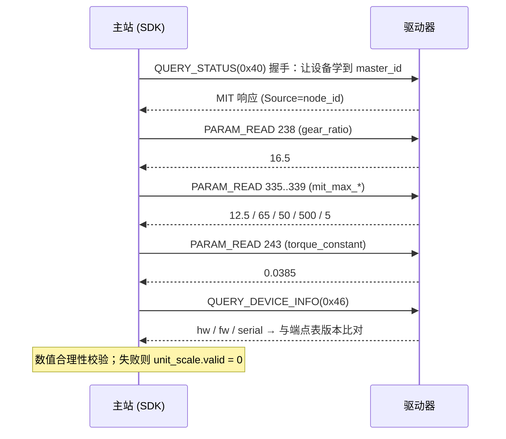
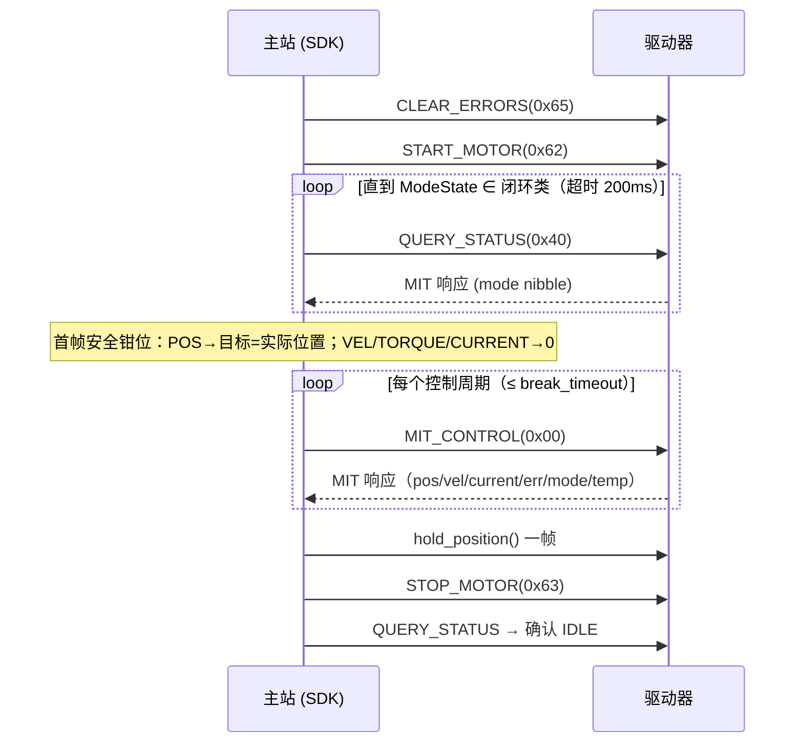
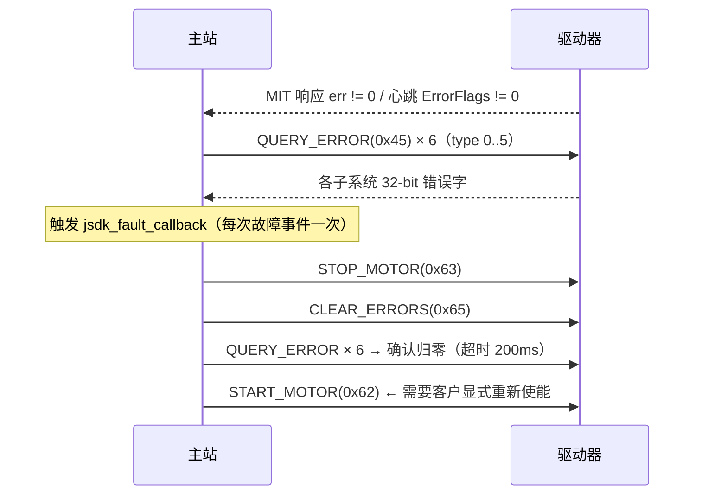

# CYBERBEAST 协议实现者手册（PROTOCOL_NOTES）

> **读者**：实现 `src/proto_cyberbeast/*` 的人，以及需要判断"异常到底出在哪一层"的工程师。
> **用途**：把固件里的字节级事实集中到一处，实现时不必反复翻 `can_cyberbeast.cpp`。
> **权威来源**（有冲突时以此为准，本手册为转录）：
> - `ODrive/Firmware/communication/can/can_cyberbeast.hpp`（常量/枚举/位布局）
> - `ODrive/Firmware/communication/can/can_cyberbeast.cpp`（行为）
> - `ODrive/docs/cyberbeast-protocol.md`（v2.4，面向客户）
> - `ODrive/Firmware/autogen/endpoints.hpp`（设备实际服务的端点 JSON）
>
> 本手册中的"⚠"标记表示**与直觉或与文档描述不一致**之处，必须按手册实现。

---

## 1. CAN ID 编解码

29-bit 扩展 ID，**唯一**的元数据载体（帧内无协议头）：

```
 bit  28..26   25..18     17..10       9..2       1..0
     ┌────────┬─────────┬───────────┬─────────┬───────┐
     │Priority│ MsgType │ Dest/Group│ Source  │  Seq  │
     │ 3 bit  │  8 bit  │   8 bit   │  8 bit  │ 2 bit │
     └────────┴─────────┴───────────┴─────────┴───────┘
```

```c
#define JSDK_PRI_SHIFT      26u
#define JSDK_MSGTYPE_SHIFT  18u
#define JSDK_DEST_SHIFT     10u
#define JSDK_SOURCE_SHIFT    2u
#define JSDK_SEQ_SHIFT       0u

static uint32_t cb_make_id(uint8_t pri, uint8_t msgtype, uint8_t dest, uint8_t src, uint8_t seq)
{
    return ((uint32_t)(pri     & 0x07u) << JSDK_PRI_SHIFT)
         | ((uint32_t)(msgtype)          << JSDK_MSGTYPE_SHIFT)
         | ((uint32_t)(dest    & 0xFFu) << JSDK_DEST_SHIFT)
         | ((uint32_t)(src     & 0xFFu) << JSDK_SOURCE_SHIFT)
         | ((uint32_t)(seq     & 0x03u) << JSDK_SEQ_SHIFT);
}
/* 解包同理：((id >> SHIFT) & MASK) */
```

**寻址模式判定**（唯一分界线）：

| 条件 | 含义 | `Dest` 字段语义 |
|---|---|---|
| `MsgType < 0x80` | 单播 | 目标节点 ID（1..254） |
| `MsgType >= 0x80` | 广播 | 8-bit 位图；`0xFF` = 全局（所有节点） |

**接收过滤伪码**（等价于固件 `is_message_for_me`）：

```c
int cb_is_for_me(uint8_t my_node_id, uint32_t id)
{
    uint8_t msgtype = (id >> 18) & 0xFF;
    uint8_t dest    = (id >> 10) & 0xFF;

    if (my_node_id == 0) return 0;                       /* node_id 0 = 禁用 */

    if (msgtype >= 0x80) {                               /* 广播 */
        if (dest == 0xFF) return 1;                      /* 全局 */
        if (my_node_id >= 8) return 0;                   /* ⚠ 仅 1..7 可被位寻址 */
        return (dest & (1u << my_node_id)) != 0;
    }
    return dest == my_node_id;                           /* 单播 */
}
```

> ⚠ 上表的“`Dest` 字段语义”两行要**合起来看**：只有
> `msgtype >= 0x80 && dest == 0xFF` 才是全局广播。对单播类型，`dest = 0xFF`
> 就是字面的“目标节点 255”，不匹配任何设备（没有 node_id 255 的节点）。

**优先级常量**：`CRITICAL=0, EMERGENCY=1, HIGH_CTRL=2, CTRL=3, CONFIG=4, QUERY=5, STATUS=6, LOW=7`。
**发送时优先级选择**（与固件一致）：

| 发送内容 | Priority |
|---|---|
| ESTOP / FAULT_ALERT | `CRITICAL(0)` / `EMERGENCY(1)` |
| MIT / POS / VEL / TORQUE / CURRENT（单播与广播） | `HIGH_CTRL(2)` |
| 参数读写、JSON 描述符 | `CONFIG(4)` |
| 各类查询（0x40..0x47, 0x49） | `QUERY(5)` |

**ID 计算示例**（取自 `docs/cyberbeast-protocol.md` §2.4，已逐个复核）：

| 场景（字段） | ID |
|---|---|
| pri=2, mt=0x00, dest=5, src=1, seq=1 （MIT 点对点） | `0x08001405` |
| pri=2, mt=0x80, dest=0xFF, src=1, seq=2 （MIT 广播，位图全选） | `0x0A03FC06` |
| pri=6, mt=0x48, dest=1, src=3, seq=0 （Dev#3 → Master 1 心跳） | `0x1920040C` |
| pri=0, mt=0xC0, dest=0xFF, src=1, seq=0 （ESTOP 全局广播） | **`0x0303FC04`** |

> ⚠ **上游文档笔误**：`docs/cyberbeast-protocol.md` §2.4 示例 4 写的结果是 `0x003FFC04`，
> 但该值反解出来是 `msgtype=0x0F`，与示例自身的 `(0xC0 << 18)` 矛盾。
> 按公式 `(0<<26)|(0xC0<<18)|(0xFF<<10)|(1<<2)|0` 应为 **`0x0303FC04`**。
> 本 SDK 的黄金向量（`tools/gen_golden_vectors.py` → `tests/data/golden_vectors.h`）
> 用四条示例的**输入字段**独立复算，结果与上式一致。
>
> 另注：示例 1/2 的结果必须配合其 `seq=1` / `seq=2`，否则会差 1~2（`Seq` 是最低 2 位）。

---

## 2. Classic / CAN-FD 判定

**判定发生在设备侧**，且**没有运行时协商**：

```c
/* can_cyberbeast.cpp: init() */
isClassic = (odrv.can_.config_.baud_rate <= 1000000);
```

| 设备 `can.config.baud_rate` | 结果 |
|---|---|
| 10k / 20k / 50k / 100k / 125k / 250k / 500k / 1M | **Classic**，帧长 ≤ 8 B |
| `2000*1000` | CAN FD：1 Mbps 仲裁 / 2 Mbps 数据，BRS = 1 |
| `5000*1000`（**默认**） | CAN FD：1 Mbps 仲裁 / 5 Mbps 数据，BRS = 1 |

**实现要求**：
- 主站必须自己知道对端是 Classic 还是 FD —— 由 `jsdk_context_config_t.is_fd` 显式指定。
- 两端不一致时**帧会被静默丢弃**（没有错误码，只能靠"没有响应"发现）。
  因此 `jsdk_context_configure()` 的握手必须**校验是否有响应**，并给出
  "设备无响应：请检查 is_fd 与波特率是否与设备 can.config.baud_rate 一致" 的提示。
- CAN FD 发送时 `bitrate_switch = 1`、TDC 由驱动处理（SocketCAN 用 `CAN_RAW_FD_FRAMES` + `CANFD_BRS`）。

---

## 3. 通用编码约定

| 约定 | 说明 |
|---|---|
| 帧字段字节序 | **Big-Endian**（Motorola）。CAN ID 位域、`ep_id`、`offset`、`ReqLen`、查询/状态响应（`0x40`/`0x46`/`0x49`）、控制帧的定点与浮点全是 BE。`f32` 也是 BE（IEEE-754 原样 4 字节反序放置） |
| ⚠ 参数值字节序 | **Little-Endian**（第二个例外，**实测修正**）—— `PARAM_READ(0x20)` / `PARAM_WRITE(0x21)` 的**值字节**（单读响应、批量值流、写请求载荷）是小端。证据与实测见 **§3.1** |
| JSON 描述符 | 相关的 `offset / totalLen / crc / chunkOffset` 全为 **Little-Endian**（第三个例外） |
| `f32` 编解码 | `float → memcpy → be_bytes[0..3] = (w>>24, >>16, >>8, &0xFF)`；解码反向 |
| MIT 定点 | 见 §4.1，注意 `kp/kd` 是**无符号**范围 `[0, MAX]` |
| 温度 | `u8`，实际 °C = `值 − 50`，固件钳位到 0..255（即 −50..205 °C） |
| 无帧头/尾巴 | 不存在 CRC、长度前缀、序号校验。`Seq` 字段存在但**无人校验** |

```c
static float cb_be_to_f32(const uint8_t *b)
{
    uint32_t w = ((uint32_t)b[0] << 24) | ((uint32_t)b[1] << 16)
               | ((uint32_t)b[2] <<  8) | (uint32_t)b[3];
    float f;
    memcpy(&f, &w, sizeof f);          /* 依赖 IEEE-754 单精度 */
    return f;
}
static void cb_f32_to_be(float v, uint8_t *b)
{
    uint32_t w;
    memcpy(&w, &v, sizeof w);
    b[0] = (uint8_t)(w >> 24); b[1] = (uint8_t)(w >> 16);
    b[2] = (uint8_t)(w >>  8); b[3] = (uint8_t)(w);
}
```

---

### 3.1 ⚠ 参数值的字节序：小端（实测修正，2026-09-20）

**结论**：`0x20` / `0x21` 的**值字节是小端**，不是大端。上面表格里的
“Big-Endian”只对**帧字段**成立。本节是**修订说明**：协议文档（含上游
`ODrive/docs/cyberbeast-protocol.md:45` 的 P7 与 `:326`–`:328` 的“约定”）
写的“全协议 Big-Endian”与真机不符。

**固件证据**（`ODrive` @ `4ff46135`，`Firmware/communication/can/can_cyberbeast.cpp`）：

| 位置 | 代码 | 含义 |
|---|---|---|
| `cmd_param_read()` `:613`–`:615`、`:631` | `cbufptr_t input_buffer{value_buf, 0}` → `endpoint_handler(...)` → `std::memcpy(&txmsg.buf[4], &value_buf[offset], actual_data_len)` | 端点内存**原样**进载荷 |
| `cmd_param_read_batch()` `:689`–`:693` | 同上（逐端点 `endpoint_handler` 后紧密拼接） | 批量值流同样是小端 |
| `cmd_param_write()` `:765`–`:768` | `cbufptr_t input_buffer{&msg.buf[4], size_t(data_len)}` → `endpoint_handler(...)` | 载荷**原样**写回端点内存 |
| `cmd_param_write_segmented()` `:790` | 分段写复用同一条路径 | 分块拼接后同样是小端 |

`endpoint_handler()` 是**内存序列化**，不做字节序归一；目标是 ARM Cortex-M（小端），
所以线上就是小端。控制帧/查询响应里的“大端”是固件**手写拆字节**的结果
（`float_to_uint`、`float_to_big_endian_bytes` 等）—— 与参数通路是**两套代码**，
所以这个不一致是真实的、且稳定的。

**真机实测**（slcan + CANable，node 1，`fw_version = 1544`）：

| 端点 | 线上原始字节 | 按大端解 | 按**小端**解 | 真值 |
|---|---|---|---|---|
| `axis0.config.can.node_id`（180, u32） | `01 00 00 00` | 16777216 | **1** | 1 |
| `axis0.config.can.heartbeat_rate_ms`（182, u32） | `64 00 00 00` | 1677721600 | **100** | 100 |
| `axis0.motor.config.gear_ratio`（242, f32） | `00 00 F8 40` | 8.90553e-41 | **7.75** | 7.75 |
| `0x46` 查询响应的 `fw_version` | `00 00 06 08` | **1544** | 134610944 | 1544 |

最后一行是**反证**：同一台设备上，查询响应必须按大端解才合理 —— 所以不是“整个协议
都反了”，而是“**参数通路与帧字段是两套字节序**”。

前两行还与**修复前的症状**数值吻合，可以直接当交叉验证用：
改前 `read` 打印的 `8.90553e-41` **正是** `00 00 F8 40` 按大端解的结果（浮点位模式精确对应，
误差 0.0000%），而它按小端解就是改后读到的 `7.75` —— 即“修复后的值”与“修复前的垃圾值”
互为字节反序，不是“调到好看了”。

> ⚠ 顺便纠正一个**夹具引起的错觉**：项目夹具里 `gear_ratio` 一直是 **16.5**，
> 文档里也拿 16.5 当参照（本表初稿就写错过）。真机的值是 **7.75**。
> 凡是“物理量换算/刚度/限幅”类结论，最终必须以**真机读回的标定值**为准。

**影响面**：`read` / `batch-read` / `dump-config` / `configure()` 的标定读取
（`gear_ratio`、`cpr`、`pole_pairs`、`torque_constant`、`mit_max_*`）/ SDO 缓冲区 /
Python `param_get`。读错字节序**不报错**，只会得到“看着像数值”的垃圾
（如 `gear_ratio = 8.9e-41`），而标定检查会把它当成“参数超范围”，
把矛头指向标定解析（本项目就踩过：一度以为真机固件与描述符对不上）。

**处理方式（本 SDK，不改固件）**：值编解码统一走 `cb_le_get_*()` / `cb_le_put_*()`
（`src/proto_cyberbeast/cb_frame.c`，说明与证据注释在 `cb_frame.h`），
帧字段继续用 `cb_be_*()`。回归用例把线上**原始字节**钉死在 `tests/test_hal_virtual.c`
的 `[7] param access`（`node_id` 读到 `01 00 00 00`、批量值流 `64 00` / `00 20 00 00`、
分段写分块字节）。固件侧已登记为 **F27**（`FIRMWARE_ISSUES.zh-CN.md`）。

---

## 4. 实时控制帧

### 4.1 MIT_CONTROL (0x00) / MIT_CONTROL_BCAST (0x80)

**方向** M→D　**载荷** 8 B / 设备（广播时为 8 B × N 槽）

> ⚠ 固件**不用 CAN ID 的 `Seq` 传输位置**：广播时槽位由 `node_id` 直接决定。

**广播槽位规则**（FD）：

```
byte  0..7   槽位 0  → node_id 0（禁用，实际不使用）
byte  8..15  槽位 1  → node_id 1
byte 16..23  槽位 2  → node_id 2
...
byte 56..63  槽位 7  → node_id 7
slot = node_id
```

固件侧校验：`msg.len < (slot + 1) * 8` → **直接丢弃**。因此广播帧必须填到
`(max_node_id + 1) * 8` 字节；**未使用槽位也不能省略**（用安全值填充）。

> ⚠ **容易被字节数坑到**：因为槽位号就是 `node_id`，而设备 0 不存在，所以头 8 字节
> 永远属于“空槽”。发送 1~7 号设备（位掩码 `0xFE`）的 FD 广播必须凑够 **64 字节**，
> 不能只发 7×8=56 字节——否则 7 号设备读不到自己的槽位（固件会因 `len < 64` 直接丢帧）。
> 对应 API：`cb_mit_bcast_frame_len(max_node_id_in_mask)`。

**Classic 广播**：只有槽位 0，所有被位掩码选中的设备执行**同一条**指令（长度 8 即可）。

**单播**：`slot = 0`。

> ⚠ **`Dest = 0xFF` 是全局广播，不是“位图全选”**。固件 `is_message_for_me()` 的判断顺序是
> 先看 `dest == 0xFF` → 直接返回 true（含 `node_id >= 8`），再看位图。因此无法用位图
> “只选 1~7 号而排除 8 号以上”——那需要 `dest = 0xFE`（bit0 自然为 0）。

**编码数值语义（SDK 与固件的唯一有意差异）**：

| | 固件 `float_to_uint` | SDK `cb_mit_f2u` |
|---|---|---|
| 量化 | **向零截断** | **四舍五入**（对称远离零） |
| 越界 | **不钳位 → 掩码回绕** | **饱和到量程边界** |
| 误差 | 最大 1.0 LSB | 最大 0.5 LSB，且 `pack(unpack(b)) == b` 幂等 |

固件的截断语义由 `cb_mit_f2u_raw()` 单独保留，仅用于诊断与向量对拍。
回绕的实测危害：`+12.625 rad`（仅超 1%）→ 掩码后解码为 `−12.376 rad`；
`+50.5 N·m` → `−49.5 N·m`（反向满力矩）。因此 SDK 侧**必须**钳位，并通过
`cb_mit_pack_command(..., &clamped)` 把“命令已被修正”这一事实告诉调用方。

> ✅ **已决议（2026-09-19）**：保持 SDK 侧四舍五入。后续会修改固件 `float_to_uint()`
> 为四舍五入，使两侧完全一致；届时 SDK 无需改动，但 `cb_mit_f2u_raw()` 的
> “固件复刻”语义需同步更新。

**编解码**：

```c
/* 定点：x ∈ [x_min, x_max] → [0, 2^bits - 1]，越界钳位 */
static int32_t cb_f2u(float x, float x_min, float x_max, int bits)
{
    float span = x_max - x_min;
    int32_t maxv = (1 << bits) - 1;
    int32_t v = (int32_t)((x - x_min) * (float)maxv / span);
    if (v < 0) v = 0;
    if (v > maxv) v = maxv;
    return v;
}
static float cb_u2f(int32_t v, float x_min, float x_max, int bits)
{
    return (float)v * (x_max - x_min) / (float)((1 << bits) - 1) + x_min;
}

/* 编码（BE 位打包） */
void cb_pack_mit(uint8_t *b, float pos, float vel, float kp, float kd, float tau,
                 float pmax, float vmax, float kpmax, float kdmax, float tmax)
{
    int32_t p  = cb_f2u(pos, -pmax, pmax, 16);
    int32_t v  = cb_f2u(vel, -vmax, vmax, 12);
    int32_t kp_= cb_f2u(kp,   0.0f, kpmax, 12);
    int32_t kd_= cb_f2u(kd,   0.0f, kdmax, 12);
    int32_t t  = cb_f2u(tau, -tmax, tmax, 12);

    b[0] = (uint8_t)(p >> 8);
    b[1] = (uint8_t)(p);
    b[2] = (uint8_t)(v >> 4);
    b[3] = (uint8_t)(((v & 0x0F) << 4) | ((kp_ >> 8) & 0x0F));
    b[4] = (uint8_t)(kp_);
    b[5] = (uint8_t)(kd_ >> 4);
    b[6] = (uint8_t)(((kd_ & 0x0F) << 4) | ((t >> 8) & 0x0F));
    b[7] = (uint8_t)(t);
}

/* 解码（解开同样布局） */
void cb_unpack_mit(const uint8_t *b, float *pos, float *vel, float *kp, float *kd, float *tau,
                   float pmax, float vmax, float kpmax, float kdmax, float tmax)
{
    int32_t p  = ((int32_t)b[0] << 8) | b[1];
    int32_t v  = ((int32_t)b[2] << 4) | (b[3] >> 4);
    int32_t kp_= ((int32_t)(b[3] & 0x0F) << 8) | b[4];
    int32_t kd_= ((int32_t)b[5] << 4) | (b[6] >> 4);
    int32_t t  = ((int32_t)(b[6] & 0x0F) << 8) | b[7];
    *pos = cb_u2f(p,  -pmax, pmax, 16);
    *vel = cb_u2f(v,  -vmax, vmax, 12);
    *kp  = cb_u2f(kp_, 0.0f, kpmax, 12);
    *kd  = cb_u2f(kd_, 0.0f, kdmax, 12);
    *tau = cb_u2f(t,  -tmax, tmax, 12);
}
```

**线上单位**（`pos/vel/tau` 是**输出端**）：

| 量 | 单位 | 满量程来源 |
|---|---|---|
| `pos` | rad（输出端） | `mit_max_pos`（端点 335，默认 12.5） |
| `vel` | rad/s（输出端） | `mit_max_vel`（端点 336，默认 65.0） |
| `kp` | —（无符号） | `mit_max_kp`（端点 338，默认 500.0） |
| `kd` | —（无符号） | `mit_max_kd`（端点 339，默认 5.0） |
| `tau` | N·m（输出端） | `mit_max_torque`（端点 337，默认 50.0） |

**固件内部换算**（`mit_control_cmd`）：

```
motor_pos    = pos * gear_ratio / (2π)
motor_vel    = vel * gear_ratio / (2π)
motor_torque = tau / gear_ratio
kp, kd       = 原样传入（⚠ 见 §7 坑 1）
controller.control_mode = POSITION_CONTROL
controller.input_mode   = INPUT_MODE_MIT (9)
```

> ⚠ **发送 MIT 帧不会改变 `requested_state`**。若轴处于 IDLE，指令只改配置、不会出力，
> 但设备**仍会回复**。必须先 `START_MOTOR(0x62)`。

**响应**：单播立即回复（见 §4.2）。广播**不回复**（`master_id != 0 && !is_bcast` 才回）。

---

### 4.2 MIT 响应帧（MsgType 0x00，8 B）

> ⚠ **`0x00 / 0x01 / 0x02 / 0x03 / 0x40 / 0x49` 的回复 MsgType 都是 `0x00`**。必须按
> `(Source, Priority=HIGH_CTRL, MsgType=0x00)` 分派，并容忍"未请求的响应"。

```
[0] pos[15:8]
[1] pos[7:0]
[2] vel[11:4]
[3] vel[3:0] << 4 | err[3:0]
[4] cur[11:4]
[5] cur[3:0] << 4 | mode[3:0]
[6] motor_temp u8  (实际 °C = 值 − 50)
[7] mos_temp   u8  (实际 °C = 值 − 50)
```

```c
int32_t p   = ((int32_t)b[0] << 8) | b[1];
int32_t v   = ((int32_t)b[2] << 4) | (b[3] >> 4);
uint8_t err = b[3] & 0x0F;
int32_t c   = ((int32_t)b[4] << 4) | (b[5] >> 4);
uint8_t mode= b[5] & 0x0F;
int8_t  t_m = (int8_t)b[6] - 50;
int8_t  t_f = (int8_t)b[7] - 50;

pos_rad = cb_u2f(p, -pmax, pmax, 16);   /* 输出端 rad */
vel_rps = cb_u2f(v, -vmax, vmax, 12);   /* 输出端 rad/s */
```

**电流解码**（关键，量程不是固定值）：

```c
/* 固件 pack_mit_response */
float max_current = 40.0f;                    /* 回退值 */
if (torque_constant > 0.001f) {
    max_current = mit_max_torque / torque_constant;
    if (max_current > 80.0f) max_current = 80.0f;
}
current_A = cb_u2f(c, -max_current, max_current, 12);
```

→ **SDK 必须读 `torque_constant`（端点 243）**，否则电流/力矩全部错。
读不到时按 ±40 A 解码并在反馈中置位 `JSDK_JF_SCALE_INVALID`。

**ErrorCode（4-bit）**：

| 值 | 含义 | 备注 |
|---|---|---|
| 0 | NONE | |
| 1 | MOTOR | |
| 2 | ENCODER | |
| 3 | CONTROLLER | |
| 4 | UNDER_VOLTAGE | ⚠ 过压（`DC_BUS_OVER_VOLTAGE`）也映射到此处 |
| 5 | OVER_TEMP | |
| 6 | OVER_CURRENT | |
| 7 | STALL | |
| 8 | CAN_TIMEOUT | ⚠ `ERROR_ESTOP_REQUESTED` 与 `ERROR_CAN_BUS_FAILED` 都映射到此处 |
| 0xF | MULTIPLE | 多个子系统同时报错 |

→ 精确原因必须靠 `QUERY_ERROR(0x45)`（§4.11）。

**ModeState（4-bit）**：`0=RESET, 1=CALIBRATING, 2=IDLE, 3=CLOSED_LOOP, 4=MIT, 5=POSITION, 6=VELOCITY, 7=TORQUE`。

**发送时的 ID**：`Priority = HIGH_CTRL(2)`、`MsgType = 0x00`、`Dest = 请求方 master_id`、
`Source = 本机 node_id`、`Seq` 每轴滚动 `(seq+1)&3`（仅此帧递增）。

**位置量程提示**：`pos` 为 16-bit 定点，满量程 `±mit_max_pos`（默认 ±12.5 rad）。
超出量程的**真实位置**会在线上被钳位 → SDK 不应据此判断"位置回绕"，
`pos_unwrap` 默认关闭。

---

### 4.3 POS_CONTROL (0x01) / POS_CONTROL_BCAST (0x81)

**方向** M→D

| 模式 | 载荷 | 布局 |
|---|---|---|
| CAN FD | 12 B | `[0..3] f32 目标位置【度，输出端】`　`[4..7] f32 速度限制【RPM，输出端】`　`[8..11] f32 电流限制【A】` |
| Classic | 8 B | `[0..3] f32 目标位置【度】`　`[4..5] i16 速度限制【RPM】`　`[6..7] i16 电流限制【0.1 A】` |

⚠ Classic 下 **长度不足 8 字节直接丢弃**；FD 下**不足 12 字节直接丢弃**。

**固件内部换算**：

```
motor_target_turns = 度 / 360 × gear_ratio
motor_vel_limit    = RPM / 60 × gear_ratio
controller.control_mode   = POSITION_CONTROL
controller.input_mode     = INPUT_MODE_POS_FILTER (3)
controller.config.vel_limit  = motor_vel_limit        ← ⚠ 持久改写（不落 Flash）
motor.config.torque_lim      = cur_limit_A × torque_constant  ← ⚠ 同上
```

**响应**：MIT 响应格式。

**SDK 单位映射**：`rad → 度 = rad × 180/π`；`rad/s → RPM = rad/s × 60/(2π)`。

---

### 4.4 VEL_CONTROL (0x02) / VEL_CONTROL_BCAST (0x82)

**方向** M→D　**载荷** 8 B（Classic 与 FD 相同）

```
[0..3] f32 目标速度【RPM，输出端】
[4..7] f32 电流限制【A】
```

**固件内部换算**：

```
motor_target = RPM / 60 × gear_ratio
controller.control_mode = VELOCITY_CONTROL
controller.input_mode   = INPUT_MODE_VEL_RAMP
motor.config.torque_lim = cur_limit_A × torque_constant   ← ⚠ 持久改写
```

**响应**：MIT 响应格式。

---

### 4.5 TORQUE_CONTROL (0x03) / TORQUE_CONTROL_BCAST (0x83)

**方向** M→D　**载荷** 4 B

```
[0..3] f32 目标力矩【N·m，**电机端**】
```

**固件**：`control_mode = TORQUE_CONTROL`、`input_mode = TORQUE_RAMP`、
`input_torque_ = 原值`（**不做任何换算**）。

> ⚠ **本帧的力矩是电机端，而 MIT 帧是输出端** —— 两者相差一个 `gear_ratio`！
> MIT 路径做的是 `motor_torque = torque / gear_ratio`（输出端 → 电机端），
> 而本帧直接把值赋给 `input_torque_`。固件此处**不一致**；
> SDK 只忠实转发，L3 必须分别按对端换算（见 §4.7）。

**响应**：MIT 响应格式。

---

### 4.6 CURRENT_CONTROL (0x04)

**方向** M→D　**载荷** 4 B

```
[0..3] f32 目标电流【A，电机端】
```

**固件**：与力矩控制同路径，但值先乘 `torque_constant`。

> ⚠ 三条重要限制：
> 1. **不回复**（无反馈）；参考工具 `cyberbeast_tool.py` 也只用 `send_cmd()` 发送、不等响应；
> 2. **不刷新控制类超时计时器 `last_cmd_time_`**（因为 `is_ctrl` 不含 `0x04`）；
> 3. 没有对应的广播类型（无 `0x84`）。
>
> ❌ **两个曾经写错的结论，已按源码逐行核实：**
>
> **(a) 不是“不喂看门狗”。** 固件 `do_command()` 开头就**无条件**调
> `axis.watchdog_feed()`，**任何**发往该设备的帧都喂驱动器自身的看门狗。
> 那是**另一套**机制（`axis.config_.watchdog_timeout`），与下面这个协议级
> 超时（`can.config.break_timeout`）互不相干。
>
> **(b) 不是“纯电流控制会被打断”，而是相反——安全阀根本不会武装！**
> `auto_stop_if_timeout()` 的第一句就是 `if (last_cmd_time_[i] == 0) return;`，
> 而 `last_cmd_time_` **只**由 `is_ctrl` 帧（`msgtype ≤ 0x03` 或 `0x80..0x83`）更新。
> 于是：
>
> | 客户端行为 | `last_cmd_time_` | 后果 |
> |---|---|---|
> | **只发 CURRENT** | 始终为 0 | **超时保护永不生效** —— CAN 掉线也不会 auto-stop（安全缺口 F19） |
> | 先发过一条 MIT/POS/VEL/TORQUE，之后只发 CURRENT | 已武装 | 计时器过期 → `ERROR_CAN_BUS_FAILED` + `disarm()`，**尽管 CURRENT 一直在发** |
>
> → SDK 的 `auto_keepalive` 必须周期插入一条 **`is_ctrl`** 帧（推荐 MIT），
> 才能两头兼顾：既武装超时保护，又不被它误停。
>
> ⚠ 附带一个哨兵歧义：`last_cmd_time_ == 0` 同时表示“从未收到”与“开机第 0 ms 收到”。
> 虚拟 HAL 因此把时钟起点定在 **1 ms**（见 `hal_virtual.c`）。

---

### 4.7 单位对照（⚠ 同一个物理量在不同帧里单位不同）

固件有两套 `gear_ratio` 相关的转换路径，**不统一**。下表已逐条对着固件源码核实：

| 帧 | 位置 | 速度 | 力矩 / 电流 |
|---|---|---|---|
| MIT 命令 (0x00) | **输出端** rad | **输出端** rad/s | 力矩 **输出端** N·m |
| MIT 响应（含 0x40、所有控制帧的应答） | **输出端** rad | **输出端** rad/s | 电流 电机端 A |
| POS_CONTROL (0x01) | **输出端** 度 | **输出端** RPM | 电流限制 电机端 A |
| VEL_CONTROL (0x02) | — | **输出端** RPM | 电流限制 电机端 A |
| TORQUE_CONTROL (0x03) | — | — | 力矩 **电机端** N·m ⚠ |
| CURRENT_CONTROL (0x04) | — | — | 电流 **电机端** A |
| QUERY_POS_VEL (0x41) | **电机端** turns | **电机端** turns/s | — |
| 心跳 (0x48) | **电机端** turns | **电机端** turns/s | 电流 电机端 A |

根源：MIT 响应走 `pos_out = pos * 2π / gear_ratio`（已转输出端），
而 `QUERY_POS_VEL` 与心跳直接透传 `pos_estimate_linear_src_`（电机端 turns，未转）。

→ **L3 归一化不能只写一个转换函数**；位置/速度要按帧分两类，力矩要按帧分两类。

---

## 5. 参数访问

### 5.1 端点模型

参数以 **endpoint ID（u16）** 寻址，不是 index/subindex。
端点 ID 由固件按 JSON 描述符顺序分配，**跨固件版本可能漂移**（见 §6）。

### 5.2 PARAM_READ (0x20) — 单读（分段）

**请求**（8 B）：

```
[0]     flags      (bit7 = More 由设备置位；主站请求时置 0)
[1..2]  ep_id      u16 BE
[3]     req_len    u8，本次请求字节数
[4..7]  offset     u32 BE，本段起始字节偏移
```

**响应**（≤8 B）：

```
[0]     flags      bit7 = 0x80 → 还有后续段
[1..2]  ep_id      u16 BE
[3]     data_len   u8，本段返回字节数
[4..]   value      本段数据（**值字节 = 小端**，见 §3.1）
```

主站循环：`offset += data_len`，直到响应 `flags.bit7 == 0`。

> ⚠ Classic 模式：`req_len` 被钳到 ≤ 4（4 头 + 4 值 = 8）。
> `req_len == 0` 按 4 处理（兼容旧版）。

### 5.3 PARAM_READ (0x20) — 批量（仅 CAN FD）

**请求**：

```
[0]     flags = 0x40 (PARAM_READ_FLAG_BATCH)
[1]     count u8，N ≤ 31
[2..]   N × ep_id (u16 BE)      共 2 + 2N ≤ 64
```

**响应**：

```
[0]     flags
[1]     count
[2..]   valid_bitmap：⌈N/8⌉ 字节，bit=0 表示该端点无效
[..]    value 流：按请求顺序紧密排列，**无回显**；
        每个值的字节序 = **小端**（同 §3.1）；
        无效端点不贡献任何字节（保持流对齐）
```

**错误语义**：

| 现象 | 含义 | 主站应对 |
|---|---|---|
| `flags & 0x20`（ERR）、`count = 0`、**无部分数据** | 装不下（`2 + ⌈N/8⌉ + Σlen > 64`）或某端点不存在 | 按类型长度**重新拆分**为更小的批次 |
| Classic 收到批量请求 | 设备恒回 ERR | 回退为逐条单读 |

**实现要求**：
- 批量请求的分组必须知道每个端点的**类型长度**（f32=4, u8=1, u16=2, u32=4, u64=8, bool=1）。
  这些来自运行时解析的 JSON 描述符（见 §9.2）；**SDK 不内置任何端点表**。
- 无分页（没有 More 标志）：SDK 自己按 `≤64` 预算分组，一次请求对应一次响应。

### 5.4 PARAM_WRITE (0x21)

**请求**：

```
[0]     flags      (Classic 分段时 bit7 = More)
[1..2]  ep_id      u16 BE
[3]     len        u8，本段值字节数
[4..]   value      本段值（**小端**，见 §3.1）
```

**ACK**（8 B）：

```
[0] flags | [1..2] ep_id | [3] 0 | [4..7] 00 00 00 00
```

**Classic 且 `data_len > 4`** → 自动分段：每块 4 字节，末块 `flags.bit7 = 0`。

> ⚠⚠ **最短请求帧 = 8 字节**（即"负载总长 = 4 + 值宽"必须 ≥ 8，也就是**值宽 ≥ 4**）。
> 固件 `cmd_param_write()` 的**第一句**是
> `if (msg.len < 8) return;` —— 不足 8 字节的参数写帧被**整帧静默丢弃**：
> 既不回 ACK、也不改值、也不报错。于是 `bool`(5 B) / `u8`(5 B) / `u16`(6 B)
> 端点的写入全都"看着成功、实际没写进去"，而 `u32`/`f32`(8 B) 恰好正常 ——
> 极难定位（本项目为此查了很久，见 `FIRMWARE_ISSUES` F28）。
> 主站两种合规做法：
> ① 值宽 < 4 时把帧**补零到 8 字节**（`dst[3]` 仍写**真实**值宽 —— SDK 的做法）；
> ② 用 Classic 的分段形式凑够 8 字节。
> ⚠ 固件对短帧**不回任何错误**，所以主站**不能**靠"有没有 ACK"判断这一帧是否被接受；
> 写后读回是唯一的确认手段。

> ⚠ 设备侧装配状态（`ParamWriteAsmState`）在下列情况会**中止**：
> 丢块、端点 ID 变化、主站 ID 变化。
> → SDK 必须逐块串行发送，且**同一装配过程中不得插入其他参数写**。

### 5.5 CONFIG_SAVE (0x22) / CONFIG_RESET (0x23)

> ⚠⚠ **`axis0.current_state`（端点 142）在跑序列时报的是“子状态”。**
> 真机实测（fw 1545）写 `requested_state = 3`（FULL_CALIBRATION_SEQUENCE）后：
> `current_state` 走 **4（MOTOR_CALIBRATION）→ 7（ENCODER_INDEX_SEARCH）→ 1（IDLE）**，
> **从不等于 3**，整条序列约 **29.5 s**；而 `requested_state` 在 1 ms 内就被**消费**回 0。
> 推论：
> * 上位机**不能**用“`current_state == 3`”当“已进入标定”的判据 —— 会得到
>   “写进去了但状态不动”的假象；正确判据是“**离开静息态**（IDLE/CLOSED_LOOP_CONTROL）”。
> * 回到静息态**不等于成功**：失败路径就是“进子状态 → 出错 → 回静息”，
>   成败要看 `axis0.error` / QUERY_ERROR(0x45) 的明细位。
> * 回零（`requested_state = 11`）则**确实**停 11，跑完停在 8（CLOSED_LOOP_CONTROL）。

**载荷**：无　**响应**：无

- `0x22` → `odrv.save_configuration()`
- `0x23` → `odrv.erase_configuration()`（恢复出厂**并重启**）

> ⚠ 无 ACK。SDK 的实现：发送后等待若干周期，再读回一个参数做**间接校验**。

### 5.6 JSON_DESC_READ (0x24) / JSON_DESC_DATA (0x25)

**请求**（4 B）：`[0..3] offset u32 **Little-Endian**`

**响应流**（MsgType `0x25`）：

| 类型 | 布局 | 判别 |
|---|---|---|
| 元数据帧 | `[0..1] = 00 00`　`[2..5] totalLen u32 **LE**`　`[6..7] crc u16 **LE**` | 第 0、1 字节为 0 且 `chunkOffset == 0` |
| 数据帧 | `[0..1] chunkOffset u16 **LE**`　`[2..] json 文本（Classic ≤6 B / FD ≤62 B）` | 其余情况 |

**约束与实测行为**：
- 一次请求即触发**自主流式发送**：设备在 `service_stack()` 内每 ms 最多发
  `kMaxJsonFramesPerCycle = 50` 帧，自己递增 `json_desc_.offset`，**不需主站逐块请求**。
- 传输期间 `json_desc_.active = true`，JSON 发送**优先于心跳**；此时 TX 被占满，会挤掉控制帧
  → **严禁在关节使能状态下下载**（否则看门狗 `break_timeout` 会触发 disarm）。
- `crc` 为 `fibre::json_crc_`（`VersionCRC`），是缓存与多节点共享的键。
- 主站再次发 `0x24` 会**重置**传输（`metadata_sent = false`，`offset` = 请求值）。
- 全部发完（`offset >= embedded_json_length`）后设备自动清理状态。

**实测规模与耗时**（`embedded_json_length = 41029`，`embedded_json` 来自 `Firmware/autogen/endpoints.hpp`）：

| 项 | CAN FD（`frame_len = 64`） | Classic（`frame_len = 8`） |
|---|---|---|
| 每帧 JSON 载荷（`frame_len - 2`） | 62 B | 6 B |
| 帧数 | 1 元数据 + **662** 数据 | 1 元数据 + **6839** 数据 |
| 设备侧发送下限 | ≥14 ms（50 帧/ms） | ≥137 ms |
| 总线耗时（估） | ≈0.1~0.2 s @1M/5M | ≈1~2 s @1M / ≈3~4 s @500k |

> ⚠ `chunkOffset` 仅为 **u16 LE**，上限 65535。当前 41029 已占 62%；
> 若固件把 JSON 扩到 64 KB 以上，协议会**静默回绕**。
> SDK 侧应在 `totalLen > 65535` 时直接拒绝（不向固件提需求，自行规避）。

> ⚠ **元数据帧与 `offset = 0` 的数据帧不能靠 `buf[0..1]` 区分**（两者均为 `00 00`）。
> **可靠判别规则**：数据帧的 `buf[2]` 是 JSON 首字节，恒为 `'{'` (0x7B)；元数据帧的 `buf[2]` 是
> `totalLen` 的 LSB（41029 → `0x45`），不可能是 `'{'`（除非长度巧合）。因此：
> `buf[2] == '{'` → 数据帧；否则 → 元数据帧。再叠加两条兜底：
> ① 每次请求后第一帧必为元数据帧；② `total_len ∈ [1, 65535]` 且解析结果自洽（根元素数 > 0）。
> 三者同时成立才接受，否则整体失败——**绝不接受部分解析结果**。

---

## 6. 状态查询与心跳

### 6.1 查询族

| MsgType | 请求载荷 | 响应载荷 | 响应 MsgType |
|---|---|---|---|
| `0x40` QUERY_STATUS | 无 | **MIT 响应格式**（8 B） | `0x00` |
| `0x41` QUERY_POS_VEL | 无 | `f32 pos[**电机 turns**] + f32 vel[电机 turns/s]` | `0x41` |
| `0x42` QUERY_CURRENT | 无 | `f32 Iq[A] + f32 Id_setpoint[A]` ⚠ 第二项是**给定值** | `0x42` |
| `0x43` QUERY_TEMPERATURE | 无 | `f32 电机°C + f32 FET°C` | `0x43` |
| `0x44` QUERY_BUS | 无 | `f32 Vbus[V] + f32 Ibus[A]` | `0x44` |
| `0x45` QUERY_ERROR | `1 B errorType` | `[0] type 回显 + [1..3] 00 + [4..7] u32 BE 错误字` | `0x45` |
| `0x46` QUERY_DEVICE_INFO | 无 | FD 16 B：`hw u32 + fw u32 + serial u64`；Classic 8 B：`hw u32 + fw u32` | `0x46` |
| `0x47` QUERY_POWER | 无 | `f32 电功率 W + f32 机械功率 W` | `0x47` |
| `0x49` STATUS_FEEDBACK | 无 | **MIT 响应格式**（8 B） | `0x00` |

`0x45` 的 `errorType`：`0 motor / 1 encoder / 2 sensorless / 3 controller / 4 system(ODrive) / 5 axis`。

> ⚠ 只有 `0x40` 与 `0x49` 的回复是 `MsgType 0x00`；`0x41`..`0x47` 的回复带**自己的** MsgType，
> 且 `Priority = QUERY`、`Seq = 0`。混用会导致解复用错误。

> ⚠ `0x41` 与心跳是**电机端 turns**，`0x40`/`0x49`/MIT 响应是**输出端**。
> SDK 统一转输出端：`rad = turns × 2π / gear_ratio`。

### 6.2 HEARTBEAT (0x48)

**方向** D→M　**发送时机** 由 `axis0.config.can.heartbeat_rate_ms` 决定（默认 100，0 = 关闭）
（⚠ 所有轴都用 **axis0** 的配置值）

**目的地址**：`master_ids_[axis]`，即设备**最后见到的**主站 Source；
尚未见到任何主站时默认发往 `0x01`。

> ⚠ **主站必须先发至少一帧**，否则收不到心跳（除非本机 master_id == 1）。
> ⚠ 设备复位后会忘记 master_id，需重新握手。

**Classic（8 B）**：

```
[0]    Life[7:5] | ErrorFlags[4:0]
[1]    current_state[7:4] | control_mode[3:0]
[2]    motor_temp u8（−50 偏移）
[3..4] pos  i16 BE  【电机 turns × 100】
[5..6] vel  i16 BE  【电机 turns/s × 100】
[7]    Iq   i8      【0.5 A/bit】
```

**CAN FD（18 B）**：

```
[0]     Life[7:5] | ErrorFlags[4:0]
[1]     current_state[7:4] | control_mode[3:0]
[2]     motor_temp u8（−50）
[3]     mos_temp   u8（−50）
[4..5]  Vbus   u16 BE  【0.1 V】
[6..7]  Ibus   i16 BE  【0.01 A】
[8..11] pos    i32 BE  【电机 turns × 10000】
[12..15] vel   i32 BE  【电机 turns/s × 10000】
[16..17] Iq    i16 BE  【0.01 A】
```

`Life[7:5]` 是 3-bit 滚动计数（0..7），可用于检测设备是否重启（值跳变 ≠ 正常递增）。

**ErrorFlags**：`AXIS=0x01, MOTOR=0x02, ENCODER=0x04, CONTROLLER=0x08, BOARD=0x10`。

> ⚠ 心跳的 `current_state` 是**固件 `AxisState` 枚举**（与 ModeState nibble 不同）。
> 需要 ModeState 语义时请用 MIT 响应或 `QUERY_STATUS`。

---

## 7. 系统管理与广播

| MsgType | 载荷 | 行为 | 响应 |
|---|---|---|---|
| `0x60` SET_NODE_ID | `[0] 新 ID (1..0xFE)` | 改 `axis.config.can.node_id`，**不落 Flash** | 无 |
| `0x61` SET_ZERO | 无 | `encoder_.set_current_pos_zero()` | 无 |
| `0x62` START_MOTOR | 无 | `requested_state = CLOSED_LOOP_CONTROL` | 无 |
| `0x63` STOP_MOTOR | 无 | `requested_state = IDLE` | 无 |
| `0x64` RESET_DEVICE | 无 | 软复位（会断开总线一段时间） | 无 |
| `0x65` CLEAR_ERRORS | 无 | `odrv.clear_errors()`（清全部子系统） | 无 |
| `0xC0` ESTOP | 忽略 | `error \|= ERROR_ESTOP_REQUESTED`；`requested_state = IDLE` | 无 |
| `0xC1` FAULT_ALERT | 忽略 | 同上（固件对两者处理一致） | 无 |

> ⚠ **标定与回零没有专用命令**。必须写 `axis0.requested_state` 端点：
> `3` = FULL_CALIBRATION_SEQUENCE，`11` = AXIS_STATE_HOMING。
> 或在 Flash 里设置 `startup_motor_calibration` 等开机自动执行。

> ⚠ **广播永不回复**（`MsgType ≥ 0x80` 时全部响应被抑制）。
> 广播后的反馈只能靠心跳 + 后续单播查询。

> ⚠ **位掩码寻址上限**：固件 `is_message_for_me` 对广播要求 `node_id < 8`；
> `mit_control_cmd` 对广播 MIT 也要求 `device_id < 8`。
> 因此 **node_id ≥ 8 的节点只能被 `Dest = 0xFF` 全局广播命中，且 MIT 广播会被忽略**
> （`device_id >= MAX_BROADCAST_DEVICES` 直接 return）。
> 而 `ESTAP`/`FAULT_ALERT` 等全局广播对所有 node_id 都有效。

---

## 8. 看门狗（安全关键）

```c
/* can_cyberbeast.cpp: auto_stop_if_timeout() —— 由 service_stack() 每 1 ms 调用 */
if (last_cmd_time_[i] == 0) return;             /* 从未收到过控制帧 → 不检查 */
uint32_t timeout_ms = odrv.can_.config_.break_timeout;
if (timeout_ms == 0) return;                    /* ⚠ 0 = **超时检测被禁用** */
if (now - last_cmd_time_[i] > timeout_ms) {
    axis.error_ |= Axis::ERROR_CAN_BUS_FAILED;
    axis.motor_.disarm();
    last_cmd_time_[i] = 0;                      /* 防止重复触发 */
}
```

> ⚠⚠ **`0` = 禁用（本项曾在项目早期写反）**。最新固件就是上面这四行：`timeout_ms == 0`
> **直接 return**，而且 `ODriveCAN::Config_t::break_timeout` 的**默认值就是 0**
> （`odrive_can.hpp`）⇒ 设备出厂状态是“**没有协议级超时保护**”。
> 早期固件确实把 0 当 100 ms，当时 SDK 也跟着把 0 归一成 100 ms，
> 结果把“未武装”显示成了“已武装 100 ms”（已修正，见 SDK 侧影响一节）。
> 另注：`odrive_can.cpp` 的 Simple/Canopen 路径也是 `if (config_.break_timeout > 0)`。

**哪些帧喂狗**（`is_ctrl`）：

```c
is_ctrl = (msgtype <= 0x03)                                    /* MIT / POS / VEL / TORQUE */
       || (msgtype >= 0x80 && msgtype <= 0x83);                /* 对应的广播 */
/* ⚠ 0x04 CURRENT_CONTROL 不在其中 */
```

**任何被寻址到的帧**（含查询、参数读写）都会调用 `axis.watchdog_feed()` —— 但这是
ODrive 自己的看门狗，与本节的 `break_timeout` 自动停机是**两套**机制。

**SDK 侧时序要求**：

```
t0: 发送第一帧控制指令        → 设备开始计时
t0 + timeout: 若再无控制帧     → 故障 + disarm
```

`auto_keepalive = 1` 时 `cycle_end()` 的补帧逻辑：

```c
if (has_ctrl_frame_this_cycle) {
    last_ctrl_tx = now;                       /* 已喂 */
} else {
    remaining = watchdog_ms - (now - last_ctrl_tx);
    if (remaining <= MAX(2 * period_ms, 10)) {
        send_keepalive_mit();                 /* 目标 = 上次目标，或 实际位置 + 全零增益 */
        stats.keepalive_sent++;
    }
}
```

**配置阶段检查**（`configure()`）：
- 若 `period_ns` 已知 **且设备侧超时 > 0**（`wd != JSDK_WD_DISABLED_MS`）且
  `period_ms >= watchdog_ms` → 返回 `JSDK_ERR_BAD_STATE`
  （控制回路本身就不可能喂住狗，必须让客户先放大 `break_timeout` 或缩短周期）。
  ⚠ `wd == 0`（禁用）时**必须跳过这条** —— 拿 0 去比会恒真，把每个循环命令都拒掉。
- `enable_watchdog_hint = 1` 且**需要时**（当前为 0 = 禁用，或现有超时比周期还短）
  由 SDK 写 `break_timeout = 2 × period_ms`（不落 Flash），写完**读回确认**；
  设备本来设得很宽松时**不碰**它（把 30000 ms 改成 2×周期只会让设备更容易被误停）。

**SDK 侧影响（v0.25 修正）**：

| 位置 | 旧行为（错） | 新行为 |
|---|---|---|
| `jsdk_watchdog_device_ms()` | `0 → 100` | **原样返回 0**（调用方把 0 当“没有门限”） |
| `auto_keepalive` | 总在补帧 | `wd == 0` 时**一帧不补**（无狗可喂，也不置 RISK 位） |
| `configure()` 的周期校验 | `period >= 100` 会被拒 | `wd == 0` ⇒ **跳过校验** |
| `set_watchdog_ms(0)` | 警告“0 不等于关闭” | **真的关闭**（并读回确认） |
| `dump-config` 的 `break_timeout_ms` | 显示 100（与 `read` 显示 0 矛盾） | 显示 **0 = 禁用**，与 `read` 一致 |

---

## 9. JSON 描述符与端点解析

> **v0.4 起：端点 ID 不再硬编码。** SDK 在连接时从设备下载 JSON 描述符并动态解析出全部端点，
> 因此**下表不是权威来源，仅供人工对照与排障**。
> 权威定义 = 设备实际回送的描述符本身；解析算法见 §9.2。

### 9.1 参考样本（v8，axis0）——仅供对照

来源：`Firmware/autogen/endpoints.hpp`（设备**实际服务**的那份，v8 分支）。
v8 列已逐个核对；“0.5.13”列来自 `Firmware/json/endpoints_0.5.13.json`，用于展示漂移。

| 路径 | v8 ID | 0.5.13 | Δ | 类型 | 权限 |
|---|---|---|---|---|---|
| `error` | 1 | 1 | 0 | u8 | rw |
| `vbus_voltage` | 2 | 2 | 0 | f32 | r |
| `ibus` | 3 | 3 | 0 | f32 | r |
| `serial_number` | 5 | 5 | 0 | u64 | r |
| `hw_version_major/minor/variant` | 6 / 7 / 8 | 6 / 7 / 8 | 0 | u8 | r |
| `fw_version_major/minor/revision/unreleased` | 9 / 10 / 11 / 12 | 9 / 10 / 11 / 12 | 0 | u8 | r |
| `can.config.break_timeout` | **73** | 73 | 0 | u16 | rw |
| `axis0.error` | 138 | 134 | +4 | u32 | rw |
| `axis0.current_state` | 142 | 138 | +4 | u8 | r |
| `axis0.requested_state` | **143** | 139 | +4 | u8 | rw |
| `axis0.config.startup_motor_calibration` | 145 | 141 | +4 | bool | rw |
| `axis0.config.startup_encoder_offset_calibration` | 147 | 143 | +4 | bool | rw |
| `axis0.config.startup_closed_loop_control` | 148 | 144 | +4 | bool | rw |
| `axis0.config.startup_homing` | 149 | 145 | +4 | bool | rw |
| `axis0.config.watchdog_timeout` | 153 | 149 | +4 | f32 | rw |
| `axis0.config.enable_watchdog` | 154 | 150 | +4 | bool | rw |
| `axis0.config.can.node_id` | **180** | 176 | +4 | u32 | rw |
| `axis0.config.can.is_extended` | 181 | 177 | +4 | bool | rw |
| `axis0.config.can.heartbeat_rate_ms` | **182** | 178 | +4 | u32 | rw |
| `axis0.config.can.motor_error_rate_ms` | 184 | 180 | +4 | u32 | rw |
| `axis0.motor.error` | 193 | 189 | +4 | u64 | rw |
| `axis0.motor.config.pole_pairs` | 241 | 237 | +4 | i32 | rw |
| `axis0.motor.config.gear_ratio` | **242** | 238 | +4 | f32 | rw |
| `axis0.motor.config.torque_constant` | **247** | 243 | +4 | f32 | rw |
| `axis0.motor.config.current_lim` | 249 | 245 | +4 | f32 | rw |
| `axis0.motor.config.torque_lim` | 251 | 247 | +4 | f32 | rw |
| `axis0.controller.error` | 268 | 263 | +5 | u8 | rw |
| `axis0.controller.config.control_mode` | 287 | 282 | +5 | u8 | rw |
| `axis0.controller.config.input_mode` | 288 | 283 | +5 | u8 | rw |
| `axis0.controller.config.vel_limit` | 301 | 288 | +13 | f32 | rw |
| `axis0.encoder.config.cpr` | 390 | 352 | +38 | i32 | rw |
| `axis0.controller.config.mit_max_pos` | **335** | — | 新增 | f32 | rw |
| `axis0.controller.config.mit_max_vel` | **336** | — | 新增 | f32 | rw |
| `axis0.controller.config.mit_max_torque` | **337** | — | 新增 | f32 | rw |
| `axis0.controller.config.mit_max_kp` | **338** | — | 新增 | f32 | rw |
| `axis0.controller.config.mit_max_kd` | **339** | — | 新增 | f32 | rw |
| `axis0.motor.config.gear_ratio_eff` | 612 | — | 新增 | f32 | rw |

**加粗 = SDK 启动时必须读取的关键端点。**

### 9.1 漂移量化的结论（硬约束）

对 `endpoints.hpp`（v8，594 个端点）与 `endpoints_0.5.13.json`（480 个端点）逐路径比对：

| 指标 | 值 |
|---|---|
| 共有路径 | 471 |
| ID **相同** | 66（14.0%） |
| ID **漂移** | **405（86.0%）** |
| 偏移量分布 | +4：171；+43：111；+5：36；+38：23；+37：17；+22：16；+13/+30/+27/+10 等零散 |

**根因**：端点 ID 由 JSON 描述符的**声明顺序**分配，任何位置插入/删除都会导致其后所有端点整体位移。这同时解释了为何 `mit_max_*`（335..339）只在 v8 存在。

**对 SDK 的硬要求**：

1. **禁止**把端点 ID 当作跳固件稳定的常量。编译期表必须与固件版本强绑定。
2. `configure()` 必须先 `QUERY_DEVICE_INFO(0x46)` 取 `fw u32`：
   - 命中已知版本 → 用该版本的行；
   - 未知版本 → `JSDK_ERR_UNSUPPORTED`，错误串中给出三条出路（升级 SDK / 显式给 ID / 开 JSON 模块）。
3. **最小必需集只有 11 个端点**（见下），因此“客户显式给 ID”是极低成本的逃生通道。
4. 即使版本命中，也要做数值合理性校验：`gear_ratio ∈ [1, 1000]`、`mit_max_pos > 0`、
   `mit_max_torque > 0`、`torque_constant ∈ (0, 1]`。任一不满足 → `JSDK_ERR_PROTOCOL`
   且 `unit_scale.valid = 0`（**绝不用错误量程算出错误力矩**）。

**最小必需集（11 个）**：

| 用途 | 路径 | v8 ID |
|---|---|---|
| 减速比 | `axis0.motor.config.gear_ratio` | 242 |
| 力矩常数（解码电流） | `axis0.motor.config.torque_constant` | 247 |
| MIT 位置量程 | `axis0.controller.config.mit_max_pos` | 335 |
| MIT 速度量程 | `axis0.controller.config.mit_max_vel` | 336 |
| MIT 力矩量程 | `axis0.controller.config.mit_max_torque` | 337 |
| MIT Kp 量程 | `axis0.controller.config.mit_max_kp` | 338 |
| MIT Kd 量程 | `axis0.controller.config.mit_max_kd` | 339 |
| 标定 / 回零 | `axis0.requested_state` | 143 |
| 状态观测 | `axis0.current_state` | 142 |
| 节点地址（校验用） | `axis0.config.can.node_id` | 180 |
| 看门狗超时 | `can.config.break_timeout` | 73 |

> ⚠ `Firmware/json/*.json`（含 `endpoints_0.5.13.json`、`endpoints_v8.json`）是固件构建产物的
> **副本**，旧版本不含 `mit_max_*`；即使是最新的 `endpoints_v8.json` 也不一定是设备二进制里
> 那一份。SDK 生成端点表时必须以**设备实际服务的那份**为准，即
> `Firmware/autogen/endpoints.hpp`。工具 `tools/gen_endpoints.py` 用同样方法解析它，
> 作为 SDK 解析器的**对拍基准**（不再是构建依赖）：
> 拼接其中的 JSON 字符串字面量 → 得到完整 JSON → 递归展开 `members`（本次核对即用此方法）。
> 同时建议 `gen_endpoints.py` 作为**对照校验工具**保留：解析设备 JSON 后与 `endpoints.hpp`
> 对拍，用于回归验证 SDK 解析器（不再是构建依赖，也不再生成任何表）。

### 9.2 描述符结构与解析算法

**JSON 结构**（顶层是数组，元素为节点）：

```json
[
  {"name":"","id":0,"type":"json","access":"r"},
  {"name":"error","id":1,"type":"uint8","access":"rw"},
  {"name":"axis0","type":"object","members":[
      {"name":"motor","type":"object","members":[
          {"name":"config","type":"object","members":[
              {"name":"gear_ratio","id":242,"type":"float","access":"rw"}
          ]}
      ]}
  ]},
  {"name":"get_gpio_states","type":"function","inputs":[],
   "outputs":[{"name":"status","id":476,"type":"uint32","access":"r"}]}
]
```

**路径拼接规则**（与 `endpoints.hpp` 生成器一致）：

| 节点类型 | 路径处理 | 是否产生端点 |
|---|---|---|
| 普通叶子（有 `id` + `type`） | `父路径 + '.' + name` | ✅ |
| `type == "object"` | 递归 `members`，自身无 `id` 则不产生端点 | 仅其叶子 |
| `type == "function"` | 递归 `inputs` / `outputs` | `inputs[i].id` 与 `outputs[i].id` **都会分配 ID**（可枚举，但不可直接读写） |
| `type == "json"` | 根节点占位（`name==""`, `id==0`） | 忽略 |

因此 v8 解析出的平铺端点数 = **594**（含 function 的 inputs/outputs），而非 40（顶层元素数）。

**实测类型分布**（v8，41029 字节原始 JSON 中出现的全部 `type`）：

| type | 次数 | 是否成为端点 | 说明 |
|---|---|---|---|
| `object` | 66 | ❌ | 容器节点，**无 id**，故不进端点表 |
| `float` | 247 | ✅ | |
| `bool` | 88 | ✅ | |
| `uint8` | 57 | ✅ | |
| `uint32` | 123 | ✅ | 含 `node_id` / `heartbeat_rate_ms` 等**整型关键参数** |
| `uint16` | 18 | ✅ | 含根节点 `can.config.break_timeout` |
| `int32` | 20 | ✅ | |
| `uint64` | 3 | ✅ | |
| `int64` | 1 | ✅ | `axis0.steps` |
| `endpoint_ref` | 6 | ✅ | 不透明（`config.gpioN_*_mapping.endpoint`） |
| `json` | 1 | ✅ | 根节点占位（`name=""`, `id=0`） |
| `function` | 30 | ✅ | **无 `access` 字段**，解析器必须容忍缺省 |

> ⚠ 两处容易被漏掉的事实（都是实测才发现的）：
> 1. **`object` 类型必须认识**。只统计“带 id 的节点”会漏掉它，导致解析器在
>    第一个容器处就报 “unknown endpoint type”。
> 2. **`access` 可能缺失**（30 条 `function`），缺失时按 `0` 处理（不可读写）。
>
> 另外：实测 **JSON 括号最大嵌套深度 = 10**（最深端点
> `axis0.motor.motor_thermistor.config.temp_limit_upper`），对应解析器帧深度
> `1(根数组) + 2×4 = 9`。`JSDK_JSON_MAX_DEPTH` 取 **16** 留余量。

**增量解析状态机要求**：

| 要求 | 说明 |
|---|---|
| 流式 | 逐字节喂入（FD 下每帧 62 字节），**不缓存完整 41 KB** |
| 无递归 | 显式路径栈（深度上限 8，超出→`JSDK_ERR_PARSE`） |
| 无 malloc | 路径缓冲与栈均为定长（路径上限由 `max_path_len` 控制，默认 128） |
| 健壮 | 非法 JSON / 截断 / 超 `max_endpoints` / 超 `max_path_len` → 整体失败，**不留部分结果** |
| 惰性截断 | `filter_paths` **全部为精确路径**且全部命中后（且 `stop_when_satisfied=1`）才可提前终止下载，`desc_info.complete = 0`。⚠ **含通配/段前缀 filter 时不得提前终止**——前缀 filter 会被其**第一个**匹配项“满足”，提前停止会静默丢掉同前缀家族的其余路径（丢哪些还取决于 JSON 字段顺序）。详见 §14 F21 |

**关键 C 结构（SDK 内部）**：

```c
typedef struct {
    uint8_t  depth;                    /* 当前嵌套深度 */
    uint16_t stack_off[9];             /* 每层路径在 path[] 中的起始偏移 + 1 */
    char     path[JSDK_PATH_MAX];      /* 当前路径拼接缓冲 */
    uint8_t  state;                    /* KEYS / KEY_DONE / VAL / STR / NUM / ARR / OBJ ... */
    char     cur_key[64];              /* 当前键名 */
    uint8_t  cur_type;                 /* 当前键的 type 字串已缓存的枚举值 */
    uint32_t cur_id;                   /* 当前键的 id */
    uint8_t  cur_access;               /* 当前键的 access 位 */
    uint8_t  have_id, have_type, have_access;
    jsdk_desc_emit_fn emit;            /* 叶子完成回调 */
    void    *emit_user;
} jsdk_json_parser_t;
```

> 注意：`id` / `type` / `access` 与 `name` 在同一个对象内，但**字段顺序不保证**
> （设备生成器按结构体声明顺序输出）。因此必须在遇到 `}` 时，
> 若 `have_id && have_type` 则 emit，否则视为纯容器。

**解析完成后的必需集校验**（SDK 硬要求）：

| 必需端点 | 缺失后果 |
|---|---|
| `axis0.motor.config.gear_ratio` | `JSDK_ERR_NOT_FOUND` |
| `axis0.motor.config.torque_constant` | 同上 |
| `axis0.controller.config.mit_max_{pos,vel,torque,kp,kd}` | 同上 |
| `axis0.requested_state` | 同上（标定/回零不可用） |

即使全部找到，仍需做**数值合理性校验**（`gear_ratio ∈ [1,1000]`、`mit_max_* > 0`、
`torque_constant ∈ (0,1]`），任一失败 → `unit_scale.valid = 0` 且拒绝物理量 API。

---

## 10. 时序：完整控制生命周期

### 10.1 握手与配置



FD 下 `335..339` 可用**一次批量读**取回（5 × f32 = 20 B，加 2 + 1 字节头 = 23 B ≤ 64）。
Classic 下必须逐条（且 `req_len ≤ 4`）。

### 10.2 使能 → 控制 → 禁用



### 10.3 故障恢复



### 10.4 广播同步（≤7 关节）

```
一帧 CAN FD（Priority=HIGH_CTRL, MsgType=0x80, Dest=位图, Source=master）
  byte 0..7   槽位 0 → 不使用（安全值填充）
  byte 8..15  槽位 1 → node 1 的 MIT 参数
  byte 16..23 槽位 2 → node 2
  byte 24..31 槽位 3 → node 3
  byte 32..63 → 其余槽位（按实际最大 node_id 填满并填充安全值）
```
- `Dest` = `Σ(1 << node_id)`；`0xFF` 表示含 node_id ≥ 8 的全局广播（但 MIT 广播对它们无效）。
- 帧长必须 ≥ `(max_node_id + 1) × 8`，否则对应槽位的设备会**丢弃整帧**。
- 广播后**无任何反馈**。

---

## 11. 实现检查表

| # | 检查项 | 为什么 |
|---|---|---|
| 1 | 只用 29-bit 扩展帧；丢弃 RTR | 固件 `handle_can_message` 直接 return |
| 2 | 帧字段按 **Big-Endian**；**参数值（0x20/0x21）是小端**；JSON 描述符字段也是小端 | 两处字节序例外，最容易搞反的地方（见 §3.1） |
| 3 | `is_fd` 与设备 `baud_rate` 必须匹配，且**无法协商** | 不匹配 = 静默无响应 |
| 4 | 回复按 `(Source, Priority, MsgType)` 分派，容忍"未请求的 MIT 响应" | `0x00/0x01/0x02/0x03/0x40/0x49` 回复全是 `0x00` |
| 5 | 不依赖 `Seq` 做丢包检测 | 字段存在但无人校验 |
| 6 | MIT 的 `kp/kd` 按**无符号** `[0, MAX]` 编码 | 负值会被静默钳到 0 |
| 7 | 电流解码用 `min(mit_max_torque / torque_constant, 80)`，失败回退 ±40 A | 否则电流全错 |
| 8 | 心跳与 `0x41` 是**电机端 turns**，需 `× 2π / gear_ratio` | 与 MIT 响应坐标系不同 |
| 9 | 广播帧长度 ≥ `(max_node_id + 1) × 8` | 否则设备丢弃整帧 |
| 10 | node_id ≥ 8 不做位掩码广播 / MIT 广播 | 固件直接 return |
| 11 | 看门狗：只有 `≤0x03` 与 `0x80..0x83` 喂狗；**`0` = 禁用**（不是 100 ms） | 设备默认就是 0 ⇒ 出厂无保护，要主站武装 |
| 12 | `configure()` 前先发握手帧，否则收不到心跳 | 设备不知道 master_id |
| 13 | `master_id` 不得为 0 | 设备完全不回复 |
| 14 | Classic 参数写 >4 B 必须分段，且装配期间不插入其他写 | 设备会中止装配 |
| 15 | 批量读在 Classic 上必定失败 → 回退单读 | 固件恒回 ERR |
| 16 | **不硬编码任何端点 ID**：连接时下载 JSON 描述符并动态解析 | 实测跨固件版本漂移率 86% |
| 17 | MIT 命令**不等于**使能 | 必须先 `START_MOTOR` |
| 18 | POS/VEL 会**持久改写** `vel_limit` / `torque_lim` | 不落 Flash，但影响后续行为 |
| 19 | 标定/回零只能通过写 `requested_state` | 无专用命令 |
| 20 | `deactivate` 顺序：hold → STOP_MOTOR → 确认 IDLE | 直接停发会触发看门狗故障 |
| 21 | 描述符下载**只能在关节未使能时**进行 | 50 帧/ms 会占满 TX 并挤掉控制帧 → 看门狗 disarm |
| 22 | 描述符下载的 RX 排空不受 `rx_burst_limit` 限制 | 662 帧连续到达，按 32 帧/周期会丢帧导致 JSON 断裂 |
| 23 | 元数据帧判别用 `buf[2] == '{'` + 首帧约定 + `total_len` 校验 | 元数据帧与 offset=0 数据帧的 `buf[0..1]` 都是 `00 00` |
| 24 | `total_len > 65535` 直接拒绍 | `chunkOffset` 仅 u16 LE，会静默回绕 |
| 25 | 解析失败→整体失败，不留部分结果 | 部分解析会静默用错量程算出错力矩 |

---

## 12. 与 Python 参考实现对拍

`ODrive/tools/can/cyberbeast_tool.py`（2876 行，python-can）是当前唯一完整的主站实现，
可用作**黄金向量**来源，避免"SDK 与工具各错一半还互相印证"。

```bash
# 生成编解码用例（不改动工具，直接 import 其内部函数）
python - <<'PY'
import importlib.util, json, sys
spec = importlib.util.spec_from_file_location("cbt", "ODrive/tools/can/cyberbeast_tool.py")
m = importlib.util.module_from_spec(spec); spec.loader.exec_module(m)

cases = []
pmax, vmax, kpmax, kdmax, tmax = 12.5, 65.0, 500.0, 5.0, 50.0
for pos, vel, kp, kd, tau in [
    (0.0, 0.0, 0.0, 0.0, 0.0),
    (12.5, 65.0, 500.0, 5.0, 50.0),          # 正满量程
    (-12.5, -65.0, 0.0, 0.0, -50.0),         # 负满量程
    (1.234, -2.345, 12.34, 0.567, -3.21),    # 一般值
]:
    buf = m.pack_mit_command(pos, vel, kp, kd, tau, None) \
          if False else None   # 工具签名可能不同，按实际调整
    # 也可直接用 ID 构造函数：
    can_id = m.make_cyberbeast_id(2, 0x00, 5, 1, 0)
    cases.append({"id": can_id})
print(json.dumps(cases))
PY
```

**建议的对拍范围**（每类至少 4 条边界 + 3 条一般值）：

| 类别 | 用例 |
|---|---|
| CAN ID | 单播/广播/全局/心跳，含 node_id 1、7、8、254 边界 |
| MIT 命令 | 5 个量的 ±满量程、0、一般值；负数 kp/kd 被钳位 |
| MIT 响应 | 各 ErrorCode、各 ModeState、温度 −50/0/205 边界 |
| POS | FD 12 B 与 Classic 8 B 两套；i16 定点的 ±32767 边界 |
| 参数读写 | 单读分段（More）、批量（含 invalid bitmap）、Classic 分段写 5/6/8 字节 |
| 心跳 | Classic 8 B 与 FD 18 B；pos/vel 的 i16/i32 边界；Life 滚动 |
| 查询 | 0x41..0x47 各自的载荷布局与 MsgType |

这些向量落到 `tests/test_frame_codec.c` / `test_mit_codec.c` / `test_param_codec.c`，
在 CI 中无需硬件即可回归。

---

## 13. 与固件沟通时的高频问题

| 现象 | 常见原因 |
|---|---|
| 完全没有任何响应 | `master_id = 0`；`is_fd` 与设备 `baud_rate` 不匹配；`node_id` 设成了 0；CAN 链路未 up；终端电阻 |
| 收不到心跳但单播查询正常 | 设备还没从本机收到过帧（master_id 未学习）；或 `heartbeat_rate_ms = 0` |
| 使能后 ~100 ms 就报错停机 | 设备侧 `break_timeout` **已武装**（非 0），而控制帧没喂上；或用了 `CURRENT_CONTROL` 以为在喂狗。注意**默认是 0 = 禁用**，所以“会停机”说明有人（或 `enable_watchdog_hint`）把它打开了 |
| 力矩明显比预期大 2~3 倍 | `kp/kd` 量纲问题（§4.1 / 坑 1） |
| 电流读数始终为 ±40 附近跳动 | 未读 `torque_constant`，用了回退量程 |
| 多关节广播有的关节不动 | 帧长不足 `(max_node_id+1)×8`；或 node_id ≥ 8；或 `Dest` 位图漏了该位 |
| 位置出现跳变 | 混淆了心跳（电机端 turns）与 MIT 响应（输出端 rad） |
| 参数读写偶发失败 | Classic 分段装配被其他写打断；或批量读在 Classic 上被 ERR 拒绝 |
| 标定命令没反应 | 协议无标定命令，必须写 `requested_state = 3` |
| 换了固件后参数读错 | 端点 ID 漂移（§9） |

---

## 14. 固件问题：权威清单已移至 `FIRMWARE_ISSUES.zh-CN.md`（本节只留 SDK 侧落实）

> **固件问题部分已合并到 `docs/FIRMWARE_ISSUES.zh-CN.md`**（统一编号 **F1 ~ F26**，
> 带类型/严重度/修复顺序，每条附固件源码锚点与行号）。本节**不再维护第二份问题表** ——
> 两份编号各自漂移过，已合并为一份权威清单。编号可直接对照：
>
> - 原 §14 的 **F11 ~ F22**（缺陷）→ 新清单 §1.1（并新增 **F23** `rx_seq_` 未实现丢包检测、
>   **F24** `active_report_enabled_` 死成员、**F25** `0x04` 无响应帧、**F26** `Dest` 文档语义）
> - 原 DESIGN §10 的 **F1 ~ F10**（需求）→ 新清单 §1.3 / §5（其中 **F3**、**F10 作废**、
>   **F4 并入 F19**）
>
> 下面只保留**SDK 侧的落实说明**（我们如何规避这些问题）。另有一条**工具问题**附在最后，
> 它虽不属于固件缺陷，但会直接影响固件问题的定位效率。

**参考工具 `tools/can/cyberbeast_tool.py` 的 `AXIS_STATE_NAMES` 已过时** ——
它把 `5` 映射为 `sensorless-control`，而本固件 `AxisState` **跳过 5**（旧版 ODrive 的取值），
且缺少 `15 = ENCODER_LINEARIZATION`。SDK 的名称表改从
`Firmware/autogen/interfaces.hpp` 生成（权威），并以测试断言"与工具表不同"，
防止有人照着工具改回去（见 `tests/test_proto.c` 的 `[7] names`）。

> **F21 的 SDK 侧落实**：`cb_desc_filters_all_exact()` 先判定 filter 列表是否
> **全为精确路径**，仅此时才置 `stop_allowed`；含任何通配/段前缀则**禁用**提前终止
> （代价：多下约 40% 帧），并通过 `cb_desc_fetch_result_t.stop_allowed` 回报。
> 对应测试：`tests/test_desc_fetch.c` 的 `3a`（通配 → 扫完且 `mit_max_*` 家族完整）
> 与 `3b`（精确 → 24490/41029 B 处提前终止）。
> 另：`3c` 锁定一个相关实现陷阱 —— **“收满”判定必须先于“提前终止”判定**，
> 否则最后一个 filter 恰好在**末帧**才满足时，一次**完整**下载会被误标成
> `complete=0 / stopped_early=1`，无谓地否掉一份可用的 raw 缓存。

> 上述 F13 的应对已在 **SDK 侧**落实：`cb_param_pack_write_chunk()` 会拒绝
> ① 非末块不满 4 字节、② 非末块声明 `More` 却已填满、③ 末块未刚好补齐值。
> 这样 SDK 作为主站**永远不会生成**那种会把尾部静默补 0 的帧
> （对应测试：`tests/test_hal_virtual.c` 的 `[7] param access` 与
> `tests/test_proto.c` 的 `[10] param write / segmented`）。


> **F22 的 SDK 侧落实**：`jsdk_group_set_mit()` 在 FD 路径上是**两遍**的 ——
> 先算出本轮需要的最大槽号 `max_slot`，然后对 `0..max_slot` 中**每一个未使用的
> 槽位**显式调用 `cb_mit_pack_command(dst, 0,0,0,0,0)`，再填入真实目标，
> 帧长取 `cb_mit_bcast_frame_len(max_slot)`（`(max_slot+1)*8`）。
> `tests/test_group.c` 专门断言“空闲槽位字节**不是**全零”，并断言整帧与逐槽
> `cb_mit_pack_command()` 的手拼结果**逐字节相同**。Classic 路径则只在
> “全员同目标”时才用槽位 0 广播，否则整体降级为单播。
> 另外，SDK 侧 `cb_make_broadcast_mask()` 会先校验所有 `node_id ∈ 1..7`，
> 否则返回 `−1` 让上层走单播 —— 对应测试 `tests/test_group.c` 的
> `[3]`（`node_id = 8` 拒绝）与 `configure()` 的提前告警。
